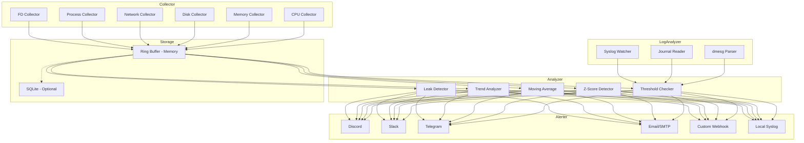

# 아키텍처 및 설계 문서

## 1. 시스템 아키텍처 개요

SysOps Agent는 세 개의 핵심 파이프라인 단계로 구성됩니다: **Collector → Analyzer → Alerter**. 각 단계는 독립적인 모듈로 분리되어 있으며, 비동기 채널(tokio mpsc)을 통해 데이터를 전달합니다.



## 2. 데이터 흐름

```
[procfs/sysfs] ──collect──▶ [MetricSample] ──store──▶ [RingBuffer]
                                                           │
                                                    ──analyze──▶ [AnalysisResult]
                                                                       │
                                                                 ──alert──▶ [AlertChannel]
```

### MetricSample 구조

```rust
struct MetricSample {
    timestamp: u64,          // Unix epoch (seconds)
    metric: MetricId,        // Enum identifying the metric
    value: f64,              // Measured value
    labels: SmallVec<[Label; 4]>,  // device, mountpoint, pid 등
}
```

### 비동기 채널 설계

- Collector → Storage: `mpsc::channel<MetricSample>` (bounded, 10,000 capacity)
- Storage → Analyzer: Analyzer가 Storage를 직접 query (pull 모델)
- Analyzer → Alerter: `mpsc::channel<Alert>` (bounded, 1,000 capacity)

채널이 full일 때는 oldest sample을 drop (backpressure 처리). 로그로 drop 카운트를 기록합니다.

## 3. Collector 모듈

### 3.1 수집 원리

모든 메트릭은 `/proc` 및 `/sys` 파일시스템에서 직접 파싱합니다. 외부 바이너리 호출이나 라이브러리 의존 없이, 커널이 제공하는 가상 파일시스템을 직접 읽습니다.

### 3.2 수집 소스

| 카테고리 | 소스 파일 | 수집 주기 |
|----------|-----------|-----------|
| CPU | `/proc/stat` | 10초 |
| Memory | `/proc/meminfo` | 10초 |
| Disk I/O | `/proc/diskstats` | 10초 |
| Disk Usage | `/proc/mounts` + `statvfs()` | 60초 |
| Network | `/proc/net/dev` | 10초 |
| Process | `/proc/[pid]/stat`, `/proc/[pid]/status` | 30초 |
| File Descriptors | `/proc/sys/fs/file-nr`, `/proc/[pid]/fd/` | 30초 |
| Load Average | `/proc/loadavg` | 10초 |
| Uptime | `/proc/uptime` | 60초 |

### 3.3 파싱 전략

**Zero-copy 파싱**: 파일 내용을 스택 버퍼(4KB)에 읽고, `&str` 슬라이싱으로 파싱합니다. 힙 할당을 최소화합니다.

```rust
// Example: /proc/stat parsing
fn parse_cpu_stat(buf: &[u8]) -> Result<CpuStats> {
    let s = std::str::from_utf8(buf)?;
    for line in s.lines() {
        if line.starts_with("cpu ") {
            // split and parse fields without allocation
        }
    }
}
```

**Delta 계산**: CPU, 디스크 I/O, 네트워크 등 카운터 메트릭은 이전 값과의 차이를 계산하여 rate로 변환합니다.

### 3.4 Collector Trait

```rust
#[async_trait]
pub trait Collector: Send + Sync {
    /// Collector의 고유 이름
    fn name(&self) -> &str;

    /// 메트릭 수집 수행
    async fn collect(&mut self) -> Result<Vec<MetricSample>>;

    /// 수집 주기 (초)
    fn interval_secs(&self) -> u64;
}
```

## 4. Analyzer 모듈

### 4.1 이상 탐지 알고리즘

#### Threshold-based (임계값 기반)
가장 기본적인 방법. 설정된 임계값을 초과하면 즉시 알림을 발생시킵니다.

```
if metric.value > threshold.critical → Alert(Critical)
if metric.value > threshold.warn → Alert(Warn)
```

#### Z-Score (표준 편차 기반)
최근 N개 샘플의 평균과 표준 편차를 계산하고, 현재 값이 몇 시그마 벗어났는지 판단합니다.

```
z = (current - mean) / stddev
if |z| > 3.0 → anomaly
```

- 윈도우 크기: 기본 360 샘플 (10초 간격 = 1시간)
- 최소 샘플 수: 30개 이상이어야 z-score 계산 활성화

#### Moving Average (이동 평균)
Exponential Moving Average (EMA)를 사용하여 급격한 변화를 감지합니다.

```
ema = alpha * current + (1 - alpha) * prev_ema
deviation = |current - ema| / ema
if deviation > threshold → anomaly
```

- alpha: 0.1 (느린 적응) ~ 0.3 (빠른 적응), 설정 가능

### 4.2 트렌드 분석

**선형 회귀 (Sliding Window)**: 최근 N 시간의 데이터에 선형 회귀를 적용하여 리소스 소진 시점을 예측합니다.

```
slope = Σ((x - x̄)(y - ȳ)) / Σ((x - x̄)²)
exhaustion_time = (threshold - current) / slope
```

- 디스크: slope > 0이고 24시간 내 용량 소진 예측 시 알림
- 메모리: slope > 0이고 6시간 내 OOM 예측 시 알림

구현은 `OnlineLinearRegression` 구조체로, 새 데이터 추가/오래된 데이터 제거를 O(1)로 수행합니다 (Welford's algorithm 변형).

### 4.3 누수 감지 (Leak Detection)

**프로세스별 RSS 추적**: 각 프로세스의 RSS를 주기적으로 기록하고, 단조 증가 패턴을 감지합니다.

```
if rss_slope > threshold_mb_per_hour
   AND r_squared > 0.8  // 강한 선형 상관
   AND duration > min_observation_period
→ Alert(memory_leak)
```

**File Descriptor 누수**: 프로세스별 fd 수를 추적, 지속적 증가 감지.

### 4.4 Analyzer Trait

```rust
pub trait Analyzer: Send + Sync {
    fn name(&self) -> &str;

    /// 분석 수행, Alert 목록 반환
    fn analyze(&mut self, storage: &Storage) -> Vec<Alert>;
}
```

## 5. Alerter 모듈

### 5.1 채널 추상화

모든 알림 채널은 `AlertChannel` trait을 구현합니다:

```rust
#[async_trait]
pub trait AlertChannel: Send + Sync {
    fn name(&self) -> &str;

    async fn send(&self, alert: &Alert) -> Result<()>;

    fn supports_batch(&self) -> bool { false }

    async fn send_batch(&self, alerts: &[Alert]) -> Result<()> {
        for alert in alerts {
            self.send(alert).await?;
        }
        Ok(())
    }
}
```

### 5.2 Rate Limiting

Token Bucket 알고리즘을 사용합니다:

- 채널별 독립 rate limiter
- 기본: 분당 10개, 시간당 60개
- Critical/Emergency는 rate limit 우회 가능 (설정 가능)

### 5.3 중복 제거 (Deduplication)

같은 `(metric, severity, labels)` 조합의 알림은 설정된 기간 내 재발송하지 않습니다.

```rust
struct DeduplicationKey {
    metric: MetricId,
    severity: Severity,
    label_hash: u64,
}
// HashMap<DeduplicationKey, Instant> 로 마지막 발송 시각 추적
```

### 5.4 Severity 레벨

| Level | 설명 | 기본 동작 |
|-------|------|-----------|
| Info | 참고 정보 | 로그만 기록 |
| Warn | 주의 필요 | 설정된 채널로 알림 |
| Critical | 즉시 조치 필요 | 모든 채널로 알림, rate limit 완화 |
| Emergency | 시스템 장애 임박 | 모든 채널 즉시 발송, rate limit 무시 |

## 6. Storage

### 6.1 Ring Buffer (In-Memory)

메트릭 종류별로 고정 크기의 ring buffer를 유지합니다.

```rust
struct RingBuffer<T> {
    data: Vec<T>,
    head: usize,
    len: usize,
    capacity: usize,
}
```

- 기본 용량: 메트릭당 8,640 샘플 (10초 간격 = 24시간)
- 총 메모리 사용량: ~30개 메트릭 × 8,640 × 24 bytes ≈ 6.2MB

### 6.2 SQLite (Optional, `sqlite` feature)

장기 보존이 필요한 경우 SQLite에 1분 평균으로 다운샘플링하여 저장합니다.

- 테이블: `metrics(timestamp, metric_id, value, labels_json)`
- 인덱스: `(metric_id, timestamp)`
- 보존 기간: 설정 가능 (기본 30일)
- WAL 모드로 읽기/쓰기 동시성 확보

## 7. Log Analyzer

### 7.1 소스

| 소스 | 방법 | 비고 |
|------|------|------|
| dmesg | `/dev/kmsg` 읽기 또는 `klogctl()` | CAP_SYSLOG 필요 |
| systemd journal | `libsystemd` FFI 또는 journal 파일 직접 파싱 | systemd 환경 |
| syslog | `/var/log/syslog` 또는 `/var/log/messages` tail | 범용 |

### 7.2 패턴 라이브러리

사전 정의된 정규식 패턴으로 중요 이벤트를 감지합니다:

**OOM Kill**
```regex
Out of memory: Killed process (\d+) \((.+)\) total-vm:(\d+)kB
```

**Hardware Errors**
```regex
(Hardware Error|Machine check|MCE|ECC|EDAC|corrected error|uncorrectable error)
```

**Filesystem Errors**
```regex
(EXT4-fs error|XFS.*error|Remounting filesystem read-only|I/O error)
```

**Hung Tasks**
```regex
task .+ blocked for more than \d+ seconds
```

**Network Issues**
```regex
(link is not ready|NIC Link is Down|carrier lost|rx_fifo_errors)
```

각 패턴은 severity 레벨이 매핑되어 있으며, 사용자가 TOML 설정으로 커스텀 패턴을 추가할 수 있습니다.

## 8. Security Model

### 8.1 최소 권한 원칙

| 기능 | 필요 권한 | 비고 |
|------|-----------|------|
| CPU/메모리/디스크 통계 | 없음 | `/proc/*` 는 일반 사용자 읽기 가능 |
| 프로세스 상세 정보 | `CAP_DAC_READ_SEARCH` | 다른 사용자의 프로세스 정보 |
| 네트워크 통계 | 없음 | `/proc/net/dev` 읽기 가능 |
| dmesg | `CAP_SYSLOG` | 커널 로그 접근 |
| Prometheus endpoint | 없음 (비특권 포트 사용) | 포트 ≥ 1024 |

### 8.2 네트워크 보안

- 기본: **outbound-only** (알림 전송만 함)
- Prometheus endpoint: opt-in, `127.0.0.1` 바인딩 기본
- TLS: `tls-rustls` (순수 Rust) 또는 `tls-native` (OpenSSL) 선택

### 8.3 Secret 관리

- Webhook URL, SMTP 비밀번호 등은 설정 파일에 직접 기재 또는 환경 변수 참조 (`${ENV_VAR}`)
- 설정 파일 권한: `0600` 권장
- 로그에 secret 값 출력 금지 (마스킹 처리)

## 9. Platform Abstraction

### 9.1 배포판 감지

```rust
fn detect_distro() -> Distro {
    // 1. /etc/os-release 파싱 (모든 최신 배포판)
    // 2. /etc/centos-release fallback (CentOS 7)
    // 3. /etc/redhat-release fallback
}
```

### 9.2 procfs 경로

모든 procfs 경로는 `PROC_ROOT` 상수로 추상화하여 테스트 시 mock 가능:

```rust
pub struct ProcFs {
    root: PathBuf,  // 기본: "/proc"
}
```

### 9.3 서비스 관리

- systemd: `sysops-agent.service` unit 파일 제공
- SysVinit: CentOS 7 호환 init 스크립트 (선택적)

## 10. Performance Budget

### 10.1 메모리 목표

| 구성 요소 | 예상 사용량 |
|-----------|------------|
| Ring Buffer (30 metrics × 24h) | ~6 MB |
| Log Buffer | ~2 MB |
| Analyzer State | ~1 MB |
| HTTP Client Pool | ~2 MB |
| 기타 (stack, code) | ~10 MB |
| **합계** | **~21 MB** (목표 <50 MB) |

### 10.2 비동기 I/O

- `tokio` runtime: 기본 worker 2개 (서버의 CPU를 과도하게 사용하지 않음)
- 파일 I/O: `tokio::fs` 또는 blocking thread pool (procfs 읽기는 매우 빠르므로)
- HTTP: `reqwest` + connection pooling (채널당 1개 연결 재사용)

### 10.3 최적화 전략

- **SmallVec**: 대부분의 label 배열은 4개 이하이므로 힙 할당 회피
- **String Interning**: 반복되는 메트릭 이름, label key는 intern하여 메모리 절약
- **Batch I/O**: procfs 파일을 한 번에 읽고 여러 메트릭 추출
- **Lazy Initialization**: 비활성화된 collector/analyzer는 초기화하지 않음
