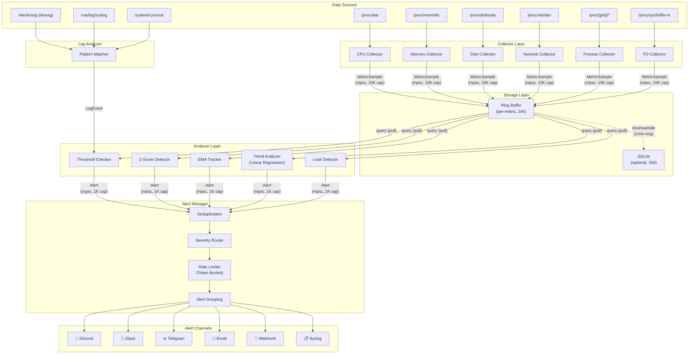

# 🏗️ 아키텍처 및 설계 문서

> SysOps Agent의 전체 아키텍처, 모듈 설계, 알고리즘, 보안 모델, 성능 최적화를 다루는 상세 설계 문서

---

## 목차

1. [시스템 아키텍처 개요](#1-시스템-아키텍처-개요)
2. [데이터 흐름](#2-데이터-흐름)
3. [Collector 모듈](#3-collector-모듈)
4. [멀티소켓 CPU & NUMA](#4-멀티소켓-cpu--numa)
5. [GPU 모니터링 (NVIDIA)](#5-gpu-모니터링-nvidia)
6. [시스템 인벤토리](#6-시스템-인벤토리)
7. [Analyzer 모듈](#7-analyzer-모듈)
8. [Alerter 모듈](#8-alerter-모듈)
9. [NATS 텔레메트리](#9-nats-텔레메트리)
10. [Storage](#10-storage)
11. [Log Analyzer](#11-log-analyzer)
12. [Security Model](#12-security-model)
13. [Platform Abstraction](#13-platform-abstraction)
14. [Performance Budget](#14-performance-budget)
15. [에러 처리 및 복원력](#15-에러-처리-및-복원력)
16. [확장 포인트](#16-확장-포인트)

---

## 1. 시스템 아키텍처 개요

SysOps Agent는 **Collector → Storage → Analyzer → Alerter** 4단계 파이프라인으로 구성됩니다. 각 단계는 독립적인 모듈로 분리되어 있으며, tokio 비동기 채널(mpsc)을 통해 데이터를 전달합니다.

### 1.1 컴포넌트 다이어그램



### 1.2 프로세스 구조

```
┌─────────────────────────────── Main Process ───────────────────────────────┐
│                                                                            │
│   tokio runtime (2 worker threads)                                         │
│                                                                            │
│   ┌─────────┐  ┌─────────┐  ┌─────────┐  ┌─────────┐  ┌─────────┐      │
│   │  Task:  │  │  Task:  │  │  Task:  │  │  Task:  │  │  Task:  │      │
│   │ CPU     │  │ Memory  │  │ Disk    │  │Network  │  │Process  │ ...  │
│   │Collector│  │Collector│  │Collector│  │Collector│  │Collector│      │
│   └────┬────┘  └────┬────┘  └────┬────┘  └────┬────┘  └────┬────┘      │
│        │            │            │            │            │              │
│        └────────────┴────────────┴────────────┴────────────┘              │
│                                  │                                        │
│                        mpsc::channel<MetricSample>                        │
│                                  │                                        │
│                                  ▼                                        │
│                          ┌──────────────┐                                 │
│                          │  Task:       │                                 │
│                          │  Storage +   │                                 │
│                          │  Analyzer    │                                 │
│                          │  Loop        │                                 │
│                          └──────┬───────┘                                 │
│                                 │                                         │
│                       mpsc::channel<Alert>                                │
│                                 │                                         │
│                                 ▼                                         │
│                          ┌──────────────┐                                 │
│                          │  Task:       │                                 │
│                          │  Alert       │                                 │
│                          │  Manager     │                                 │
│                          └──────────────┘                                 │
│                                                                            │
│   ┌──────────────┐     ┌───────────────┐                                  │
│   │  Task:       │     │  Task:        │                                  │
│   │  Log         │     │  Prometheus   │ (optional, feature-gated)        │
│   │  Analyzer    │     │  HTTP Server  │                                  │
│   └──────────────┘     └───────────────┘                                  │
│                                                                            │
│   Signal Handler: SIGTERM → graceful shutdown, SIGHUP → config reload     │
└────────────────────────────────────────────────────────────────────────────┘
```

### 1.3 배포 토폴로지

```
┌──── Data Center / Cloud ────────────────────────────────────────┐
│                                                                  │
│   ┌─────────────┐  ┌─────────────┐  ┌─────────────┐            │
│   │ Web Server  │  │ DB Server   │  │ Cache Server│            │
│   │             │  │             │  │             │            │
│   │ ┌─────────┐ │  │ ┌─────────┐ │  │ ┌─────────┐ │            │
│   │ │ SysOps  │ │  │ │ SysOps  │ │  │ │ SysOps  │ │            │
│   │ │ Agent   │ │  │ │ Agent   │ │  │ │ Agent   │ │            │
│   │ └────┬────┘ │  │ └────┬────┘ │  │ └────┬────┘ │            │
│   └──────┼──────┘  └──────┼──────┘  └──────┼──────┘            │
│          │                │                │                     │
│          └────────────────┼────────────────┘                     │
│                           │ HTTPS (outbound only)                │
└───────────────────────────┼──────────────────────────────────────┘
                            │
              ┌─────────────┼─────────────┐
              ▼             ▼             ▼
        ┌──────────┐  ┌──────────┐  ┌──────────┐
        │ Discord  │  │  Slack   │  │ Telegram │
        │ Webhook  │  │ Webhook  │  │ Bot API  │
        └──────────┘  └──────────┘  └──────────┘

              ┌─────────────┐
              │ Prometheus  │  (optional, pull)
              │ Server      │──scrape──▶ :9100/metrics
              └──────┬──────┘
                     ▼
              ┌─────────────┐
              │  Grafana    │
              └─────────────┘
```

---

## 2. 데이터 흐름

### 2.1 메트릭 파이프라인

```
 ┌───────────────┐     10s/30s/60s      ┌─────────────────┐
 │  /proc, /sys  │ ═══════collect══════▶ │  MetricSample   │
 │  (kernel VFS) │                       │  {              │
 └───────────────┘                       │    timestamp,   │
                                         │    metric_id,   │
                                         │    value: f64,  │
                                         │    labels[]     │
                                         │  }              │
                                         └────────┬────────┘
                                                  │
                                    mpsc (bounded, 10,000)
                                                  │
                                                  ▼
                                         ┌────────────────┐
                                         │  Ring Buffer   │───persist──▶ SQLite?
                                         │  (per-metric)  │  (1min avg downsample)
                                         └────────┬───────┘
                                                  │
                                            query (pull)
                                                  │
                                    ┌─────────────┼─────────────┐
                                    ▼             ▼             ▼
                              ┌──────────┐ ┌──────────┐ ┌──────────┐
                              │Threshold │ │ Z-Score  │ │  Trend   │
                              │  Check   │ │ Detect   │ │ Analyze  │
                              └────┬─────┘ └────┬─────┘ └────┬─────┘
                                   │            │            │
                                   └────────────┼────────────┘
                                                │
                                    mpsc (bounded, 1,000)
                                                │
                                                ▼
                                       ┌────────────────┐
                                       │ Alert Manager  │
                                       │ (dedup, rate   │
                                       │  limit, route) │
                                       └────────┬───────┘
                                                │
                              ┌────────┬────────┼────────┬────────┐
                              ▼        ▼        ▼        ▼        ▼
                          Discord   Slack   Telegram   Email   Webhook
```

### 2.2 MetricSample 구조

```rust
pub struct MetricSample {
    pub timestamp: u64,                      // Unix epoch (seconds)
    pub metric: MetricId,                    // Enum: CpuUsage, MemoryUsed, ...
    pub value: f64,                          // 측정 값
    pub labels: SmallVec<[Label; 4]>,        // 스택 할당 (4개 이하)
}

pub struct Label {
    pub key: &'static str,                   // "device", "mountpoint", "pid"
    pub value: CompactString,                // 힙 할당 최소화
}

// 크기: ~64 bytes per sample
// 24h × 10s interval = 8,640 samples/metric
// 30 metrics × 8,640 × 64 bytes ≈ 16 MB (worst case)
```

### 2.3 Backpressure 처리

```
Collector ──▶ [mpsc channel, cap=10,000] ──▶ Storage

  채널 full 시:
  ├─ try_send() 실패 → oldest sample drop
  ├─ drop counter 증가 (메트릭으로 노출)
  └─ 로그 경고: "Dropped N samples due to backpressure"

  원인: Analyzer가 느리거나 I/O 지연
  대응: Storage가 catch up 할 때까지 collector는 계속 수집
```

---

## 3. Collector 모듈

### 3.1 수집 원리

모든 메트릭은 `/proc` 및 `/sys` 파일시스템에서 직접 파싱합니다. 외부 바이너리 호출이나 라이브러리 의존 없이, 커널이 제공하는 가상 파일시스템을 직접 읽습니다.

### 3.2 수집 소스 매핑

```
┌──────────────┬──────────────────────────────┬────────┬───────────────┐
│ 카테고리     │ 소스 파일                     │ 주기   │ 파싱 방식     │
├──────────────┼──────────────────────────────┼────────┼───────────────┤
│ CPU          │ /proc/stat                   │ 10초   │ delta counter │
│ Memory       │ /proc/meminfo                │ 10초   │ gauge 직접    │
│ Disk I/O     │ /proc/diskstats              │ 10초   │ delta counter │
│ Disk Usage   │ /proc/mounts + statvfs()     │ 60초   │ gauge 직접    │
│ Network      │ /proc/net/dev                │ 10초   │ delta counter │
│ Process      │ /proc/[pid]/stat, status     │ 30초   │ gauge 직접    │
│ File Desc.   │ /proc/sys/fs/file-nr         │ 30초   │ gauge 직접    │
│              │ /proc/[pid]/fd/              │        │ readdir count │
│ Load Average │ /proc/loadavg                │ 10초   │ gauge 직접    │
│ Uptime       │ /proc/uptime                 │ 60초   │ gauge 직접    │
└──────────────┴──────────────────────────────┴────────┴───────────────┘
```

### 3.3 파싱 전략: Zero-copy

파일 내용을 스택 버퍼(4KB)에 읽고, `&str` 슬라이싱으로 파싱합니다. 힙 할당을 최소화합니다.

```rust
// /proc/stat 파싱 예시
fn parse_cpu_stat(buf: &[u8]) -> Result<CpuStats> {
    let s = std::str::from_utf8(buf)?;
    for line in s.lines() {
        if line.starts_with("cpu ") {
            let mut fields = line.split_whitespace().skip(1);
            let user = fields.next().and_then(|s| s.parse::<u64>().ok()).unwrap_or(0);
            let nice = fields.next().and_then(|s| s.parse::<u64>().ok()).unwrap_or(0);
            // ... idle, iowait, irq, softirq, steal
        }
    }
}
```

**Delta 계산**: CPU, 디스크 I/O, 네트워크 등 카운터 메트릭은 이전 값과의 차이를 계산하여 rate로 변환합니다.

```
          t1                 t2
cpu_user: 150000    →    150500
                    Δ = 500 ticks
                    elapsed = 10s
                    rate = 500 / (total_Δ) = 5.0%
```

### 3.4 Collector Trait

```rust
#[async_trait]
pub trait Collector: Send + Sync {
    /// Collector의 고유 이름
    fn name(&self) -> &str;

    /// 메트릭 수집 수행
    async fn collect(&mut self) -> Result<Vec<MetricSample>>;

    /// 수집 주기 (초)
    fn interval_secs(&self) -> u64;
}
```

### 3.5 CPU Collector 상세

```
/proc/stat 파싱:

  cpu  150000 1000 50000 800000 5000 2000 1000 500 0 0
  │     │      │     │      │     │     │     │    │
  │     user  nice  system idle  iowait irq  softirq steal
  │
  cpu0 75000 500 25000 400000 ...  (per-core)

  출력 메트릭:
  ├── cpu_usage_percent      (전체 CPU 사용률)
  ├── cpu_user_percent       (user 모드)
  ├── cpu_system_percent     (kernel 모드)
  ├── cpu_iowait_percent     (I/O 대기)
  ├── cpu_steal_percent      (VM steal, 클라우드 환경 중요)
  ├── cpu_core_usage_percent (코어별, labels: {core: "0"})
  └── load_avg_1m/5m/15m     (/proc/loadavg)
```

---

## 4. 멀티소켓 CPU & NUMA

### 4.1 멀티소켓 CPU 토폴로지

엔터프라이즈 서버는 2~8소켓 구성이 일반적입니다. SysOps Agent는 소켓/코어/스레드 계층을 인식하여 소켓별 독립 모니터링을 지원합니다.

```
┌─────────────────────── 2-Socket Server ───────────────────────┐
│                                                                │
│  ┌─── Socket 0 (NUMA Node 0) ───┐  ┌─── Socket 1 (NUMA Node 1) ───┐
│  │                               │  │                               │
│  │  Core 0  [T0, T1]            │  │  Core 28 [T56, T57]           │
│  │  Core 1  [T2, T3]            │  │  Core 29 [T58, T59]           │
│  │  ...                         │  │  ...                          │
│  │  Core 27 [T54, T55]          │  │  Core 55 [T110, T111]         │
│  │                               │  │                               │
│  │  L3 Cache: 42MB              │  │  L3 Cache: 42MB               │
│  │  Local Memory: 256GB         │  │  Local Memory: 256GB          │
│  └───────────────────────────────┘  └───────────────────────────────┘
│                                                                │
│  Interconnect: UPI / QPI (cross-socket memory access penalty)  │
└────────────────────────────────────────────────────────────────┘
```

### 4.2 데이터 소스

```
┌────────────────────────────────┬──────────────────────────────────┐
│ 정보                           │ 소스                             │
├────────────────────────────────┼──────────────────────────────────┤
│ Socket count                   │ /sys/devices/system/cpu/         │
│                                │   cpu*/topology/physical_package_id│
│ Core-to-socket mapping         │ /sys/devices/system/cpu/         │
│                                │   cpu*/topology/core_id          │
│ NUMA node count                │ /sys/devices/system/node/        │
│ CPU-to-NUMA mapping            │ /sys/devices/system/node/        │
│                                │   node*/cpulist                  │
│ Per-NUMA memory                │ /sys/devices/system/node/        │
│                                │   node*/meminfo                  │
│ Per-CPU usage                  │ /proc/stat (cpu0, cpu1, ...)     │
│ ECC errors (EDAC)              │ /sys/devices/system/edac/mc*/    │
│                                │   csrow*/ce_count, ue_count      │
│ CPU frequency                  │ /sys/devices/system/cpu/         │
│                                │   cpu*/cpufreq/scaling_cur_freq  │
│ CPU temperature                │ /sys/class/hwmon/hwmon*/temp*    │
└────────────────────────────────┴──────────────────────────────────┘
```

### 4.3 소켓별 CPU 사용률 계산

```rust
// /proc/stat에서 cpu0, cpu1, ... 별로 파싱
// topology/physical_package_id로 그룹핑

struct SocketStats {
    socket_id: u32,
    core_ids: Vec<u32>,
    thread_ids: Vec<u32>,            // logical CPU ids
    usage_percent: f64,               // 소켓 내 모든 코어 평균
    max_core_usage: f64,              // 가장 높은 코어
    frequency_mhz: f64,              // 평균 주파수
    temperature_celsius: Option<f64>, // hwmon
}

// 출력 메트릭:
// cpu_socket_usage_percent     {socket: "0"}   → 45.2%
// cpu_socket_usage_percent     {socket: "1"}   → 12.3%
// cpu_socket_max_core_percent  {socket: "0"}   → 98.1%  (핫스팟 감지)
```

### 4.4 NUMA 메모리 모니터링

```
/sys/devices/system/node/node0/meminfo:
  Node 0 MemTotal:       262144000 kB
  Node 0 MemFree:         65536000 kB
  Node 0 MemUsed:        196608000 kB

→ 메트릭:
  memory_numa_used_percent    {node: "0"}   → 75.0%
  memory_numa_used_percent    {node: "1"}   → 32.1%
  memory_numa_free_mb         {node: "0"}   → 64000
  memory_numa_free_mb         {node: "1"}   → 178000

⚠️ NUMA imbalance 감지:
  if max(node_usage) - min(node_usage) > 40% → Alert(Warn)
  "NUMA memory imbalance: node0=75%, node1=32%"
```

### 4.5 ECC Memory 에러 모니터링

```
/sys/devices/system/edac/mc0/csrow0/ce_count  → correctable errors
/sys/devices/system/edac/mc0/csrow0/ue_count  → uncorrectable errors

→ 메트릭:
  ecc_correctable_errors      {mc: "0", csrow: "0"}  → gauge
  ecc_uncorrectable_errors    {mc: "0", csrow: "0"}  → gauge

규칙:
  ce_count 증가 → Warn  (DIMM 열화 징후)
  ue_count > 0  → Critical (데이터 손상 위험, DIMM 교체 필요)
```

---

## 5. GPU 모니터링 (NVIDIA)

### 5.1 개요

`gpu` feature flag로 활성화. NVIDIA Management Library (NVML)를 통해 GPU 메트릭을 직접 수집합니다. `nvidia-smi` CLI 호출 없이 C 바인딩으로 접근하여 오버헤드를 최소화합니다.

```
┌────────── GPU Collector ──────────┐
│                                    │
│  ┌──────────────────────────────┐ │
│  │ nvml-wrapper (Rust crate)    │ │
│  │                              │ │
│  │  nvmlInit()                  │ │
│  │  nvmlDeviceGetCount()        │ │
│  │  nvmlDeviceGetHandleByIndex()│ │
│  │  nvmlDeviceGetUtilizationRates()│
│  │  nvmlDeviceGetMemoryInfo()   │ │
│  │  nvmlDeviceGetTemperature()  │ │
│  │  nvmlDeviceGetPowerUsage()   │ │
│  │  nvmlDeviceGetEccMode()      │ │
│  │  ...                         │ │
│  └──────────┬───────────────────┘ │
│             │                      │
│             ▼ libnvidia-ml.so      │
│        (NVIDIA driver 포함)        │
└────────────────────────────────────┘
```

### 5.2 수집 메트릭

```
┌──────────────────────────────┬─────────────────────────┬─────────┐
│ 메트릭                       │ NVML API                │ 주기    │
├──────────────────────────────┼─────────────────────────┼─────────┤
│ GPU Utilization %            │ GetUtilizationRates     │ 10초    │
│ GPU Memory Used/Total        │ GetMemoryInfo           │ 10초    │
│ GPU Temperature (°C)         │ GetTemperature          │ 10초    │
│ GPU Power Usage (W)          │ GetPowerUsage           │ 10초    │
│ GPU Clock (MHz)              │ GetClockInfo            │ 10초    │
│ GPU Fan Speed %              │ GetFanSpeed             │ 30초    │
│ ECC Errors (SBE/DBE)         │ GetTotalEccErrors       │ 60초    │
│ PCIe Throughput (rx/tx)      │ GetPcieThroughput       │ 10초    │
│ Encoder/Decoder Utilization  │ GetEncoderUtilization   │ 30초    │
│ Per-Process GPU Memory       │ GetComputeRunningProcesses│ 30초  │
│ Throttle Reasons             │ GetCurrentClocksThrottleReasons│10초│
│ NVLink Throughput            │ GetNvLinkUtilization    │ 30초    │
│ Retired Pages (pending/blacklisted)│ GetRetiredPages   │ 300초   │
└──────────────────────────────┴─────────────────────────┴─────────┘

Labels: {gpu: "0", model: "A100-SXM4-80GB", uuid: "GPU-xxxx"}
```

### 5.3 GPU 이상 탐지

```
┌─────────────────────────┬────────────┬────────────────────────────┐
│ 조건                    │ Severity   │ 의미                       │
├─────────────────────────┼────────────┼────────────────────────────┤
│ temperature > 85°C      │ 🟡 Warn    │ Thermal throttling 임박    │
│ temperature > 95°C      │ 🔴 Critical│ 과열, 성능 저하 발생       │
│ memory_used > 90%       │ 🟡 Warn    │ OOM 위험                   │
│ memory_used > 98%       │ 🔴 Critical│ GPU OOM 임박               │
│ ecc_dbe > 0             │ 🔴 Critical│ 복구 불가 메모리 에러      │
│ ecc_sbe 급증            │ 🟡 Warn    │ GPU 메모리 열화            │
│ retired_pages > threshold│ 🔴 Critical│ GPU 교체 필요             │
│ Xid error in dmesg      │ 🔴 Critical│ GPU 장애                   │
│ throttle: thermal       │ 🟡 Warn    │ 열 제한 중                 │
│ throttle: power         │ 🟡 Warn    │ 전력 제한 중               │
│ GPU fallen off bus      │ ⚫ Emergency│ GPU 하드웨어 장애          │
└─────────────────────────┴────────────┴────────────────────────────┘
```

### 5.4 멀티 GPU 토폴로지

```
  ┌───── GPU Server (DGX-like) ─────────────────────┐
  │                                                   │
  │  CPU Socket 0              CPU Socket 1           │
  │  ┌─────────┐               ┌─────────┐           │
  │  │ NUMA 0  │               │ NUMA 1  │           │
  │  └────┬────┘               └────┬────┘           │
  │       │ PCIe                    │ PCIe            │
  │  ┌────┴────┐ ┌────────┐  ┌────┴────┐ ┌────────┐│
  │  │ GPU 0   │─│ GPU 1  │  │ GPU 2   │─│ GPU 3  ││
  │  │ A100    │ │ A100   │  │ A100    │ │ A100   ││
  │  └────┬────┘ └───┬────┘  └────┬────┘ └───┬────┘│
  │       │ NVLink    │            │ NVLink    │     │
  │       └───────────┘            └───────────┘     │
  │                                                   │
  │  GPU-CPU Affinity:                                │
  │  GPU 0,1 → NUMA 0 (Socket 0)                     │
  │  GPU 2,3 → NUMA 1 (Socket 1)                     │
  └───────────────────────────────────────────────────┘

  → 메트릭에 {gpu: "0", numa_node: "0", pcie_bus: "0000:3b:00.0"} label 포함
```

### 5.5 Graceful Degradation

GPU feature가 활성화되었으나 NVIDIA 드라이버가 없는 서버에서는:

```
1. nvmlInit() 실패 → 경고 로그 1회 출력
2. GPU Collector 비활성화
3. 나머지 Collector (CPU, Memory 등) 정상 동작
4. 주기적으로 드라이버 감지 재시도 (선택적)
```

---

## 6. 시스템 인벤토리

### 6.1 개요

에이전트 시작 시 및 주기적(기본 5분)으로 서버의 하드웨어/소프트웨어 스펙을 수집합니다. 이 정보는 NATS를 통해 중앙 CMDB/인벤토리 시스템에 전송되며, 자산 관리, 용량 계획, 취약점 관리에 활용됩니다.

### 6.2 수집 아키텍처

```
 ┌─────────────────── Inventory Collector ───────────────────┐
 │                                                            │
 │  ┌──────────────┐  ┌──────────────┐  ┌──────────────┐    │
 │  │ OS Info      │  │ CPU Info     │  │ Memory Info  │    │
 │  │              │  │              │  │              │    │
 │  │ /etc/os-     │  │ /proc/cpuinfo│  │ /proc/meminfo│    │
 │  │ release      │  │ lscpu        │  │ dmidecode    │    │
 │  │ uname -r     │  │ /sys/devices/│  │ /sys/devices/│    │
 │  │              │  │ system/cpu/  │  │ system/edac/ │    │
 │  └──────┬───────┘  └──────┬───────┘  └──────┬───────┘    │
 │         │                 │                  │             │
 │  ┌──────────────┐  ┌──────────────┐  ┌──────────────┐    │
 │  │ GPU Info     │  │ Disk Info    │  │ Network Info │    │
 │  │              │  │              │  │              │    │
 │  │ NVML API     │  │ /sys/block/  │  │ /sys/class/  │    │
 │  │ nvidia-smi   │  │ smartctl     │  │ net/         │    │
 │  │              │  │ lsblk        │  │ ethtool      │    │
 │  └──────┬───────┘  └──────┬───────┘  └──────┬───────┘    │
 │         │                 │                  │             │
 │  ┌──────────────┐                                         │
 │  │ BIOS/Board   │                                         │
 │  │              │                                         │
 │  │ /sys/devices/│                                         │
 │  │ virtual/dmi/ │                                         │
 │  │ dmidecode    │                                         │
 │  └──────┬───────┘                                         │
 │         │                                                  │
 └─────────┼──────────────────────────────────────────────────┘
           │
           ▼
   ┌───────────────┐
   │ SystemInfo    │──── JSON serialize ──── NATS publish
   │ (struct)      │                         sysops.{hostname}.inventory
   └───────────────┘
```

### 6.3 SystemInfo 구조체

```rust
#[derive(Serialize)]
pub struct SystemInfo {
    pub hostname: String,
    pub collected_at: DateTime<Utc>,
    pub agent_version: String,
    pub os: OsInfo,
    pub cpu: CpuInfo,
    pub numa: Option<NumaInfo>,
    pub memory: MemoryInfo,
    pub gpu: Vec<GpuInfo>,              // feature "gpu"
    pub disks: Vec<DiskInfo>,
    pub network: Vec<NetworkInfo>,
    pub bios: Option<BiosInfo>,
}

#[derive(Serialize)]
pub struct OsInfo {
    pub distro: String,                  // "Ubuntu", "Rocky Linux"
    pub version: String,                 // "22.04.4 LTS"
    pub kernel: String,                  // "5.15.0-91-generic"
    pub arch: String,                    // "x86_64"
    pub hostname: String,
    pub boot_time: DateTime<Utc>,
    pub uptime_secs: u64,
}

#[derive(Serialize)]
pub struct CpuInfo {
    pub model: String,                   // "Intel Xeon Gold 6348 @ 2.60GHz"
    pub vendor: String,                  // "GenuineIntel", "AuthenticAMD"
    pub family: u32,
    pub model_id: u32,
    pub stepping: u32,
    pub microcode: String,
    pub sockets: u32,
    pub cores_per_socket: u32,
    pub threads_per_core: u32,
    pub total_threads: u32,
    pub base_mhz: f64,
    pub max_mhz: Option<f64>,
    pub cache_l1d_kb: u32,
    pub cache_l1i_kb: u32,
    pub cache_l2_kb: u32,
    pub cache_l3_kb: u32,
    pub flags: Vec<String>,             // ["avx512f", "avx512bw", ...]
}

#[derive(Serialize)]
pub struct MemoryInfo {
    pub total_mb: u64,
    pub dimm_count: Option<u32>,         // dmidecode 필요
    pub dimms: Option<Vec<DimmInfo>>,
    pub ecc_supported: bool,
}

#[derive(Serialize)]
pub struct DimmInfo {
    pub slot: String,                    // "DIMM_A1"
    pub size_mb: u64,                    // 32768
    pub type_: String,                   // "DDR4", "DDR5"
    pub speed_mhz: u32,                 // 3200
    pub manufacturer: String,            // "Samsung"
    pub part_number: String,
    pub serial: String,
    pub ecc: bool,
}

#[derive(Serialize)]
pub struct GpuInfo {
    pub index: u32,
    pub model: String,                   // "NVIDIA A100-SXM4-80GB"
    pub uuid: String,
    pub vram_mb: u64,
    pub driver_version: String,
    pub cuda_version: String,
    pub pcie_gen: u32,
    pub pcie_width: u32,
    pub power_limit_watts: f64,
    pub ecc_enabled: bool,
    pub numa_node: Option<u32>,
    pub pcie_bus_id: String,
    pub serial: Option<String>,
}

#[derive(Serialize)]
pub struct DiskInfo {
    pub name: String,                    // "nvme0n1", "sda"
    pub model: String,
    pub serial: Option<String>,
    pub capacity_mb: u64,
    pub interface: String,               // "NVMe", "SAS", "SATA"
    pub firmware: Option<String>,
    pub smart_healthy: Option<bool>,
    pub rotational: bool,                // true=HDD, false=SSD/NVMe
}

#[derive(Serialize)]
pub struct NetworkInfo {
    pub name: String,                    // "eno1", "eth0"
    pub mac: String,
    pub speed_mbps: Option<u64>,         // 25000
    pub mtu: u32,                        // 9000
    pub driver: Option<String>,          // "mlx5_core", "i40e"
    pub firmware: Option<String>,
    pub ipv4: Vec<String>,
    pub ipv6: Vec<String>,
}

#[derive(Serialize)]
pub struct BiosInfo {
    pub vendor: String,                  // "Dell Inc."
    pub version: String,
    pub release_date: String,
    pub product_name: String,            // "PowerEdge R750"
    pub serial: Option<String>,
}
```

### 6.4 수집 소스 및 권한

```
┌────────────────────┬──────────────────────────┬────────────────┐
│ 정보               │ 소스                      │ 권한           │
├────────────────────┼──────────────────────────┼────────────────┤
│ OS, kernel         │ /etc/os-release, uname    │ 없음           │
│ CPU model/topology │ /proc/cpuinfo, lscpu      │ 없음           │
│ CPU frequency      │ /sys/devices/system/cpu/   │ 없음           │
│ Memory total       │ /proc/meminfo              │ 없음           │
│ DIMM details       │ dmidecode -t 17            │ root/sudo ⚠️  │
│ BIOS/Board         │ /sys/devices/virtual/dmi/  │ 없음 (부분)   │
│                    │ dmidecode -t 0,2           │ root/sudo ⚠️  │
│ GPU                │ NVML API                   │ video group    │
│ Disk model/serial  │ /sys/block/*/device/       │ 없음           │
│ SMART              │ smartctl                   │ root/sudo ⚠️  │
│ Network interface  │ /sys/class/net/            │ 없음           │
│ Network speed      │ ethtool (ioctl)            │ 없음           │
│ ECC/EDAC           │ /sys/devices/system/edac/  │ 없음           │
└────────────────────┴──────────────────────────┴────────────────┘

⚠️ = Optional. root 없으면 해당 필드만 null, 나머지는 정상 수집
```

### 6.5 변경 감지

인벤토리는 주기적으로 수집하되, 변경이 없으면 NATS 전송을 skip합니다 (대역폭 절약). 변경 감지는 JSON hash 비교로 수행합니다.

```
collect → hash(JSON) → 이전 hash와 비교
                        │
                  ┌─────┴─────┐
                  │ 같음      │ 다름
                  ▼           ▼
               skip        publish to NATS
              (로그만)     + 로그 "inventory changed"
```

예외: 첫 시작, 강제 전송 주기(기본 1시간)에는 무조건 전송.

---

## 7. Analyzer 모듈

### 4.1 이상 탐지 알고리즘 비교

```
┌──────────────────┬──────────────┬────────────────┬──────────────────┐
│ 알고리즘         │ 감지 대상    │ 반응 속도      │ False Positive   │
├──────────────────┼──────────────┼────────────────┼──────────────────┤
│ Threshold        │ 절대 위험    │ ⚡ 즉시        │ 낮음 (명확)     │
│ Z-Score          │ 통계적 이상  │ 🔄 1시간 학습  │ 중간            │
│ EMA              │ 급격한 변화  │ ⚡ 수분 내     │ 중간            │
│ Trend (LinReg)   │ 점진적 증가  │ 🐢 수시간      │ 낮음            │
│ Leak Detection   │ 리소스 누수  │ 🐢 1시간+      │ 매우 낮음       │
└──────────────────┴──────────────┴────────────────┴──────────────────┘
```

### 4.2 Threshold-based (임계값 기반)

가장 기본적인 방법. 설정된 임계값을 초과하면 즉시 알림을 발생시킵니다.

```
                    ┌─── Emergency (99%)
                    │ ┌─ Critical (95%)
                    │ │ ┌─ Warn (90%)
 100% ──────────────┤ │ │
                    │ │ │
  95% ──────────────┤─┤ │        ╭──╮
                    │ │ │   ╭───╯  ╰──── value
  90% ──────────────┤─┤─┤──╯
                    │ │ │
                    │ │ │
   0% ──────────────┴─┴─┴──────────────────▶ time
```

```rust
if metric.value > threshold.emergency → Alert(Emergency)
if metric.value > threshold.critical  → Alert(Critical)
if metric.value > threshold.warn      → Alert(Warn)
```

### 4.3 Z-Score (표준 편차 기반)

최근 N개 샘플의 평균과 표준 편차를 계산하고, 현재 값이 몇 시그마 벗어났는지 판단합니다.

```
         mean
          │
          │     +1σ   +2σ   +3σ (anomaly!)
          │      │     │     │
  ────────┼──────┼─────┼─────┼──────────
          │      │     │     │
          │      68%   95%   99.7%
          │
     ╭─╮  │        ╭╮
    ╭╯ ╰╮ │   ╭───╯╰─── ← 3σ 이상 → Alert!
  ──╯   ╰─┼──╯
          │
  ────────┼──────────────────────────▶ time
```

```rust
z = (current - mean) / stddev
if z.abs() > 3.0 → anomaly
```

- 윈도우 크기: 기본 360 샘플 (10초 간격 = 1시간)
- 최소 샘플 수: 30개 이상이어야 z-score 계산 활성화
- **Online 알고리즘**: Welford's method로 mean/variance를 O(1) 업데이트

### 4.4 Moving Average (EMA)

Exponential Moving Average를 사용하여 급격한 변화를 감지합니다.

```
          EMA (smooth line)
           │
   ╭─╮    │         ╭╮ ← spike: deviation > threshold
  ╭╯ ╰╮   │    ╭───╯╰───╮
  ╯   ╰───┼───╯         ╰───
           │
  ─────────┼──────────────────▶ time

  ema_new = α × current + (1 - α) × ema_old
  deviation = |current - ema| / ema
  if deviation > threshold → anomaly
```

- alpha: 0.1 (느린 적응) ~ 0.3 (빠른 적응), 설정 가능

### 4.5 트렌드 분석 (Linear Regression)

최근 N시간의 데이터에 선형 회귀를 적용하여 리소스 소진 시점을 예측합니다.

```
                                      ╱ 예측선 (extrapolation)
  100% ─ ─ ─ ─ ─ ─ ─ ─ ─ ─ ─ ─ ─ ╱─ ─ Disk Full!
                                 ╱      ↑
                              ╱         exhaustion_time
   80% ─────────────────── ╱──── threshold
                         ╱
          ╭─────────── ╱    ← 실제 데이터 + regression line
   60% ──╱────────────╱
        ╱  slope > 0
   40% ╱
       │
       └───────────────────────────▶ time
           t_now              t_exhaust

  slope = Σ((x - x̄)(y - ȳ)) / Σ((x - x̄)²)
  exhaustion_time = (threshold - current) / slope
```

- 디스크: slope > 0이고 **24시간 내** 용량 소진 예측 시 알림
- 메모리: slope > 0이고 **6시간 내** OOM 예측 시 알림
- 구현: `OnlineLinearRegression` — Welford 변형, O(1) 추가/제거

### 4.6 누수 감지 (Leak Detection)

```
  RSS (MB)
   │
   │                              ╭──── 단조 증가 패턴
   │                         ╭───╯     R² > 0.8
   │                    ╭───╯          → Memory Leak!
   │               ╭───╯
   │          ╭───╯
   │     ╭───╯
   │╭───╯
   │╯
   └─────────────────────────────▶ time
        1h+  (min observation period)

  조건:
  1. rss_slope > threshold_mb_per_hour
  2. r_squared > 0.8 (강한 선형 상관)
  3. duration > min_observation_period (1h+)
  → Alert(memory_leak, pid, process_name)

  FD 누수도 동일 로직 적용
```

### 4.7 Analyzer Trait

```rust
pub trait Analyzer: Send + Sync {
    fn name(&self) -> &str;

    /// 분석 수행, Alert 목록 반환
    fn analyze(&mut self, storage: &Storage) -> Vec<Alert>;
}
```

---

## 8. Alerter 모듈

### 5.1 Alert 구조체

```rust
pub struct Alert {
    pub id: Uuid,
    pub timestamp: DateTime<Utc>,
    pub hostname: String,
    pub severity: Severity,
    pub metric: MetricId,
    pub value: f64,
    pub threshold: f64,
    pub message: String,
    pub labels: HashMap<String, String>,
    pub duration: Option<Duration>,
    pub analyzer: String,                 // "threshold", "zscore", "trend"
}

pub enum Severity {
    Info,       // 참고 정보, 로그만
    Warn,       // 주의 필요
    Critical,   // 즉시 조치 필요
    Emergency,  // 시스템 장애 임박
}
```

### 5.2 Alert Manager 파이프라인

```
 Alert 수신
     │
     ▼
 ┌──────────────────┐
 │  Deduplication   │  (metric, severity, label_hash) 기준
 │                  │  같은 키 → dedup_window(10분) 내 재발송 차단
 │  HashMap<Key,    │
 │    Instant>      │
 └────────┬─────────┘
          │ (unique alerts only)
          ▼
 ┌──────────────────┐
 │  Severity Router │  severity에 따라 전송 채널 결정
 │                  │
 │  Info     → log  │
 │  Warn     → configured channels
 │  Critical → all channels + @mention
 │  Emergency→ all channels + bypass rate limit
 └────────┬─────────┘
          │
          ▼
 ┌──────────────────┐
 │  Rate Limiter    │  Token Bucket per channel
 │                  │
 │  tokens: 10/min  │  리필 속도: 1 token / 6초
 │  burst: 5        │  Emergency는 bypass 가능
 └────────┬─────────┘
          │
          ▼
 ┌──────────────────┐
 │  Alert Grouping  │  5초 윈도우 내 같은 호스트의 알림 묶기
 │  (batch window)  │
 └────────┬─────────┘
          │
          ▼
 ┌──────────────────┐
 │  Channel Send    │  비동기 HTTP POST
 │  (with retry)    │  실패 시 3회 retry (exponential backoff)
 └──────────────────┘
```

### 5.3 채널 추상화

```rust
#[async_trait]
pub trait AlertChannel: Send + Sync {
    fn name(&self) -> &str;

    async fn send(&self, alert: &Alert) -> Result<()>;

    fn supports_batch(&self) -> bool { false }

    async fn send_batch(&self, alerts: &[Alert]) -> Result<()> {
        for alert in alerts {
            self.send(alert).await?;
        }
        Ok(())
    }
}
```

### 5.4 채널별 전송 형식

```
┌─────────────────────────────────────────────────────────────────┐
│  Discord (Embed)                                                │
│  ┌───────────────────────────────────────────────────────────┐  │
│  │ 🔴 CRITICAL — CPU Usage Alert                            │  │
│  │ ─────────────────────────────────────────                 │  │
│  │ **Host:** web-server-01                                   │  │
│  │ **Metric:** CPU Usage                                     │  │
│  │ **Value:** 95.2% (threshold: 90%)                         │  │
│  │ **Duration:** 5m 30s                                      │  │
│  │ **Analyzer:** threshold                                   │  │
│  │ **Time:** 2026-02-22 16:30:00 KST                        │  │
│  │ ─────────────────────────────────────────                 │  │
│  │ @devops                                                   │  │
│  └───────────────────────────────────────────────────────────┘  │
│  Color: 🟡warn=orange  🔴critical=red  ⚫emergency=dark red   │
└─────────────────────────────────────────────────────────────────┘

┌─────────────────────────────────────────────────────────────────┐
│  Slack (Block Kit)                                              │
│  ┌───────────────────────────────────────────────────────────┐  │
│  │ :red_circle: *CRITICAL — CPU Usage Alert*                 │  │
│  │ ───────────────────────────────                           │  │
│  │ *Host:* web-server-01                                     │  │
│  │ *CPU Usage:* 95.2% → threshold 90%                        │  │
│  │ *Duration:* 5 minutes                                     │  │
│  │ ───────────────────────────────                           │  │
│  │ <@U12345>                                                 │  │
│  └───────────────────────────────────────────────────────────┘  │
└─────────────────────────────────────────────────────────────────┘

┌─────────────────────────────────────────────────────────────────┐
│  Telegram (HTML)                                                │
│  ┌───────────────────────────────────────────────────────────┐  │
│  │ 🔴 <b>CRITICAL</b> — CPU Usage Alert                     │  │
│  │                                                           │  │
│  │ 🖥 Host: <code>web-server-01</code>                       │  │
│  │ 📊 CPU Usage: <b>95.2%</b> (threshold: 90%)              │  │
│  │ ⏱ Duration: 5m 30s                                       │  │
│  │ 🕐 2026-02-22 16:30:00 KST                               │  │
│  └───────────────────────────────────────────────────────────┘  │
└─────────────────────────────────────────────────────────────────┘

┌─────────────────────────────────────────────────────────────────┐
│  Webhook (JSON)                                                 │
│  {                                                              │
│    "hostname": "web-server-01",                                 │
│    "timestamp": "2026-02-22T07:30:00Z",                         │
│    "severity": "critical",                                      │
│    "metric": "cpu_usage_percent",                                │
│    "value": 95.2,                                                │
│    "threshold": 90.0,                                            │
│    "message": "CPU usage 95.2% exceeds threshold 90%",          │
│    "labels": {"core": "all"},                                    │
│    "duration_secs": 330,                                         │
│    "analyzer": "threshold"                                       │
│  }                                                              │
└─────────────────────────────────────────────────────────────────┘
```

---

## 9. NATS 텔레메트리

### 9.1 개요

NATS는 경량 메시징 시스템으로, SysOps Agent가 메트릭/알림/인벤토리를 중앙 시스템에 전송하는 데 사용됩니다. 기존 알림 채널(Discord, Slack 등)이 **이벤트 기반 알림**이라면, NATS는 **주기적 텔레메트리** 용도입니다.

### 9.2 아키텍처

```
┌──────────── Agent Side ────────────┐     ┌──────── NATS Server ────────┐
│                                     │     │                             │
│  ┌───────────────┐                  │     │  Subject Hierarchy:         │
│  │ NATS Publisher │                 │     │                             │
│  │               │   async-nats    │     │  sysops.                    │
│  │  ┌──────────┐ │   (Rust crate)  │     │  ├── {hostname}.           │
│  │  │ Metrics  │─┤────────────────▶│────▶│  │   ├── metrics   (30s)   │
│  │  │ Buffer   │ │   NATS protocol │     │  │   ├── alerts    (event) │
│  │  ├──────────┤ │   (TCP:4222)    │     │  │   ├── inventory (5min)  │
│  │  │Inventory │─┤                 │     │  │   └── heartbeat (60s)   │
│  │  ├──────────┤ │                 │     │  ├── {hostname2}.          │
│  │  │ Alerts   │─┤                 │     │  │   └── ...               │
│  │  ├──────────┤ │                 │     │  └── ...                   │
│  │  │Heartbeat │─┤                 │     │                             │
│  │  └──────────┘ │                 │     └──────────────┬──────────────┘
│  └───────────────┘                  │                    │
│                                     │          subscribe │
└─────────────────────────────────────┘                    │
                                                ┌──────────┼──────────┐
                                                ▼          ▼          ▼
                                          ┌──────────┐ ┌────────┐ ┌──────┐
                                          │Dashboard │ │ CMDB   │ │Alert │
                                          │(Grafana) │ │Invent. │ │Gate  │
                                          └──────────┘ └────────┘ └──────┘
```

### 9.3 Subject 설계

```
sysops.                                  # 최상위 prefix (설정 가능)
├── {hostname}.metrics                   # 메트릭 배치 (JSON array)
│     interval: 30초
│     payload: { hostname, timestamp, metrics: [{name, value, labels}...] }
│     compression: zstd (optional)
│
├── {hostname}.alerts                    # 이상 탐지 알림
│     trigger: 이벤트 발생 시
│     payload: { hostname, timestamp, severity, metric, value, message }
│
├── {hostname}.inventory                 # 시스템 인벤토리
│     interval: 300초 (변경 시만 전송, 1시간마다 강제)
│     payload: SystemInfo (전체 하드웨어/소프트웨어 스펙)
│
└── {hostname}.heartbeat                 # 생존 신호
      interval: 60초
      payload: { hostname, timestamp, uptime_secs, agent_version, status }
```

### 9.4 NATS Publisher 구현

```rust
pub struct NatsPublisher {
    client: async_nats::Client,
    subject_prefix: String,
    hostname: String,

    // 전송 주기 관리
    metrics_interval: Duration,
    inventory_interval: Duration,
    heartbeat_interval: Duration,

    // 배치 버퍼
    metrics_buffer: Vec<MetricSample>,
    batch_size: usize,

    // 인벤토리 변경 감지
    last_inventory_hash: Option<u64>,

    // 압축
    compression_enabled: bool,
}

#[async_trait]
impl NatsPublisher {
    async fn publish_metrics(&self, metrics: &[MetricSample]) -> Result<()> {
        let subject = format!("{}.{}.metrics", self.subject_prefix, self.hostname);
        let payload = serde_json::to_vec(&MetricsBatch {
            hostname: &self.hostname,
            timestamp: Utc::now(),
            metrics,
        })?;

        let payload = if self.compression_enabled {
            zstd::encode_all(&payload[..], 3)?
        } else {
            payload
        };

        self.client.publish(subject, payload.into()).await?;
        Ok(())
    }

    async fn publish_inventory(&mut self, info: &SystemInfo) -> Result<()> {
        let payload = serde_json::to_vec(info)?;
        let hash = hash64(&payload);

        // 변경 감지: hash 같으면 skip
        if Some(hash) == self.last_inventory_hash {
            return Ok(());
        }

        let subject = format!("{}.{}.inventory", self.subject_prefix, self.hostname);
        self.client.publish(subject, payload.into()).await?;
        self.last_inventory_hash = Some(hash);
        Ok(())
    }
}
```

### 9.5 연결 복원력

```
NATS 연결 끊김 시:
├── async-nats 자동 재연결 (built-in)
├── 재연결 동안 메트릭 → 로컬 버퍼 (ring buffer, 최대 1000개)
├── 재연결 성공 → 버퍼 flush
├── 버퍼 초과 → oldest drop + 카운트 로그
└── 재연결 실패 → 다른 기능 (알림 채널, 로컬 모니터링)은 정상 동작

NATS 미설정/비활성 시:
└── NATS Publisher 미초기화, 다른 모듈에 영향 없음
```

### 9.6 보안

- **TLS**: `nats://` → 평문, `tls://` → TLS 연결
- **인증**: Token, User/Password, NKey, JWT/Credentials file 지원
- **Authorization**: NATS server-side subject permission으로 publish-only 제한
- **Payload**: 민감 정보(serial number 등) 포함 시 TLS 필수

---

## 10. Storage

### 6.1 Ring Buffer (In-Memory)

메트릭 종류별로 고정 크기의 ring buffer를 유지합니다.

```
  Ring Buffer (capacity = 8640, ~24h @ 10s interval)

  head
   │
   ▼
  ┌───┬───┬───┬───┬───┬───┬ ─ ─ ┬───┬───┐
  │ 0 │ 1 │ 2 │ 3 │ 4 │ 5 │     │n-1│ n │
  └───┴───┴───┴───┴───┴───┴ ─ ─ ┴───┴───┘
        ▲                              ▲
        │                              │
     oldest                         newest
     (overwritten                   (next write
      when full)                     position)
```

```rust
pub struct RingBuffer<T> {
    data: Vec<T>,
    head: usize,
    len: usize,
    capacity: usize,
}
```

- 기본 용량: 메트릭당 8,640 샘플 (10초 간격 = 24시간)
- 총 메모리: ~30 메트릭 × 8,640 × 64 bytes ≈ 16 MB

### 6.2 SQLite (Optional, `sqlite` feature)

장기 보존이 필요한 경우 SQLite에 1분 평균으로 다운샘플링하여 저장합니다.

```
Ring Buffer (10s resolution, 24h)
     │
     │  every 60s: aggregate
     ▼
SQLite (1min avg, 30 days)
     │
     table: metrics(timestamp, metric_id, value, labels_json)
     index: (metric_id, timestamp)
     mode: WAL (concurrent read/write)
     │
     │  daily: delete WHERE timestamp < now() - retention
     ▼
  Auto-vacuum
```

---

## 11. Log Analyzer

### 7.1 소스 및 파싱

```
 ┌──────────────────────────────────────────────────────┐
 │                  Log Sources                          │
 │                                                       │
 │  ┌─────────────┐  ┌───────────────┐  ┌────────────┐ │
 │  │  /dev/kmsg   │  │ systemd       │  │ /var/log/  │ │
 │  │  (dmesg)     │  │ journal       │  │ syslog     │ │
 │  │              │  │               │  │ messages   │ │
 │  │ CAP_SYSLOG   │  │ libsystemd    │  │ tail -f    │ │
 │  │ 필요         │  │ FFI 또는      │  │ 방식       │ │
 │  │              │  │ 파일 직접     │  │            │ │
 │  └──────┬───────┘  └──────┬────────┘  └─────┬──────┘ │
 │         │                 │                  │        │
 │         └─────────────────┼──────────────────┘        │
 │                           │                           │
 │                           ▼                           │
 │                  ┌────────────────┐                   │
 │                  │ Pattern Matcher │                  │
 │                  │ (regex engine)  │                  │
 │                  └────────┬───────┘                   │
 │                           │                           │
 └───────────────────────────┼───────────────────────────┘
                             │ LogEvent → Alert
                             ▼
                      Alert Manager
```

### 7.2 패턴 라이브러리

| 패턴 | 정규식 | Severity |
|------|--------|----------|
| OOM Kill | `Out of memory: Killed process (\d+) \((.+)\)` | 🔴 Critical |
| Hardware Error | `(Hardware Error\|Machine check\|MCE\|ECC\|EDAC)` | 🔴 Critical |
| Filesystem Error | `(EXT4-fs error\|XFS.*error\|Remounting.*read-only)` | 🔴 Critical |
| Hung Task | `task .+ blocked for more than \d+ seconds` | 🟡 Warn |
| Network Down | `(NIC Link is Down\|carrier lost\|link is not ready)` | 🟡 Warn |
| I/O Error | `(I/O error\|Buffer I/O error\|blk_update_request)` | 🔴 Critical |
| Segfault | `segfault at` | 🟡 Warn |
| Kernel Panic | `Kernel panic` | ⚫ Emergency |

사용자 커스텀 패턴도 TOML 설정으로 추가 가능.

---

## 12. Security Model

### 8.1 최소 권한 원칙

```
┌──────────────────────────────────────────────────────────────┐
│                     Permission Model                          │
│                                                               │
│  ┌─────────────────────┬──────────────────┬────────────────┐ │
│  │ 기능                │ 필요 권한         │ 비고           │ │
│  ├─────────────────────┼──────────────────┼────────────────┤ │
│  │ CPU/Memory/Load     │ (없음)           │ 누구나 읽기    │ │
│  │ Disk Stats/Usage    │ (없음)           │ 누구나 읽기    │ │
│  │ Network Stats       │ (없음)           │ 누구나 읽기    │ │
│  │ 다른 유저 프로세스  │ CAP_DAC_READ_    │ /proc/[pid]    │ │
│  │                     │ SEARCH           │ 접근           │ │
│  │ dmesg 읽기          │ CAP_SYSLOG       │ /dev/kmsg      │ │
│  │ Prometheus port     │ (없음)           │ port ≥ 1024    │ │
│  │ Webhook 전송        │ (없음)           │ outbound HTTPS │ │
│  └─────────────────────┴──────────────────┴────────────────┘ │
│                                                               │
│  ❌ root 불필요                                               │
│  ❌ 수신 포트 없음 (기본)                                     │
│  ❌ 파일 쓰기 없음 (SQLite 제외)                              │
│  ✅ Capabilities만 사용                                       │
└──────────────────────────────────────────────────────────────┘
```

### 8.2 네트워크 보안

```
  SysOps Agent
  ┌──────────────────┐
  │                  │
  │  No listening    │       ┌─── Discord Webhook
  │  ports (default) │──────▶├─── Slack Webhook
  │                  │ HTTPS ├─── Telegram API
  │  Outbound ONLY   │  POST └─── Custom Webhook
  │                  │
  │  Optional:       │ listen
  │  Prometheus ─────│──────▶ 127.0.0.1:9100 (localhost only)
  └──────────────────┘
```

### 8.3 Secret 관리

- Webhook URL, SMTP 비밀번호 등은 환경 변수 참조 지원: `${ENV_VAR}`
- 설정 파일 권한: `0600` 필수
- **로그에 secret 값 출력 금지** — 마스킹 처리 (`https://hooks.slack.com/***`)
- systemd `LoadCredential=` 지원 (향후)

---

## 13. Platform Abstraction

### 9.1 배포판 감지

```rust
fn detect_distro() -> Distro {
    // 1. /etc/os-release 파싱 (모든 최신 배포판)
    // 2. /etc/centos-release fallback (CentOS 7)
    // 3. /etc/redhat-release fallback
}

enum Distro {
    Ubuntu { version: String },
    Rocky { version: String },
    CentOS { version: String },
    Unknown,
}
```

### 9.2 procfs 경로 추상화

```rust
pub struct ProcFs {
    root: PathBuf,  // 기본: "/proc", 테스트: "/tmp/mock_proc"
}

impl ProcFs {
    pub fn stat(&self) -> PathBuf { self.root.join("stat") }
    pub fn meminfo(&self) -> PathBuf { self.root.join("meminfo") }
    // ...
}
```

### 9.3 로그 파일 경로

```
┌──────────────────┬──────────────────────────────┐
│ 배포판           │ 기본 syslog 경로              │
├──────────────────┼──────────────────────────────┤
│ Ubuntu           │ /var/log/syslog               │
│ CentOS / Rocky   │ /var/log/messages             │
│ (systemd 환경)   │ journalctl -f (journal)       │
└──────────────────┴──────────────────────────────┘
```

---

## 14. Performance Budget

### 10.1 메모리 목표

```
┌────────────────────────────┬──────────────┐
│ 구성 요소                  │ 예상 사용량   │
├────────────────────────────┼──────────────┤
│ Ring Buffer (30 × 24h)     │   ~16 MB     │
│ Log Buffer                 │    ~2 MB     │
│ Analyzer State             │    ~1 MB     │
│ HTTP Client Pool           │    ~2 MB     │
│ Binary + Stack             │   ~10 MB     │
├────────────────────────────┼──────────────┤
│ 합계                       │  ~31 MB      │
│ 목표                       │  < 50 MB     │
└────────────────────────────┴──────────────┘
```

### 10.2 CPU 목표

```
┌────────────────────────────┬──────────────┐
│ 상태                       │ CPU 사용률   │
├────────────────────────────┼──────────────┤
│ 유휴 (수집 간격 사이)      │   < 0.1%     │
│ 수집 중 (procfs 파싱)      │   < 1%       │
│ 분석 중 (z-score, trend)   │   < 2%       │
│ 알림 전송 중               │   < 1%       │
│ 피크 (수집+분석 동시)      │   < 5%       │
└────────────────────────────┴──────────────┘
```

### 10.3 최적화 전략

- **SmallVec**: label 배열 4개 이하는 스택 할당
- **String Interning**: 반복 문자열 intern으로 메모리 절약
- **Batch I/O**: procfs 파일 한 번 읽기 → 여러 메트릭 추출
- **Lazy Initialization**: 비활성 collector/analyzer 미초기화
- **tokio runtime**: worker 2개 제한 (서버 CPU 보호)
- **Connection Pooling**: reqwest 채널당 1개 연결 재사용

---

## 15. 에러 처리 및 복원력

### 11.1 장애 격리

```
Collector 실패 → 해당 collector만 skip, 다른 collector 계속 수집
Analyzer 실패  → 해당 analyzer만 skip, 다른 analyzer 계속 분석
Channel 실패   → 3회 retry (exponential backoff), 실패 시 다른 채널은 정상 전송
Storage 실패   → Ring Buffer는 실패 불가 (in-memory), SQLite만 영향
Config 오류    → 기본값 사용 + 경고 로그
```

### 11.2 Graceful Shutdown

```
SIGTERM 수신
     │
     ▼
  Collector 중지 (현재 수집 완료 대기)
     │
     ▼
  Pending Alert 전송 (최대 10초 대기)
     │
     ▼
  SQLite flush & close
     │
     ▼
  PID 파일 제거
     │
     ▼
  Exit(0)
```

### 11.3 Config Reload

```
SIGHUP 수신
     │
     ▼
  새 config.toml 파싱
     │
  ┌──┴──┐
  │성공  │실패
  │     │
  ▼     ▼
 적용  무시 + 경고 로그
       (기존 설정 유지)
```

---

## 16. 확장 포인트

### 12.1 커스텀 Collector 추가

`Collector` trait 구현 → `CollectorRegistry`에 등록

### 12.2 커스텀 Analyzer 추가

`Analyzer` trait 구현 → `AnalyzerRegistry`에 등록

### 12.3 커스텀 Alert Channel 추가

`AlertChannel` trait 구현 → config에 채널 추가

### 12.4 향후 로드맵

- **Agent → Central Server** 아키텍처 (중앙 집계)
- **Container 모니터링** (cgroup v2 메트릭)
- **GPU 모니터링** (nvidia-smi 파싱)
- **Windows 지원** (WMI/Performance Counters)
- **Auto-remediation** (알림 → 자동 조치: 프로세스 재시작, 로그 정리 등)

---

## 부록 A. 메시징 솔루션 비교 분석

SysOps Agent의 텔레메트리 전송 및 Control Plane 구현을 위해 주요 메시징 솔루션을 다각적으로 비교 분석했습니다.

### A.1 평가 기준

SysOps Agent 유스케이스 요구사항:
- 수천~수만 에이전트에서 소량 메트릭(JSON 수KB)을 고빈도(10~30초)로 전송
- 양방향 통신: 텔레메트리(Agent→Server) + 제어(Server→Agent, config push/restart)
- Agent 경량성: 단일 Rust 바이너리, 리소스 최소화
- Server 수평 확장: 여러 ingest worker가 부하 분산
- 운영 단순성: Private Cloud 환경에서 최소 인프라

### A.2 후보 솔루션 7종

#### NATS (현재 선택) ⭐

```
┌──────────────────────────────────────────────────────────────────┐
│  NATS — Cloud-Native Messaging                                   │
│                                                                   │
│  아키텍처: Go 단일 바이너리 (<20MB), 내장 클러스터링              │
│  프로토콜: 자체 텍스트 프로토콜 (매우 경량)                       │
│  패턴: Pub/Sub + Request-Reply + Queue Groups (모두 네이티브)     │
│  보장: Core=at-most-once, JetStream=at-least/exactly-once        │
│  성능: 200K-400K msg/sec (persistent), sub-ms 레이턴시            │
│  Rust: async-nats (공식, 성숙)                                    │
│                                                                   │
│  ✅ Request-Reply → Control Plane에 이상적                        │
│  ✅ Queue Groups → Server ingest worker 수평 확장 투명             │
│  ✅ Subject wildcard → sysops.*.metrics 유연한 라우팅              │
│  ✅ Multi-tenancy (accounts) → 팀/환경 격리                       │
│  ✅ 운영 복잡도 최소 — ZooKeeper/Erlang 불필요                    │
│  ⚠️ Kafka 대비 throughput 낮음 (대량 로그에는 부적합)             │
│  ⚠️ 생태계가 Kafka/RabbitMQ보다 작음                              │
└──────────────────────────────────────────────────────────────────┘
```

#### Apache Kafka

```
┌──────────────────────────────────────────────────────────────────┐
│  Kafka — Distributed Commit Log                                   │
│                                                                   │
│  아키텍처: JVM 기반, ZooKeeper/KRaft, 최소 3~6노드               │
│  프로토콜: 자체 바이너리 프로토콜                                  │
│  패턴: Pub/Sub + Consumer Groups (Request-Reply 없음)             │
│  보장: at-least-once (기본), exactly-once (트랜잭션)               │
│  성능: 500K-1M+ msg/sec (배치), 10-50ms 레이턴시                 │
│  Rust: rdkafka (librdkafka 바인딩, 무거움)                        │
│                                                                   │
│  ✅ 최고 throughput, 대용량 데이터 스트리밍 강자                   │
│  ✅ 영구 저장 + replay, 정확한 순서 보장                           │
│  ✅ 최대 생태계 (Connect, Streams, ksqlDB)                        │
│  ❌ Request-Reply 없음 → Control Plane 별도 구현 필요              │
│  ❌ Agent 측 librdkafka 무거움 (~수MB, C 의존)                    │
│  ❌ 운영 복잡도 높음 (최소 3노드, partition 관리)                   │
│  ❌ 10K 에이전트 소량 메트릭에는 과도 (대포로 참새 잡기)           │
└──────────────────────────────────────────────────────────────────┘
```

#### RabbitMQ

```
┌──────────────────────────────────────────────────────────────────┐
│  RabbitMQ — Enterprise Message Broker                             │
│                                                                   │
│  아키텍처: Erlang/OTP, 최소 2GB RAM                               │
│  프로토콜: AMQP 0-9-1 (+ MQTT, STOMP 플러그인)                   │
│  패턴: Pub/Sub + Work Queues + Direct Reply-to                    │
│  보장: at-least-once (publisher confirms + consumer acks)          │
│  성능: 50K-100K msg/sec, 5-20ms 레이턴시                          │
│  Rust: lapin (AMQP, 보통 성숙도)                                  │
│                                                                   │
│  ✅ AMQP 표준, 풍부한 라우팅 (exchange, routing key)               │
│  ✅ Management UI 내장                                             │
│  ✅ Quorum queues로 안정적 HA                                      │
│  ⚠️ Erlang 기반 → NATS의 4-8배 리소스                             │
│  ⚠️ NATS의 절반 수준 throughput                                    │
│  ⚠️ AMQP 클라이언트가 NATS보다 복잡                               │
└──────────────────────────────────────────────────────────────────┘
```

#### MQTT (Mosquitto / EMQX)

```
┌──────────────────────────────────────────────────────────────────┐
│  MQTT — IoT Standard Protocol                                     │
│                                                                   │
│  아키텍처: 경량 브로커 (Mosquitto ~1MB, EMQX=Erlang)              │
│  프로토콜: MQTT 3.1.1 / 5.0 (2바이트 헤더, 최소 오버헤드)        │
│  패턴: Pub/Sub only (Request-Reply 없음)                          │
│  보장: QoS 0(fire-forget) / 1(at-least-once) / 2(exactly-once)   │
│  성능: 높은 동시 연결 (EMQX: 100M+), 적절한 throughput            │
│  Rust: rumqttc (성숙)                                              │
│                                                                   │
│  ✅ 프로토콜 오버헤드 최소, IoT 표준                               │
│  ✅ LWT (Last Will and Testament) → 에이전트 오프라인 감지          │
│  ✅ Retained messages → 마지막 상태 자동 유지                      │
│  ❌ Request-Reply 없음 → Control Plane 별도 구현                   │
│  ❌ Queue groups 없음 → Server 수평 확장에 불리                    │
│  ❌ Persistence/replay가 비표준 (브로커마다 다름)                   │
│  ❌ 서버 모니터링보다 IoT 센서에 최적화된 설계                     │
└──────────────────────────────────────────────────────────────────┘
```

#### gRPC / OTLP (Direct Streaming)

```
┌──────────────────────────────────────────────────────────────────┐
│  gRPC — Direct Agent-to-Server Streaming                          │
│                                                                   │
│  아키텍처: 브로커 없음, Agent가 Server에 직접 연결                 │
│  프로토콜: HTTP/2 + Protobuf (OTLP 표준 가능)                    │
│  패턴: Unary RPC + Server/Client/Bidirectional Streaming          │
│  보장: at-most-once (재시도 로직 직접 구현)                        │
│  성능: 매우 낮은 레이턴시, Protobuf=JSON 대비 ~70% 작음           │
│  Rust: tonic (성숙, 공식급)                                        │
│                                                                   │
│  ✅ 브로커 인프라 불필요                                           │
│  ✅ Bidirectional streaming → Control Plane에 강력                 │
│  ✅ Type-safe API (protobuf 코드 생성)                             │
│  ✅ OpenTelemetry OTLP/OpAMP 표준 호환 가능                       │
│  ❌ 단일 장애점: Server 다운 시 전체 Agent 전송 실패               │
│  ❌ 수만 persistent connection을 Server가 직접 관리해야 함         │
│  ❌ Fan-out/routing/buffering 직접 구현 필요                       │
│  ❌ Server 수평 확장 시 Agent reconnect 로직 복잡                  │
└──────────────────────────────────────────────────────────────────┘
```

**참고: OpAMP (Open Agent Management Protocol)**

OpenTelemetry 프로젝트에서 정의한 에이전트 fleet 관리 표준 프로토콜. Config push, health reporting, 업그레이드 관리를 포함. WebSocket/HTTP 기반. SysOps Agent의 Control Plane 설계 시 참고할 가치가 있으며, 향후 호환 레이어 검토 가능.

#### Direct HTTP Push (Datadog/Telegraf 방식)

```
┌──────────────────────────────────────────────────────────────────┐
│  HTTP Push — REST API Direct Push                                 │
│                                                                   │
│  아키텍처: 브로커 없음, Agent가 Server REST API에 POST            │
│  프로토콜: HTTP/1.1 or HTTP/2 + JSON/Protobuf                    │
│  패턴: 단방향 (Agent→Server만)                                    │
│                                                                   │
│  ✅ 구현 최단순, 표준 HTTP                                        │
│  ✅ Agent 측 reqwest만으로 구현 가능                               │
│  ❌ 단방향 — Control Plane(Server→Agent) 별도 메커니즘 필요        │
│  ❌ Server 다운 시 메트릭 유실 (재전송 로직 Agent 부담)            │
│  ❌ 수만 에이전트 동시 POST → Server HTTP 병목                     │
│  ❌ Connection per request 비효율 (HTTP/2 필요)                    │
└──────────────────────────────────────────────────────────────────┘
```

#### Prometheus Pull Model

```
┌──────────────────────────────────────────────────────────────────┐
│  Prometheus Pull — Server Scrapes Agents                          │
│                                                                   │
│  아키텍처: Server가 모든 Agent의 /metrics 엔드포인트를 scrape     │
│  프로토콜: HTTP GET + Prometheus text format                      │
│                                                                   │
│  ✅ 업계 표준, Grafana 연동 최적                                   │
│  ❌ Agent에 수신 포트 필요 → 보안 공격 표면 증가                   │
│  ❌ NAT/방화벽 뒤의 에이전트 접근 불가                             │
│  ❌ 10K+ 에이전트 scrape는 실용적이지 않음                         │
│  ❌ Push 모델인 SysOps와 근본적으로 다른 철학                      │
└──────────────────────────────────────────────────────────────────┘
```

### A.3 정량 비교표

```
┌─────────────┬────────┬────────┬────────┬────────┬────────┬────────┐
│             │  NATS  │ Kafka  │Rabbit  │  MQTT  │  gRPC  │  HTTP  │
├─────────────┼────────┼────────┼────────┼────────┼────────┼────────┤
│ Throughput  │  200K  │  1M+   │ 100K   │ 100K+  │  高    │  中    │
│ (msg/sec)   │ -400K  │        │        │        │        │        │
├─────────────┼────────┼────────┼────────┼────────┼────────┼────────┤
│ Latency     │ <1ms   │10-50ms │ 5-20ms │ <1ms   │ <1ms   │ 1-5ms  │
├─────────────┼────────┼────────┼────────┼────────┼────────┼────────┤
│ Server      │ <20MB  │ 1GB+   │ 200MB+ │ <10MB  │  N/A   │  N/A   │
│ Footprint   │        │ (JVM)  │(Erlang)│        │(no brk)│(no brk)│
├─────────────┼────────┼────────┼────────┼────────┼────────┼────────┤
│ 최소 RAM    │ 64MB   │  4GB+  │  2GB+  │ 64MB   │  N/A   │  N/A   │
├─────────────┼────────┼────────┼────────┼────────┼────────┼────────┤
│ Request-    │   ✅   │   ❌   │   ⚠️   │   ❌   │   ✅   │   ❌   │
│ Reply       │ native │        │limited │        │bidir   │        │
├─────────────┼────────┼────────┼────────┼────────┼────────┼────────┤
│ Queue       │   ✅   │   ✅   │   ✅   │   ❌   │   ❌   │   ❌   │
│ Groups      │        │ConsGrp │WorkQ   │        │        │        │
├─────────────┼────────┼────────┼────────┼────────┼────────┼────────┤
│ Persistence │   ✅   │   ✅   │   ✅   │   ⚠️   │   ❌   │   ❌   │
│             │JetStrm │ native │Quorum  │broker  │        │        │
│             │        │        │        │specific│        │        │
├─────────────┼────────┼────────┼────────┼────────┼────────┼────────┤
│ 운영 노드   │  1-3   │  3-6+  │  2-3   │  1-3   │   0    │   0    │
├─────────────┼────────┼────────┼────────┼────────┼────────┼────────┤
│ Rust Crate  │async-  │rdkafka │ lapin  │rumqttc │ tonic  │reqwest │
│             │nats ◉  │ ◉      │ ○      │ ◉      │ ◉      │ ◉      │
│             │(성숙)  │(C dep) │(보통)  │(성숙)  │(성숙)  │(성숙)  │
├─────────────┼────────┼────────┼────────┼────────┼────────┼────────┤
│ Control     │  ◉◉◉   │  ◉     │  ◉◉    │  ◉     │ ◉◉◉   │  ◉     │
│ Plane 적합  │req-rep │        │dir-rep │        │bidir   │        │
├─────────────┼────────┼────────┼────────┼────────┼────────┼────────┤
│ SysOps      │ ⭐⭐⭐  │  ⭐    │ ⭐⭐   │  ⭐    │ ⭐⭐   │  ⭐    │
│ 적합도      │ 최적   │  과도  │  차선  │IoT특화 │소규모ok│ 제한적 │
└─────────────┴────────┴────────┴────────┴────────┴────────┴────────┘
```

### A.4 스케일별 권장 솔루션

```
┌─────────────────────┬──────────────────────────────────────────┐
│ 에이전트 규모       │ 권장 솔루션                              │
├─────────────────────┼──────────────────────────────────────────┤
│ < 100               │ gRPC 직접 연결 또는 NATS 단일 노드       │
│ 100 ~ 10,000        │ NATS (JetStream) ← SysOps 현재 타겟     │
│ 10,000 ~ 100,000    │ NATS 클러스터 (3-5 노드)                 │
│ 100,000+            │ Kafka/Redpanda + 별도 Control Plane      │
│                     │ (또는 NATS Super Cluster)                 │
└─────────────────────┴──────────────────────────────────────────┘
```

### A.5 결론: NATS 선택 근거

SysOps Agent 유스케이스에서 NATS가 최적인 이유:

1. **양방향 통신 네이티브**: Pub/Sub(텔레메트리) + Request-Reply(제어)를 하나의 프로토콜로 해결. Kafka/MQTT는 Request-Reply가 없어 Control Plane을 별도 구현해야 함.

2. **운영 단순성**: 단일 바이너리, 설정 최소, ZooKeeper/Erlang 불필요. Private Cloud 환경에서 운영 팀 부담 최소화.

3. **정확한 스케일 매치**: 10K 에이전트 × 30개 메트릭 × 10초 간격 = ~30K msg/sec. NATS JetStream의 sweet spot (200K-400K 용량의 10-15%).

4. **Agent 경량성**: `async-nats` Rust crate가 순수 Rust로 외부 C 의존 없음. Kafka의 `rdkafka`(librdkafka C 바인딩)와 대조적.

5. **Queue Groups**: Server ingest worker를 여러 인스턴스로 수평 확장할 때, NATS queue group이 자동으로 부하 분산. 코드 변경 없이 확장 가능.

6. **Subject Hierarchy**: `sysops.{hostname}.{metrics|alerts|inventory|heartbeat}` 구조가 NATS의 wildcard 구독(`sysops.>`, `sysops.*.alerts`)과 완벽 매치.

**향후 확장 시 고려사항:**
- 100K+ 에이전트 도달 시 NATS Super Cluster 또는 Kafka 전환 평가
- OpenTelemetry OpAMP 프로토콜 호환 레이어 검토 (에이전트 관리 표준화)
- NATS의 MQTT 브리지를 활용한 IoT 에이전트 통합 가능성
