# 🏗️ Architecture and Design Document

> Comprehensive design document covering the overall architecture, module design, algorithms, security model, and performance optimization of SysOps Agent

---

## Table of Contents

1. [System Architecture Overview](#1-system-architecture-overview)
2. [Data Flow](#2-data-flow)
3. [Collector Module](#3-collector-module)
4. [Multi-socket CPU & NUMA](#4-multi-socket-cpu--numa)
5. [GPU Monitoring (NVIDIA)](#5-gpu-monitoring-nvidia)
6. [System Inventory](#6-system-inventory)
7. [Analyzer Module](#7-analyzer-module)
8. [Alerter Module](#8-alerter-module)
9. [NATS Telemetry](#9-nats-telemetry)
10. [Storage](#10-storage)
11. [Log Analyzer](#11-log-analyzer)
12. [Security Model](#12-security-model)
13. [Platform Abstraction](#13-platform-abstraction)
14. [Performance Budget](#14-performance-budget)
15. [Error Handling and Resilience](#15-error-handling-and-resilience)
16. [Extension Points](#16-extension-points)

---

## 1. System Architecture Overview

SysOps Agent consists of a 4-stage pipeline: **Collector → Storage → Analyzer → Alerter**. Each stage is separated into independent modules and data is passed through tokio asynchronous channels (mpsc).

### 1.1 Component Diagram

```mermaid
graph TB
    subgraph "Data Sources"
        PS["/proc/stat"]
        PM["/proc/meminfo"]
        PD["/proc/diskstats"]
        PN["/proc/net/dev"]
        PP["/proc/[pid]/*"]
        PF["/proc/sys/fs/file-nr"]
        DM["/dev/kmsg (dmesg)"]
        SL["/var/log/syslog"]
        JD["systemd journal"]
    end

    subgraph "Collector Layer"
        CC["CPU Collector"]
        MC["Memory Collector"]
        DC["Disk Collector"]
        NC["Network Collector"]
        PC["Process Collector"]
        FC["FD Collector"]
    end

    subgraph "Log Analyzer"
        LA["Pattern Matcher"]
    end

    subgraph "Storage Layer"
        RB["Ring Buffer<br/>(per-metric, 24h)"]
        SQ["SQLite<br/>(optional, 30d)"]
    end

    subgraph "Analyzer Layer"
        TH["Threshold Checker"]
        ZS["Z-Score Detector"]
        EM["EMA Tracker"]
        TR["Trend Analyzer<br/>(Linear Regression)"]
        LD["Leak Detector"]
    end

    subgraph "Alert Manager"
        DD["Deduplication"]
        SR["Severity Router"]
        RL["Rate Limiter<br/>(Token Bucket)"]
        AG["Alert Grouping"]
    end

    subgraph "Alert Channels"
        AD["📱 Discord"]
        AS["💬 Slack"]
        AT["✈️ Telegram"]
        AE["📧 Email"]
        AW["🔗 Webhook"]
        AY["📋 Syslog"]
    end

    PS --> CC
    PM --> MC
    PD --> DC
    PN --> NC
    PP --> PC
    PF --> FC
    DM & SL & JD --> LA

    CC & MC & DC & NC & PC & FC -->|"MetricSample<br/>(mpsc, 10K cap)"| RB
    RB -.->|"downsample<br/>(1min avg)"| SQ
    RB -->|"query (pull)"| TH & ZS & EM & TR & LD
    LA -->|"LogEvent"| TH

    TH & ZS & EM & TR & LD -->|"Alert<br/>(mpsc, 1K cap)"| DD
    DD --> SR
    SR --> RL
    RL --> AG
    AG --> AD & AS & AT & AE & AW & AY
```



### 1.2 Process Structure

```
┌─────────────────────────────── Main Process ───────────────────────────────┐
│                                                                            │
│   tokio runtime (2 worker threads)                                         │
│                                                                            │
│   ┌─────────┐  ┌─────────┐  ┌─────────┐  ┌─────────┐  ┌─────────┐      │
│   │  Task:  │  │  Task:  │  │  Task:  │  │  Task:  │  │  Task:  │      │
│   │ CPU     │  │ Memory  │  │ Disk    │  │Network  │  │Process  │ ...  │
│   │Collector│  │Collector│  │Collector│  │Collector│  │Collector│      │
│   └────┬────┘  └────┬────┘  └────┬────┘  └────┬────┘  └────┬────┘      │
│        │            │            │            │            │              │
│        └────────────┴────────────┴────────────┴────────────┘              │
│                                  │                                        │
│                        mpsc::channel<MetricSample>                        │
│                                  │                                        │
│                                  ▼                                        │
│                          ┌──────────────┐                                 │
│                          │  Task:       │                                 │
│                          │  Storage +   │                                 │
│                          │  Analyzer    │                                 │
│                          │  Loop        │                                 │
│                          └──────┬───────┘                                 │
│                                 │                                         │
│                       mpsc::channel<Alert>                                │
│                                 │                                         │
│                                 ▼                                         │
│                          ┌──────────────┐                                 │
│                          │  Task:       │                                 │
│                          │  Alert       │                                 │
│                          │  Manager     │                                 │
│                          └──────────────┘                                 │
│                                                                            │
│   ┌──────────────┐     ┌───────────────┐                                  │
│   │  Task:       │     │  Task:        │                                  │
│   │  Log         │     │  Prometheus   │ (optional, feature-gated)        │
│   │  Analyzer    │     │  HTTP Server  │                                  │
│   └──────────────┘     └───────────────┘                                  │
│                                                                            │
│   Signal Handler: SIGTERM → graceful shutdown, SIGHUP → config reload     │
└────────────────────────────────────────────────────────────────────────────┘
```

### 1.3 Deployment Topology

```
┌──── Data Center / Cloud ────────────────────────────────────────┐
│                                                                  │
│   ┌─────────────┐  ┌─────────────┐  ┌─────────────┐            │
│   │ Web Server  │  │ DB Server   │  │ Cache Server│            │
│   │             │  │             │  │             │            │
│   │ ┌─────────┐ │  │ ┌─────────┐ │  │ ┌─────────┐ │            │
│   │ │ SysOps  │ │  │ │ SysOps  │ │  │ │ SysOps  │ │            │
│   │ │ Agent   │ │  │ │ Agent   │ │  │ │ Agent   │ │            │
│   │ └────┬────┘ │  │ └────┬────┘ │  │ └────┬────┘ │            │
│   └──────┼──────┘  └──────┼──────┘  └──────┼──────┘            │
│          │                │                │                     │
│          └────────────────┼────────────────┘                     │
│                           │ HTTPS (outbound only)                │
└───────────────────────────┼──────────────────────────────────────┘
                            │
              ┌─────────────┼─────────────┐
              ▼             ▼             ▼
        ┌──────────┐  ┌──────────┐  ┌──────────┐
        │ Discord  │  │  Slack   │  │ Telegram │
        │ Webhook  │  │ Webhook  │  │ Bot API  │
        └──────────┘  └──────────┘  └──────────┘

              ┌─────────────┐
              │ Prometheus  │  (optional, pull)
              │ Server      │──scrape──▶ :9100/metrics
              └──────┬──────┘
                     ▼
              ┌─────────────┐
              │  Grafana    │
              └─────────────┘
```

---

## 2. Data Flow

### 2.1 Metric Pipeline

```
 ┌───────────────┐     10s/30s/60s      ┌─────────────────┐
 │  /proc, /sys  │ ═══════collect══════▶ │  MetricSample   │
 │  (kernel VFS) │                       │  {              │
 └───────────────┘                       │    timestamp,   │
                                         │    metric_id,   │
                                         │    value,       │
                                         │    labels       │
                                         │  }              │
                                         └─────────┬───────┘
                                                   │
                                     mpsc::channel (10K buffer)
                                                   │
                                                   ▼
 ┌─────────────────────────────────────────────────────────────┐
 │                 Storage + Analysis Loop                     │
 │                                                             │
 │  1. Store to RingBuffer ──── per-metric circular buffer    │
 │                         └─── optional SQLite persistence   │
 │                                                             │
 │  2. Run Analysis ────────── query recent data window       │
 │     • Threshold check       • Z-Score anomaly              │
 │     • EMA tracker          • Trend prediction              │
 │     • Leak detection       • Pattern matching              │
 │                                                             │
 │  3. Emit Alert (if any) ─── Alert { severity, message }    │
 └─────────────────────────┬───────────────────────────────────┘
                           │
                 mpsc::channel (1K buffer)
                           │
                           ▼
 ┌─────────────────────────────────────────────────────────────┐
 │                    Alert Manager                            │
 │                                                             │
 │  1. Deduplication ──── same alert in N seconds → suppress  │
 │  2. Severity Routing ─ INFO/WARN/CRIT/EMERG classification │
 │  3. Rate Limiting ──── token bucket per channel            │
 │  4. Grouping ────────── related alerts in time window      │
 │                                                             │
 │  5. Dispatch to channels:                                   │
 │     Discord Webhook, Slack, Telegram Bot, Email, Syslog    │
 └─────────────────────────────────────────────────────────────┘
```

### 2.2 Log Analysis Pipeline

```
 ┌─────────────────┐
 │ dmesg           │
 │ /var/log/syslog │ ═════read (tail-f)═════▶ ┌─────────────────┐
 │ journalctl -f   │                          │   LogEvent      │
 └─────────────────┘                          │   {             │
                                              │     timestamp,  │
                                              │     source,     │
                                              │     line        │
                                              │   }             │
                                              └─────────┬───────┘
                                                        │
                                              Pattern matching
                                                        │
                                                        ▼
                                              ┌─────────────────┐
                                              │ Alert (if match)│
                                              │ {               │
                                              │   severity: determined by pattern │
                                              │   message: extracted info         │
                                              │   source: log_analyzer            │
                                              │ }               │
                                              └─────────────────┘
```

---

## 3. Collector Module

### 3.1 Architecture

Each collector runs as an independent tokio task and publishes MetricSample to a shared channel:

```rust
#[async_trait]
pub trait Collector: Send + Sync {
    fn name(&self) -> &'static str;
    async fn collect(&mut self) -> Result<Vec<MetricSample>, CollectorError>;
}

pub struct MetricSample {
    pub timestamp: SystemTime,
    pub metric_id: MetricId,
    pub value: f64,
    pub labels: HashMap<String, String>,
}

// Main collector loop
async fn collector_loop<C: Collector>(
    mut collector: C,
    tx: mpsc::Sender<MetricSample>,
    interval: Duration,
    mut shutdown: broadcast::Receiver<()>
) -> Result<(), CollectorError> {
    let mut ticker = interval(interval);
    loop {
        select! {
            _ = ticker.tick() => {
                match collector.collect().await {
                    Ok(samples) => {
                        for sample in samples {
                            tx.send(sample).await?;
                        }
                    }
                    Err(e) => {
                        warn!("Collector {} failed: {}", collector.name(), e);
                        // Continue running, don't crash on single collector failure
                    }
                }
            }
            _ = shutdown.recv() => {
                info!("Collector {} shutting down", collector.name());
                break;
            }
        }
    }
    Ok(())
}
```

### 3.2 Error Handling Strategy

**Principle**: Individual collector failures should not crash the entire agent.

```rust
pub enum CollectorError {
    IoError(std::io::Error),
    ParseError(String),
    UnsupportedPlatform,
    PermissionDenied,
}

impl Collector for CpuCollector {
    async fn collect(&mut self) -> Result<Vec<MetricSample>, CollectorError> {
        let content = match fs::read_to_string("/proc/stat").await {
            Ok(content) => content,
            Err(e) if e.kind() == ErrorKind::PermissionDenied => {
                return Err(CollectorError::PermissionDenied);
            }
            Err(e) => {
                // Temporary I/O error - continue with empty result
                warn!("Failed to read /proc/stat: {}", e);
                return Ok(vec![]);  // Empty result, don't propagate error
            }
        };
        
        // Parse and return metrics...
        self.parse_proc_stat(&content)
    }
}
```

---

## 4. Multi-socket CPU & NUMA

### 4.1 CPU Topology Discovery

Modern servers often have multiple CPU sockets with NUMA architecture. We need accurate per-socket metrics:

```rust
pub struct CpuTopology {
    pub total_cores: u32,
    pub sockets: Vec<CpuSocket>,
    pub numa_nodes: Vec<NumaNode>,
}

pub struct CpuSocket {
    pub socket_id: u32,
    pub physical_cores: Vec<u32>,  // Core IDs in this socket
    pub logical_cores: Vec<u32>,   // Hyperthread IDs
}

pub struct NumaNode {
    pub node_id: u32,
    pub cpu_list: Vec<u32>,        // CPUs in this NUMA node
    pub memory_size_kb: u64,       // Memory local to this node
}

impl CpuTopology {
    pub fn discover() -> Result<Self, TopologyError> {
        // Read /sys/devices/system/cpu/cpu*/topology/*
        // Read /sys/devices/system/node/node*/cpulist
        // Read /sys/devices/system/node/node*/meminfo
        
        let mut sockets = HashMap::new();
        let mut numa_nodes = HashMap::new();
        
        for cpu_dir in glob("/sys/devices/system/cpu/cpu[0-9]*")? {
            let cpu_id = parse_cpu_id(&cpu_dir)?;
            
            // Read socket ID
            let physical_id = read_topology_file(&cpu_dir, "physical_package_id")?;
            sockets.entry(physical_id)
                .or_insert_with(Vec::new)
                .push(cpu_id);
                
            // Read NUMA node
            if let Ok(node_id) = read_topology_file(&cpu_dir, "node_id") {
                numa_nodes.entry(node_id)
                    .or_insert_with(Vec::new)
                    .push(cpu_id);
            }
        }
        
        // Build final topology structure...
        Ok(CpuTopology { /* ... */ })
    }
}
```

### 4.2 Per-Socket Metrics

Collect CPU usage per socket to detect imbalanced workloads:

```rust
impl CpuCollector {
    async fn collect_per_socket(&mut self) -> Result<Vec<MetricSample>, CollectorError> {
        let stat_content = fs::read_to_string("/proc/stat").await?;
        let mut samples = Vec::new();
        
        for socket in &self.topology.sockets {
            let mut total_user = 0u64;
            let mut total_system = 0u64;
            let mut total_idle = 0u64;
            let mut total_iowait = 0u64;
            
            // Aggregate stats for all cores in this socket
            for &core_id in &socket.logical_cores {
                if let Some(cpu_line) = find_cpu_line(&stat_content, core_id) {
                    let stats = parse_cpu_line(cpu_line)?;
                    total_user += stats.user;
                    total_system += stats.system;
                    total_idle += stats.idle;
                    total_iowait += stats.iowait;
                }
            }
            
            // Calculate socket-level usage percentage
            let total = total_user + total_system + total_idle + total_iowait;
            if total > 0 {
                let usage_pct = 100.0 * (total_user + total_system) as f64 / total as f64;
                
                samples.push(MetricSample {
                    timestamp: SystemTime::now(),
                    metric_id: MetricId::new("cpu.socket_usage_percent"),
                    value: usage_pct,
                    labels: hashmap! {
                        "socket".to_string() => socket.socket_id.to_string(),
                    },
                });
            }
        }
        
        Ok(samples)
    }
}
```

---

## 5. GPU Monitoring (NVIDIA)

### 5.1 NVML Integration

GPU monitoring requires NVIDIA driver and NVML library. We use runtime dynamic loading to support non-GPU systems:

```rust
#[cfg(feature = "gpu")]
pub struct NvmlCollector {
    nvml: Option<nvml_wrapper::Nvml>,
    devices: Vec<nvml_wrapper::Device>,
}

#[cfg(feature = "gpu")]
impl NvmlCollector {
    pub fn new() -> Result<Self, NvmlError> {
        // Try to initialize NVML
        let nvml = match nvml_wrapper::Nvml::init() {
            Ok(nvml) => Some(nvml),
            Err(nvml_wrapper::error::NvmlError::LibloadingError(_)) => {
                warn!("NVML library not found, GPU monitoring disabled");
                return Ok(NvmlCollector { nvml: None, devices: vec![] });
            }
            Err(e) => return Err(e.into()),
        };
        
        let devices = if let Some(ref nvml) = nvml {
            (0..nvml.device_count()?)
                .map(|i| nvml.device_by_index(i))
                .collect::<Result<Vec<_>, _>>()?
        } else {
            vec![]
        };
        
        Ok(NvmlCollector { nvml, devices })
    }
}

#[cfg(feature = "gpu")]
impl Collector for NvmlCollector {
    fn name(&self) -> &'static str { "gpu" }
    
    async fn collect(&mut self) -> Result<Vec<MetricSample>, CollectorError> {
        let Some(ref nvml) = self.nvml else {
            return Ok(vec![]); // No NVML, return empty
        };
        
        let mut samples = Vec::new();
        let timestamp = SystemTime::now();
        
        for (gpu_id, device) in self.devices.iter().enumerate() {
            // GPU utilization
            if let Ok(utilization) = device.utilization_rates() {
                samples.push(MetricSample {
                    timestamp,
                    metric_id: MetricId::new("gpu.utilization_percent"),
                    value: utilization.gpu as f64,
                    labels: gpu_labels(gpu_id, device),
                });
            }
            
            // GPU memory
            if let Ok(memory_info) = device.memory_info() {
                let used_pct = 100.0 * memory_info.used as f64 / memory_info.total as f64;
                samples.push(MetricSample {
                    timestamp,
                    metric_id: MetricId::new("gpu.memory_usage_percent"),
                    value: used_pct,
                    labels: gpu_labels(gpu_id, device),
                });
                
                samples.push(MetricSample {
                    timestamp,
                    metric_id: MetricId::new("gpu.memory_used_bytes"),
                    value: memory_info.used as f64,
                    labels: gpu_labels(gpu_id, device),
                });
            }
            
            // GPU temperature
            if let Ok(temp) = device.temperature(nvml_wrapper::enum_wrappers::device::TemperatureSensor::Gpu) {
                samples.push(MetricSample {
                    timestamp,
                    metric_id: MetricId::new("gpu.temperature_celsius"),
                    value: temp as f64,
                    labels: gpu_labels(gpu_id, device),
                });
            }
            
            // GPU power consumption
            if let Ok(power) = device.power_usage() {
                samples.push(MetricSample {
                    timestamp,
                    metric_id: MetricId::new("gpu.power_watts"),
                    value: power as f64 / 1000.0,  // mW -> W
                    labels: gpu_labels(gpu_id, device),
                });
            }
            
            // ECC errors
            if let Ok(ecc_errors) = device.total_ecc_errors(
                nvml_wrapper::enum_wrappers::device::MemoryErrorType::Corrected,
                nvml_wrapper::enum_wrappers::device::EccCounterType::Aggregate
            ) {
                samples.push(MetricSample {
                    timestamp,
                    metric_id: MetricId::new("gpu.ecc_errors_corrected_total"),
                    value: ecc_errors as f64,
                    labels: gpu_labels(gpu_id, device),
                });
            }
        }
        
        Ok(samples)
    }
}

fn gpu_labels(gpu_id: usize, device: &nvml_wrapper::Device) -> HashMap<String, String> {
    let mut labels = HashMap::new();
    labels.insert("gpu_id".to_string(), gpu_id.to_string());
    
    if let Ok(name) = device.name() {
        labels.insert("gpu_model".to_string(), name);
    }
    
    labels
}
```

### 5.2 GPU Process Monitoring

Track which processes are using GPU resources:

```rust
impl NvmlCollector {
    async fn collect_processes(&mut self) -> Result<Vec<MetricSample>, CollectorError> {
        let Some(ref nvml) = self.nvml else { return Ok(vec![]); };
        let mut samples = Vec::new();
        let timestamp = SystemTime::now();
        
        for (gpu_id, device) in self.devices.iter().enumerate() {
            if let Ok(processes) = device.running_compute_processes() {
                for process in processes {
                    // Get process name from /proc/[pid]/comm
                    let process_name = read_process_name(process.pid)
                        .unwrap_or_else(|_| format!("pid_{}", process.pid));
                    
                    samples.push(MetricSample {
                        timestamp,
                        metric_id: MetricId::new("gpu.process_memory_bytes"),
                        value: process.used_gpu_memory as f64,
                        labels: hashmap! {
                            "gpu_id".to_string() => gpu_id.to_string(),
                            "pid".to_string() => process.pid.to_string(),
                            "process_name".to_string() => process_name,
                        },
                    });
                }
            }
        }
        
        Ok(samples)
    }
}
```

---

## 6. System Inventory

### 6.1 Hardware Discovery

Collect comprehensive system inventory at startup and periodically:

```rust
pub struct InventoryCollector {
    last_collection: Option<SystemTime>,
    collection_interval: Duration,
}

#[derive(Serialize, Deserialize, Debug, Clone)]
pub struct SystemInventory {
    pub hostname: String,
    pub collected_at: SystemTime,
    pub os: OsInfo,
    pub cpu: CpuInfo,
    pub memory: MemoryInfo,
    pub disks: Vec<DiskInfo>,
    pub network: Vec<NetworkInfo>,
    pub gpu: Option<Vec<GpuInfo>>,
    pub chassis: Option<ChassisInfo>,
}

impl InventoryCollector {
    pub async fn collect_full_inventory(&mut self) -> Result<SystemInventory, InventoryError> {
        let hostname = hostname::get()?.to_string_lossy().into_owned();
        
        let inventory = SystemInventory {
            hostname,
            collected_at: SystemTime::now(),
            os: self.collect_os_info().await?,
            cpu: self.collect_cpu_info().await?,
            memory: self.collect_memory_info().await?,
            disks: self.collect_disk_info().await?,
            network: self.collect_network_info().await?,
            gpu: if cfg!(feature = "gpu") {
                self.collect_gpu_info().await?
            } else {
                None
            },
            chassis: self.collect_chassis_info().await.ok(),
        };
        
        Ok(inventory)
    }
    
    async fn collect_cpu_info(&self) -> Result<CpuInfo, InventoryError> {
        let cpuinfo_content = fs::read_to_string("/proc/cpuinfo").await?;
        let topology = CpuTopology::discover()?;
        
        // Parse CPU model, vendor, features, etc.
        let cpu_info = parse_cpuinfo(&cpuinfo_content)?;
        
        Ok(CpuInfo {
            model: cpu_info.model_name,
            vendor: cpu_info.vendor_id,
            sockets: topology.sockets.len() as u32,
            cores_per_socket: topology.total_cores / topology.sockets.len() as u32,
            threads_per_core: detect_hyperthreading(&topology),
            architecture: std::env::consts::ARCH.to_string(),
            features: cpu_info.flags,
            cache_l1_kb: cpu_info.cache_l1_kb,
            cache_l2_kb: cpu_info.cache_l2_kb,
            cache_l3_kb: cpu_info.cache_l3_kb,
            microcode: cpu_info.microcode,
            frequency_mhz: cpu_info.cpu_mhz,
        })
    }
    
    async fn collect_memory_info(&self) -> Result<MemoryInfo, InventoryError> {
        let meminfo_content = fs::read_to_string("/proc/meminfo").await?;
        let meminfo = parse_meminfo(&meminfo_content)?;
        
        // Detect ECC support
        let ecc_supported = fs::metadata("/sys/devices/system/edac/mc0").await.is_ok();
        
        // Try to get DIMM information (requires root for dmidecode)
        let dimms = if can_run_dmidecode().await {
            collect_dimm_info().await.unwrap_or_default()
        } else {
            vec![]
        };
        
        Ok(MemoryInfo {
            total_bytes: meminfo.mem_total * 1024,
            dimm_count: dimms.len() as u32,
            dimms,
            ecc_supported,
            numa_nodes: detect_numa_memory().await?,
        })
    }
}
```

### 6.2 DIMM Information (Root Required)

```rust
async fn collect_dimm_info() -> Result<Vec<DimmInfo>, InventoryError> {
    // Execute dmidecode --type memory
    let output = tokio::process::Command::new("dmidecode")
        .args(&["--type", "memory"])
        .output()
        .await?;
    
    if !output.status.success() {
        return Err(InventoryError::DmidecodeError);
    }
    
    let dmidecode_output = String::from_utf8(output.stdout)?;
    parse_dmidecode_memory(&dmidecode_output)
}

fn parse_dmidecode_memory(output: &str) -> Result<Vec<DimmInfo>, InventoryError> {
    let mut dimms = Vec::new();
    let mut current_dimm: Option<DimmInfo> = None;
    
    for line in output.lines() {
        let line = line.trim();
        
        if line.starts_with("Handle") && line.contains("Memory Device") {
            if let Some(dimm) = current_dimm.take() {
                if dimm.size_mb > 0 {  // Only include populated DIMMs
                    dimms.push(dimm);
                }
            }
            current_dimm = Some(DimmInfo::default());
        } else if let Some(ref mut dimm) = current_dimm {
            if line.starts_with("Locator:") {
                dimm.locator = line.split(':').nth(1).unwrap_or("").trim().to_string();
            } else if line.starts_with("Size:") {
                dimm.size_mb = parse_memory_size(line.split(':').nth(1).unwrap_or("").trim())?;
            } else if line.starts_with("Type:") {
                dimm.memory_type = line.split(':').nth(1).unwrap_or("").trim().to_string();
            } else if line.starts_with("Speed:") {
                dimm.speed_mhz = parse_memory_speed(line.split(':').nth(1).unwrap_or("").trim())?;
            } else if line.starts_with("Manufacturer:") {
                dimm.manufacturer = line.split(':').nth(1).unwrap_or("").trim().to_string();
            }
        }
    }
    
    // Don't forget the last DIMM
    if let Some(dimm) = current_dimm {
        if dimm.size_mb > 0 {
            dimms.push(dimm);
        }
    }
    
    Ok(dimms)
}
```

---

## 7. Analyzer Module

### 7.1 Analysis Pipeline

Each collected metric passes through multiple analyzers:

```rust
pub trait Analyzer: Send + Sync {
    fn name(&self) -> &'static str;
    fn analyze(&mut self, sample: &MetricSample, history: &MetricHistory) -> Option<Alert>;
}

pub struct AnalyzerChain {
    analyzers: Vec<Box<dyn Analyzer>>,
}

impl AnalyzerChain {
    pub fn new() -> Self {
        Self {
            analyzers: vec![
                Box::new(ThresholdAnalyzer::new()),
                Box::new(ZScoreAnalyzer::new()),
                Box::new(EmaAnalyzer::new()),
                Box::new(TrendAnalyzer::new()),
                Box::new(LeakAnalyzer::new()),
            ],
        }
    }
    
    pub fn analyze(&mut self, sample: &MetricSample, history: &MetricHistory) -> Vec<Alert> {
        self.analyzers
            .iter_mut()
            .filter_map(|analyzer| analyzer.analyze(sample, history))
            .collect()
    }
}
```

### 7.2 Threshold Analyzer

Simple but critical: immediate alerting on threshold breaches.

```rust
pub struct ThresholdAnalyzer {
    thresholds: HashMap<MetricId, ThresholdConfig>,
}

#[derive(Debug, Clone)]
pub struct ThresholdConfig {
    pub warn_threshold: Option<f64>,
    pub critical_threshold: Option<f64>,
    pub comparison: Comparison,
    pub hysteresis_pct: f64,  // Prevent flapping
}

#[derive(Debug, Clone)]
pub enum Comparison {
    GreaterThan,
    LessThan,
}

impl Analyzer for ThresholdAnalyzer {
    fn name(&self) -> &'static str { "threshold" }
    
    fn analyze(&mut self, sample: &MetricSample, history: &MetricHistory) -> Option<Alert> {
        let config = self.thresholds.get(&sample.metric_id)?;
        
        // Check critical threshold first
        if let Some(crit_threshold) = config.critical_threshold {
            if breaches_threshold(sample.value, crit_threshold, &config.comparison) {
                // Check if we're still above hysteresis threshold to avoid flapping
                if should_trigger_alert(sample, history, crit_threshold, config) {
                    return Some(Alert {
                        timestamp: sample.timestamp,
                        severity: Severity::Critical,
                        metric_id: sample.metric_id.clone(),
                        value: sample.value,
                        threshold: Some(crit_threshold),
                        message: format!(
                            "{} {} {} (threshold: {})",
                            sample.metric_id,
                            comparison_operator(&config.comparison),
                            sample.value,
                            crit_threshold
                        ),
                        labels: sample.labels.clone(),
                        analyzer: "threshold".to_string(),
                    });
                }
            }
        }
        
        // Check warning threshold
        if let Some(warn_threshold) = config.warn_threshold {
            if breaches_threshold(sample.value, warn_threshold, &config.comparison) {
                if should_trigger_alert(sample, history, warn_threshold, config) {
                    return Some(Alert {
                        timestamp: sample.timestamp,
                        severity: Severity::Warning,
                        metric_id: sample.metric_id.clone(),
                        value: sample.value,
                        threshold: Some(warn_threshold),
                        message: format!(
                            "{} {} {} (threshold: {})",
                            sample.metric_id,
                            comparison_operator(&config.comparison),
                            sample.value,
                            warn_threshold
                        ),
                        labels: sample.labels.clone(),
                        analyzer: "threshold".to_string(),
                    });
                }
            }
        }
        
        None
    }
}

fn should_trigger_alert(
    sample: &MetricSample,
    history: &MetricHistory,
    threshold: f64,
    config: &ThresholdConfig,
) -> bool {
    // Hysteresis: require value to go below (threshold - hysteresis) before triggering again
    if let Some(last_alert_time) = history.last_alert_time(&sample.metric_id) {
        if sample.timestamp.duration_since(last_alert_time).unwrap_or_default()
            < Duration::from_secs(300)
        {
            // Within cooldown period - check hysteresis
            let hysteresis_threshold = match config.comparison {
                Comparison::GreaterThan => threshold * (1.0 - config.hysteresis_pct / 100.0),
                Comparison::LessThan => threshold * (1.0 + config.hysteresis_pct / 100.0),
            };
            
            // Check if any recent sample went below hysteresis threshold
            let recent_samples = history.get_recent(&sample.metric_id, Duration::from_secs(300));
            let crossed_hysteresis = recent_samples.iter().any(|s| {
                match config.comparison {
                    Comparison::GreaterThan => s.value < hysteresis_threshold,
                    Comparison::LessThan => s.value > hysteresis_threshold,
                }
            });
            
            if !crossed_hysteresis {
                return false;  // Still in hysteresis zone
            }
        }
    }
    
    true
}
```

### 7.3 Z-Score Analyzer

Statistical anomaly detection using sliding window z-score:

```rust
pub struct ZScoreAnalyzer {
    window_size: usize,
    threshold: f64,
}

impl ZScoreAnalyzer {
    pub fn new() -> Self {
        Self {
            window_size: 360,  // 1 hour at 10s intervals
            threshold: 3.0,    // 3 standard deviations
        }
    }
}

impl Analyzer for ZScoreAnalyzer {
    fn name(&self) -> &'static str { "zscore" }
    
    fn analyze(&mut self, sample: &MetricSample, history: &MetricHistory) -> Option<Alert> {
        let recent_samples = history.get_recent(&sample.metric_id, Duration::from_secs(3600));
        
        if recent_samples.len() < 30 {
            return None;  // Not enough history
        }
        
        // Calculate mean and standard deviation
        let values: Vec<f64> = recent_samples.iter().map(|s| s.value).collect();
        let mean = values.iter().sum::<f64>() / values.len() as f64;
        let variance = values.iter()
            .map(|v| (v - mean).powi(2))
            .sum::<f64>() / values.len() as f64;
        let std_dev = variance.sqrt();
        
        if std_dev < 1e-6 {
            return None;  // No variation
        }
        
        // Calculate Z-score for current sample
        let zscore = (sample.value - mean) / std_dev;
        
        if zscore.abs() >= self.threshold {
            let severity = if zscore.abs() >= 4.0 {
                Severity::Critical
            } else {
                Severity::Warning
            };
            
            Some(Alert {
                timestamp: sample.timestamp,
                severity,
                metric_id: sample.metric_id.clone(),
                value: sample.value,
                threshold: None,
                message: format!(
                    "{} anomaly detected: {} (z-score: {:.2}, mean: {:.2})",
                    sample.metric_id,
                    sample.value,
                    zscore,
                    mean
                ),
                labels: sample.labels.clone(),
                analyzer: "zscore".to_string(),
            })
        } else {
            None
        }
    }
}
```

### 7.4 Trend Analyzer

Predict resource depletion using linear regression:

```rust
pub struct TrendAnalyzer {
    min_samples: usize,
    prediction_horizon: Duration,
}

impl TrendAnalyzer {
    pub fn new() -> Self {
        Self {
            min_samples: 20,
            prediction_horizon: Duration::from_secs(6 * 3600),  // 6 hours
        }
    }
}

impl Analyzer for TrendAnalyzer {
    fn name(&self) -> &'static str { "trend" }
    
    fn analyze(&mut self, sample: &MetricSample, history: &MetricHistory) -> Option<Alert> {
        // Only analyze metrics that can be "depleted"
        if !is_depletable_metric(&sample.metric_id) {
            return None;
        }
        
        let window = Duration::from_secs(6 * 3600);  // 6 hour window
        let recent_samples = history.get_recent(&sample.metric_id, window);
        
        if recent_samples.len() < self.min_samples {
            return None;
        }
        
        // Perform linear regression
        let regression = linear_regression(&recent_samples)?;
        
        // Predict future values
        let now = sample.timestamp;
        let future_time = now + self.prediction_horizon;
        let predicted_value = regression.predict(future_time);
        
        // Check if predicted value breaches critical thresholds
        let critical_level = get_critical_level(&sample.metric_id);
        
        if will_breach_threshold(predicted_value, critical_level, &sample.metric_id) {
            let time_to_breach = regression.time_to_value(critical_level);
            let severity = if time_to_breach < Duration::from_secs(3600) {
                Severity::Critical  // Less than 1 hour
            } else if time_to_breach < Duration::from_secs(24 * 3600) {
                Severity::Warning   // Less than 24 hours
            } else {
                return None;        // More than 24 hours - no immediate concern
            };
            
            Some(Alert {
                timestamp: sample.timestamp,
                severity,
                metric_id: sample.metric_id.clone(),
                value: sample.value,
                threshold: Some(critical_level),
                message: format!(
                    "{} trending towards {} in {} (current: {}, rate: {:.2}/hour)",
                    sample.metric_id,
                    critical_level,
                    humantime::format_duration(time_to_breach),
                    sample.value,
                    regression.slope * 3600.0  // per hour
                ),
                labels: sample.labels.clone(),
                analyzer: "trend".to_string(),
            })
        } else {
            None
        }
    }
}

struct LinearRegression {
    slope: f64,
    intercept: f64,
    r_squared: f64,
}

impl LinearRegression {
    fn predict(&self, time: SystemTime) -> f64 {
        let x = time.duration_since(SystemTime::UNIX_EPOCH)
            .unwrap_or_default()
            .as_secs_f64();
        self.slope * x + self.intercept
    }
    
    fn time_to_value(&self, target_value: f64) -> Duration {
        let target_time = (target_value - self.intercept) / self.slope;
        Duration::from_secs_f64(target_time.max(0.0))
    }
}

fn linear_regression(samples: &[MetricSample]) -> Option<LinearRegression> {
    if samples.len() < 2 {
        return None;
    }
    
    let n = samples.len() as f64;
    let mut sum_x = 0.0;
    let mut sum_y = 0.0;
    let mut sum_xy = 0.0;
    let mut sum_xx = 0.0;
    
    for sample in samples {
        let x = sample.timestamp
            .duration_since(SystemTime::UNIX_EPOCH)
            .unwrap_or_default()
            .as_secs_f64();
        let y = sample.value;
        
        sum_x += x;
        sum_y += y;
        sum_xy += x * y;
        sum_xx += x * x;
    }
    
    let slope = (n * sum_xy - sum_x * sum_y) / (n * sum_xx - sum_x * sum_x);
    let intercept = (sum_y - slope * sum_x) / n;
    
    // Calculate R-squared
    let y_mean = sum_y / n;
    let mut ss_tot = 0.0;
    let mut ss_res = 0.0;
    
    for sample in samples {
        let x = sample.timestamp
            .duration_since(SystemTime::UNIX_EPOCH)
            .unwrap_or_default()
            .as_secs_f64();
        let y = sample.value;
        let y_pred = slope * x + intercept;
        
        ss_tot += (y - y_mean).powi(2);
        ss_res += (y - y_pred).powi(2);
    }
    
    let r_squared = 1.0 - (ss_res / ss_tot);
    
    // Only return if we have a reasonable fit
    if r_squared > 0.7 {
        Some(LinearRegression { slope, intercept, r_squared })
    } else {
        None
    }
}
```

### 7.5 Leak Detector

Detect memory and file descriptor leaks:

```rust
pub struct LeakAnalyzer {
    min_observation_time: Duration,
    r_squared_threshold: f64,
}

impl LeakAnalyzer {
    pub fn new() -> Self {
        Self {
            min_observation_time: Duration::from_secs(30 * 60),  // 30 minutes
            r_squared_threshold: 0.8,
        }
    }
}

impl Analyzer for LeakAnalyzer {
    fn name(&self) -> &'static str { "leak" }
    
    fn analyze(&mut self, sample: &MetricSample, history: &MetricHistory) -> Option<Alert> {
        // Only analyze metrics that can leak (memory, file descriptors)
        if !is_leak_metric(&sample.metric_id) {
            return None;
        }
        
        let recent_samples = history.get_recent(&sample.metric_id, self.min_observation_time);
        
        if recent_samples.len() < 10 {
            return None;  // Not enough data
        }
        
        // Check for monotonic increase with good linear fit
        let regression = linear_regression(&recent_samples)?;
        
        // Must have positive slope (increasing) and high R²
        if regression.slope > 0.0 && regression.r_squared >= self.r_squared_threshold {
            // Calculate rate of increase
            let rate_per_hour = regression.slope * 3600.0;
            
            let severity = if rate_per_hour > get_leak_critical_rate(&sample.metric_id) {
                Severity::Critical
            } else if rate_per_hour > get_leak_warn_rate(&sample.metric_id) {
                Severity::Warning
            } else {
                return None;
            };
            
            Some(Alert {
                timestamp: sample.timestamp,
                severity,
                metric_id: sample.metric_id.clone(),
                value: sample.value,
                threshold: None,
                message: format!(
                    "Possible {} leak detected: increasing at {:.2}/hour (R² = {:.3})",
                    get_leak_type(&sample.metric_id),
                    rate_per_hour,
                    regression.r_squared
                ),
                labels: sample.labels.clone(),
                analyzer: "leak".to_string(),
            })
        } else {
            None
        }
    }
}

fn is_leak_metric(metric_id: &MetricId) -> bool {
    matches!(
        metric_id.name.as_str(),
        "proc.rss_bytes" | "proc.fd_count" | "fd.system_used"
    )
}

fn get_leak_type(metric_id: &MetricId) -> &'static str {
    match metric_id.name.as_str() {
        "proc.rss_bytes" => "memory",
        "proc.fd_count" | "fd.system_used" => "file descriptor",
        _ => "resource",
    }
}
```

---

## 8. Alerter Module

### 8.1 Alert Processing Pipeline

```rust
pub struct AlertManager {
    deduplicator: AlertDeduplicator,
    rate_limiter: RateLimiter,
    channels: Vec<Box<dyn AlertChannel>>,
    severity_router: SeverityRouter,
    grouper: AlertGrouper,
}

impl AlertManager {
    pub async fn process_alert(&mut self, alert: Alert) -> Result<(), AlertError> {
        // 1. Deduplication
        if self.deduplicator.should_suppress(&alert) {
            debug!("Alert suppressed by deduplication: {:?}", alert);
            return Ok(());
        }
        
        // 2. Severity routing - determine which channels should receive this alert
        let target_channels = self.severity_router.route_alert(&alert);
        
        // 3. Rate limiting per channel
        let channels_to_send: Vec<_> = target_channels
            .into_iter()
            .filter(|&channel_id| self.rate_limiter.check_and_consume(channel_id))
            .collect();
        
        if channels_to_send.is_empty() {
            warn!("All channels rate-limited for alert: {:?}", alert);
            return Ok(());
        }
        
        // 4. Grouping (optional) - combine related alerts
        if let Some(grouped_alert) = self.grouper.maybe_group(alert) {
            // 5. Dispatch to channels
            for &channel_id in &channels_to_send {
                if let Some(channel) = self.channels.get_mut(channel_id) {
                    if let Err(e) = channel.send_alert(&grouped_alert).await {
                        error!("Failed to send alert via {}: {}", channel.name(), e);
                    }
                }
            }
        }
        
        Ok(())
    }
}
```

### 8.2 Deduplication

```rust
pub struct AlertDeduplicator {
    recent_alerts: HashMap<AlertKey, AlertEntry>,
    cleanup_interval: Duration,
}

#[derive(Hash, PartialEq, Eq)]
struct AlertKey {
    metric_id: MetricId,
    severity: Severity,
    labels_hash: u64,  // Hash of labels for efficiency
}

struct AlertEntry {
    last_seen: SystemTime,
    count: u32,
    dedup_window: Duration,
}

impl AlertDeduplicator {
    pub fn should_suppress(&mut self, alert: &Alert) -> bool {
        let key = AlertKey {
            metric_id: alert.metric_id.clone(),
            severity: alert.severity,
            labels_hash: calculate_labels_hash(&alert.labels),
        };
        
        let dedup_window = self.get_dedup_window(alert.severity);
        
        if let Some(entry) = self.recent_alerts.get_mut(&key) {
            let time_since_last = alert.timestamp
                .duration_since(entry.last_seen)
                .unwrap_or_default();
                
            if time_since_last < entry.dedup_window {
                entry.count += 1;
                return true;  // Suppress
            } else {
                // Outside dedup window - allow and reset
                entry.last_seen = alert.timestamp;
                entry.count = 1;
                return false;
            }
        } else {
            // First time seeing this alert
            self.recent_alerts.insert(key, AlertEntry {
                last_seen: alert.timestamp,
                count: 1,
                dedup_window,
            });
            return false;
        }
    }
    
    fn get_dedup_window(&self, severity: Severity) -> Duration {
        match severity {
            Severity::Emergency => Duration::from_secs(0),     // Never suppress
            Severity::Critical => Duration::from_secs(60),     // 1 minute
            Severity::Warning => Duration::from_secs(300),     // 5 minutes
            Severity::Info => Duration::from_secs(600),        // 10 minutes
        }
    }
}
```

### 8.3 Rate Limiting

```rust
pub struct RateLimiter {
    buckets: HashMap<usize, TokenBucket>,
}

struct TokenBucket {
    tokens: f64,
    max_tokens: f64,
    refill_rate: f64,  // tokens per second
    last_refill: Instant,
}

impl RateLimiter {
    pub fn check_and_consume(&mut self, channel_id: usize) -> bool {
        let bucket = self.buckets.entry(channel_id)
            .or_insert_with(|| TokenBucket::new(10.0, 1.0 / 60.0)); // 10 tokens, 1 per minute
            
        bucket.refill();
        
        if bucket.tokens >= 1.0 {
            bucket.tokens -= 1.0;
            true
        } else {
            false
        }
    }
}

impl TokenBucket {
    fn new(max_tokens: f64, refill_rate: f64) -> Self {
        Self {
            tokens: max_tokens,
            max_tokens,
            refill_rate,
            last_refill: Instant::now(),
        }
    }
    
    fn refill(&mut self) {
        let now = Instant::now();
        let elapsed = now.duration_since(self.last_refill).as_secs_f64();
        let tokens_to_add = elapsed * self.refill_rate;
        
        self.tokens = (self.tokens + tokens_to_add).min(self.max_tokens);
        self.last_refill = now;
    }
}
```

### 8.4 Alert Channels

```rust
#[async_trait]
pub trait AlertChannel: Send + Sync {
    fn name(&self) -> &'static str;
    async fn send_alert(&mut self, alert: &Alert) -> Result<(), ChannelError>;
}

pub struct DiscordChannel {
    webhook_url: String,
    client: reqwest::Client,
}

#[async_trait]
impl AlertChannel for DiscordChannel {
    fn name(&self) -> &'static str { "discord" }
    
    async fn send_alert(&mut self, alert: &Alert) -> Result<(), ChannelError> {
        let embed = DiscordEmbed {
            title: format!("[{}] {}", severity_emoji(alert.severity), alert.metric_id),
            description: alert.message.clone(),
            color: severity_color(alert.severity),
            timestamp: alert.timestamp,
            fields: vec![
                EmbedField { name: "Value".to_string(), value: alert.value.to_string(), inline: true },
                EmbedField { name: "Host".to_string(), value: hostname().unwrap_or_default(), inline: true },
            ],
        };
        
        let payload = DiscordWebhookPayload {
            username: Some("SysOps Agent".to_string()),
            embeds: vec![embed],
        };
        
        let response = self.client
            .post(&self.webhook_url)
            .json(&payload)
            .send()
            .await?;
            
        if !response.status().is_success() {
            return Err(ChannelError::HttpError(response.status()));
        }
        
        Ok(())
    }
}

fn severity_emoji(severity: Severity) -> &'static str {
    match severity {
        Severity::Info => "ℹ️",
        Severity::Warning => "⚠️",
        Severity::Critical => "🚨",
        Severity::Emergency => "🔥",
    }
}

fn severity_color(severity: Severity) -> u32 {
    match severity {
        Severity::Info => 0x3498db,      // Blue
        Severity::Warning => 0xf39c12,   // Orange
        Severity::Critical => 0xe74c3c,  // Red
        Severity::Emergency => 0x9b59b6, // Purple
    }
}
```

---

## 9. NATS Telemetry

### 9.1 NATS Integration

```rust
#[cfg(feature = "nats")]
pub struct NatsPublisher {
    client: async_nats::Client,
    subject_prefix: String,
    hostname: String,
    metrics_buffer: Vec<MetricSample>,
    last_flush: Instant,
    flush_interval: Duration,
}

#[cfg(feature = "nats")]
impl NatsPublisher {
    pub async fn new(config: &NatsConfig) -> Result<Self, NatsError> {
        let client = if let Some(creds_file) = &config.credential_file {
            async_nats::ConnectOptions::with_credentials_file(creds_file)
                .await?
                .connect(&config.url)
                .await?
        } else if let Some(token) = &config.token {
            async_nats::ConnectOptions::with_token(token)
                .connect(&config.url)
                .await?
        } else {
            async_nats::connect(&config.url).await?
        };
        
        Ok(Self {
            client,
            subject_prefix: config.subject_prefix.clone(),
            hostname: hostname::get()?.to_string_lossy().into_owned(),
            metrics_buffer: Vec::with_capacity(config.batch_size),
            last_flush: Instant::now(),
            flush_interval: Duration::from_secs(config.metrics_interval_secs),
        })
    }
    
    pub async fn publish_metric(&mut self, sample: MetricSample) -> Result<(), NatsError> {
        self.metrics_buffer.push(sample);
        
        // Flush if buffer is full or time interval elapsed
        if self.metrics_buffer.len() >= self.metrics_buffer.capacity()
            || self.last_flush.elapsed() >= self.flush_interval
        {
            self.flush_metrics().await?;
        }
        
        Ok(())
    }
    
    async fn flush_metrics(&mut self) -> Result<(), NatsError> {
        if self.metrics_buffer.is_empty() {
            return Ok(());
        }
        
        let payload = MetricsBatch {
            hostname: self.hostname.clone(),
            timestamp: SystemTime::now(),
            metrics: std::mem::take(&mut self.metrics_buffer),
        };
        
        let subject = format!("{}.{}.metrics", self.subject_prefix, self.hostname);
        let data = serde_json::to_vec(&payload)?;
        
        // Optional compression
        let data = if self.compression_enabled {
            compress_payload(&data)?
        } else {
            data
        };
        
        self.client.publish(subject, data.into()).await?;
        self.last_flush = Instant::now();
        
        Ok(())
    }
    
    pub async fn publish_alert(&mut self, alert: &Alert) -> Result<(), NatsError> {
        let subject = format!("{}.{}.alerts", self.subject_prefix, self.hostname);
        let data = serde_json::to_vec(alert)?;
        
        self.client.publish(subject, data.into()).await?;
        Ok(())
    }
    
    pub async fn publish_inventory(&mut self, inventory: &SystemInventory) -> Result<(), NatsError> {
        let subject = format!("{}.{}.inventory", self.subject_prefix, self.hostname);
        let data = serde_json::to_vec(inventory)?;
        
        self.client.publish(subject, data.into()).await?;
        Ok(())
    }
    
    pub async fn publish_heartbeat(&mut self) -> Result<(), NatsError> {
        let heartbeat = Heartbeat {
            hostname: self.hostname.clone(),
            timestamp: SystemTime::now(),
            uptime_secs: get_uptime_seconds()?,
            agent_version: env!("CARGO_PKG_VERSION").to_string(),
            status: "healthy".to_string(),
        };
        
        let subject = format!("{}.{}.heartbeat", self.subject_prefix, self.hostname);
        let data = serde_json::to_vec(&heartbeat)?;
        
        self.client.publish(subject, data.into()).await?;
        Ok(())
    }
}
```

### 9.2 Data Structures

```rust
#[derive(Serialize, Deserialize)]
pub struct MetricsBatch {
    pub hostname: String,
    pub timestamp: SystemTime,
    pub metrics: Vec<MetricSample>,
}

#[derive(Serialize, Deserialize)]
pub struct Heartbeat {
    pub hostname: String,
    pub timestamp: SystemTime,
    pub uptime_secs: u64,
    pub agent_version: String,
    pub status: String,
}

impl MetricSample {
    pub fn to_nats_metric(&self) -> NatsMetric {
        NatsMetric {
            name: self.metric_id.name.clone(),
            value: self.value,
            labels: self.labels.clone(),
        }
    }
}

#[derive(Serialize, Deserialize)]
pub struct NatsMetric {
    pub name: String,
    pub value: f64,
    pub labels: HashMap<String, String>,
}
```

---

## 10. Storage

### 10.1 Ring Buffer

Per-metric circular buffer for recent data:

```rust
pub struct RingBuffer<T> {
    data: Vec<Option<T>>,
    capacity: usize,
    head: usize,
    size: usize,
}

impl<T> RingBuffer<T> {
    pub fn with_capacity(capacity: usize) -> Self {
        Self {
            data: vec![None; capacity],
            capacity,
            head: 0,
            size: 0,
        }
    }
    
    pub fn push(&mut self, item: T) {
        self.data[self.head] = Some(item);
        self.head = (self.head + 1) % self.capacity;
        
        if self.size < self.capacity {
            self.size += 1;
        }
    }
    
    pub fn iter(&self) -> impl Iterator<Item = &T> {
        let start = if self.size == self.capacity {
            self.head
        } else {
            0
        };
        
        (0..self.size)
            .map(move |i| &self.data[(start + i) % self.capacity])
            .filter_map(Option::as_ref)
    }
    
    pub fn get_recent(&self, duration: Duration) -> Vec<&T> 
    where 
        T: HasTimestamp 
    {
        let cutoff = SystemTime::now() - duration;
        self.iter()
            .filter(|item| item.timestamp() >= cutoff)
            .collect()
    }
}

pub trait HasTimestamp {
    fn timestamp(&self) -> SystemTime;
}

impl HasTimestamp for MetricSample {
    fn timestamp(&self) -> SystemTime {
        self.timestamp
    }
}
```

### 10.2 Metric Storage

```rust
pub struct MetricStorage {
    ring_buffers: HashMap<MetricId, RingBuffer<MetricSample>>,
    buffer_capacity: usize,
    sqlite_store: Option<SqliteStore>,
}

impl MetricStorage {
    pub fn new(config: &StorageConfig) -> Result<Self, StorageError> {
        let sqlite_store = if config.sqlite_enabled {
            Some(SqliteStore::new(&config.sqlite_path)?)
        } else {
            None
        };
        
        Ok(Self {
            ring_buffers: HashMap::new(),
            buffer_capacity: config.ring_buffer_size,
            sqlite_store,
        })
    }
    
    pub fn store_sample(&mut self, sample: MetricSample) {
        // Store in ring buffer
        let buffer = self.ring_buffers
            .entry(sample.metric_id.clone())
            .or_insert_with(|| RingBuffer::with_capacity(self.buffer_capacity));
        
        buffer.push(sample.clone());
        
        // Also store in SQLite if enabled
        if let Some(ref mut sqlite) = self.sqlite_store {
            if let Err(e) = sqlite.insert_sample(&sample) {
                warn!("Failed to store sample in SQLite: {}", e);
            }
        }
    }
    
    pub fn get_recent(&self, metric_id: &MetricId, duration: Duration) -> Vec<&MetricSample> {
        self.ring_buffers
            .get(metric_id)
            .map(|buffer| buffer.get_recent(duration))
            .unwrap_or_default()
    }
    
    pub fn get_all_recent(&self, duration: Duration) -> HashMap<MetricId, Vec<&MetricSample>> {
        self.ring_buffers
            .iter()
            .map(|(metric_id, buffer)| {
                (metric_id.clone(), buffer.get_recent(duration))
            })
            .collect()
    }
}
```

### 10.3 SQLite Store (Optional)

```rust
#[cfg(feature = "sqlite")]
pub struct SqliteStore {
    pool: sqlx::Pool<sqlx::Sqlite>,
    retention_days: u32,
}

#[cfg(feature = "sqlite")]
impl SqliteStore {
    pub async fn new(database_path: &str) -> Result<Self, SqliteError> {
        let pool = sqlx::sqlite::SqlitePoolOptions::new()
            .max_connections(1)  // SQLite doesn't benefit from multiple connections
            .connect(&format!("sqlite:{}?mode=rwc", database_path))
            .await?;
            
        // Create tables
        sqlx::migrate!("./migrations").run(&pool).await?;
        
        Ok(Self {
            pool,
            retention_days: 30,
        })
    }
    
    pub async fn insert_sample(&self, sample: &MetricSample) -> Result<(), SqliteError> {
        let timestamp = sample.timestamp
            .duration_since(SystemTime::UNIX_EPOCH)
            .unwrap_or_default()
            .as_secs() as i64;
            
        let labels_json = serde_json::to_string(&sample.labels)?;
        
        sqlx::query!(
            r#"
            INSERT INTO metrics (timestamp, metric_name, value, labels)
            VALUES (?1, ?2, ?3, ?4)
            "#,
            timestamp,
            sample.metric_id.name,
            sample.value,
            labels_json
        )
        .execute(&self.pool)
        .await?;
        
        Ok(())
    }
    
    pub async fn cleanup_old_data(&self) -> Result<u64, SqliteError> {
        let cutoff = SystemTime::now()
            .duration_since(SystemTime::UNIX_EPOCH)
            .unwrap_or_default()
            .as_secs() as i64
            - (self.retention_days as i64 * 86400);
            
        let result = sqlx::query!(
            "DELETE FROM metrics WHERE timestamp < ?1",
            cutoff
        )
        .execute(&self.pool)
        .await?;
        
        Ok(result.rows_affected())
    }
}
```

---

## 11. Log Analyzer

### 11.1 Pattern Matching

```rust
pub struct LogAnalyzer {
    sources: Vec<Box<dyn LogSource>>,
    patterns: Vec<LogPattern>,
    alert_sender: mpsc::Sender<Alert>,
}

#[derive(Debug, Clone)]
pub struct LogPattern {
    pub name: String,
    pub regex: Regex,
    pub severity: Severity,
    pub message_template: String,
}

#[async_trait]
pub trait LogSource: Send + Sync {
    async fn read_lines(&mut self) -> Result<Vec<LogLine>, LogError>;
}

pub struct LogLine {
    pub timestamp: SystemTime,
    pub source: String,
    pub content: String,
}

impl LogAnalyzer {
    pub fn new(config: &LogAnalyzerConfig, alert_sender: mpsc::Sender<Alert>) -> Result<Self, LogError> {
        let mut sources: Vec<Box<dyn LogSource>> = Vec::new();
        
        if config.sources.contains(&"dmesg".to_string()) {
            sources.push(Box::new(DmesgSource::new()?));
        }
        
        if config.sources.contains(&"syslog".to_string()) {
            sources.push(Box::new(SyslogSource::new(config.syslog_path.as_deref())?));
        }
        
        if config.sources.contains(&"journald".to_string()) {
            sources.push(Box::new(JournaldSource::new()?));
        }
        
        let mut patterns = get_default_patterns();
        for custom_pattern in &config.custom_patterns {
            patterns.push(LogPattern {
                name: custom_pattern.name.clone(),
                regex: Regex::new(&custom_pattern.pattern)?,
                severity: custom_pattern.severity,
                message_template: custom_pattern.message_template
                    .clone()
                    .unwrap_or_else(|| "Log pattern matched: {}".to_string()),
            });
        }
        
        Ok(Self {
            sources,
            patterns,
            alert_sender,
        })
    }
    
    pub async fn run(&mut self) -> Result<(), LogError> {
        loop {
            for source in &mut self.sources {
                match source.read_lines().await {
                    Ok(lines) => {
                        for line in lines {
                            self.analyze_line(&line).await;
                        }
                    }
                    Err(e) => {
                        warn!("Failed to read from log source: {}", e);
                    }
                }
            }
            
            // Brief pause to prevent excessive CPU usage
            tokio::time::sleep(Duration::from_millis(100)).await;
        }
    }
    
    async fn analyze_line(&mut self, line: &LogLine) {
        for pattern in &self.patterns {
            if let Some(captures) = pattern.regex.captures(&line.content) {
                let message = if pattern.message_template.contains("{}") {
                    format!(&pattern.message_template, &line.content)
                } else {
                    format!("{}: {}", pattern.name, &line.content)
                };
                
                let alert = Alert {
                    timestamp: line.timestamp,
                    severity: pattern.severity,
                    metric_id: MetricId::new(&format!("log.{}", pattern.name)),
                    value: 1.0,  // Occurrence count
                    threshold: None,
                    message,
                    labels: hashmap! {
                        "source".to_string() => line.source.clone(),
                        "pattern".to_string() => pattern.name.clone(),
                    },
                    analyzer: "log".to_string(),
                };
                
                if let Err(e) = self.alert_sender.send(alert).await {
                    error!("Failed to send log alert: {}", e);
                }
                
                break; // Only match first pattern per line
            }
        }
    }
}
```

### 11.2 Default Patterns

```rust
fn get_default_patterns() -> Vec<LogPattern> {
    vec![
        // OOM Killer
        LogPattern {
            name: "oom_kill".to_string(),
            regex: Regex::new(r"Out of memory: Kill process \d+ \(([^)]+)\)").unwrap(),
            severity: Severity::Critical,
            message_template: "OOM Killer activated: {}".to_string(),
        },
        
        // Hardware Errors
        LogPattern {
            name: "hardware_error".to_string(),
            regex: Regex::new(r"(Machine check|Hardware Error|EDAC|ECC)").unwrap(),
            severity: Severity::Critical,
            message_template: "Hardware error detected: {}".to_string(),
        },
        
        // GPU Xid Errors
        LogPattern {
            name: "gpu_xid_error".to_string(),
            regex: Regex::new(r"NVRM:.*Xid.*: (\d+)").unwrap(),
            severity: Severity::Critical,
            message_template: "GPU Xid error: {}".to_string(),
        },
        
        // Filesystem Errors
        LogPattern {
            name: "fs_error".to_string(),
            regex: Regex::new(r"(EXT4-fs error|XFS.*error|Remounting.*read-only)").unwrap(),
            severity: Severity::Critical,
            message_template: "Filesystem error: {}".to_string(),
        },
        
        // Network Interface Down
        LogPattern {
            name: "network_down".to_string(),
            regex: Regex::new(r"(Link is Down|carrier lost)").unwrap(),
            severity: Severity::Warning,
            message_template: "Network interface issue: {}".to_string(),
        },
        
        // Hung Tasks
        LogPattern {
            name: "hung_task".to_string(),
            regex: Regex::new(r"blocked for more than \d+ seconds").unwrap(),
            severity: Severity::Warning,
            message_template: "Hung task detected: {}".to_string(),
        },
    ]
}
```

### 11.3 Log Sources

```rust
pub struct DmesgSource {
    last_position: usize,
}

impl DmesgSource {
    pub fn new() -> Result<Self, LogError> {
        Ok(Self { last_position: 0 })
    }
}

#[async_trait]
impl LogSource for DmesgSource {
    async fn read_lines(&mut self) -> Result<Vec<LogLine>, LogError> {
        let output = tokio::process::Command::new("dmesg")
            .args(&["-r", "-t"])  // Raw format, no timestamp prefix
            .output()
            .await?;
            
        if !output.status.success() {
            return Err(LogError::CommandError("dmesg failed".to_string()));
        }
        
        let content = String::from_utf8(output.stdout)?;
        let lines: Vec<&str> = content.lines().collect();
        
        // Only process new lines since last read
        let new_lines = if self.last_position < lines.len() {
            &lines[self.last_position..]
        } else {
            &[]
        };
        
        self.last_position = lines.len();
        
        let result = new_lines
            .iter()
            .map(|line| LogLine {
                timestamp: SystemTime::now(), // dmesg doesn't provide wall clock time
                source: "dmesg".to_string(),
                content: line.to_string(),
            })
            .collect();
            
        Ok(result)
    }
}

pub struct SyslogSource {
    file_path: PathBuf,
    reader: Option<tokio::io::BufReader<tokio::fs::File>>,
}

impl SyslogSource {
    pub fn new(path: Option<&str>) -> Result<Self, LogError> {
        let file_path = path
            .map(PathBuf::from)
            .or_else(|| detect_syslog_path())
            .ok_or(LogError::SyslogNotFound)?;
            
        Ok(Self {
            file_path,
            reader: None,
        })
    }
}

#[async_trait]
impl LogSource for SyslogSource {
    async fn read_lines(&mut self) -> Result<Vec<LogLine>, LogError> {
        // Initialize reader if needed
        if self.reader.is_none() {
            let file = tokio::fs::File::open(&self.file_path).await?;
            // Seek to end of file to only read new lines
            let mut file = file;
            file.seek(SeekFrom::End(0)).await?;
            self.reader = Some(tokio::io::BufReader::new(file));
        }
        
        let mut lines = Vec::new();
        if let Some(ref mut reader) = self.reader {
            let mut line_buffer = String::new();
            
            // Read available lines (non-blocking)
            loop {
                line_buffer.clear();
                match reader.read_line(&mut line_buffer).await {
                    Ok(0) => break, // EOF
                    Ok(_) => {
                        lines.push(LogLine {
                            timestamp: SystemTime::now(),
                            source: "syslog".to_string(),
                            content: line_buffer.trim().to_string(),
                        });
                    }
                    Err(e) if e.kind() == ErrorKind::WouldBlock => break,
                    Err(e) => return Err(LogError::IoError(e)),
                }
            }
        }
        
        Ok(lines)
    }
}

fn detect_syslog_path() -> Option<PathBuf> {
    let candidates = [
        "/var/log/syslog",
        "/var/log/messages",
        "/var/log/system.log",
    ];
    
    candidates
        .iter()
        .find(|path| Path::new(path).exists())
        .map(PathBuf::from)
}
```

---

## 12. Security Model

### 12.1 Principle of Least Privilege

SysOps Agent runs with minimal privileges:

```rust
pub fn drop_privileges() -> Result<(), SecurityError> {
    // Set capability bounds to only what we need
    let required_caps = [
        Capability::DacReadSearch,  // Read /proc, /sys files
        Capability::Syslog,        // Read kernel logs via dmesg
    ];
    
    for cap in Capability::iter() {
        if !required_caps.contains(&cap) {
            if let Err(e) = caps::drop(None, CapSet::Bounding, cap) {
                warn!("Failed to drop capability {:?}: {}", cap, e);
            }
        }
    }
    
    // Set effective and permitted capabilities
    for &cap in &required_caps {
        caps::set(None, CapSet::Effective, cap)?;
        caps::set(None, CapSet::Permitted, cap)?;
    }
    
    // Drop all other capabilities
    caps::clear(None, CapSet::Inheritable)?;
    
    Ok(())
}

pub fn validate_file_access(path: &Path) -> Result<(), SecurityError> {
    // Whitelist allowed paths
    let allowed_prefixes = [
        "/proc/",
        "/sys/",
        "/dev/kmsg",
        "/var/log/",
        "/etc/sysops-agent/",
        "/var/lib/sysops-agent/",
    ];
    
    let path_str = path.to_string_lossy();
    
    if !allowed_prefixes.iter().any(|prefix| path_str.starts_with(prefix)) {
        return Err(SecurityError::UnauthorizedPath(path.to_path_buf()));
    }
    
    // Additional checks for symlinks
    if path.is_symlink() {
        let target = path.read_link()?;
        if target.is_absolute() {
            validate_file_access(&target)?;
        }
    }
    
    Ok(())
}
```

### 12.2 Input Validation

```rust
pub fn validate_config(config: &Config) -> Result<(), ValidationError> {
    // Validate hostname
    if config.agent.hostname.is_empty() || config.agent.hostname.len() > 255 {
        return Err(ValidationError::InvalidHostname);
    }
    
    if !config.agent.hostname.chars().all(|c| c.is_alphanumeric() || c == '-' || c == '.') {
        return Err(ValidationError::InvalidHostname);
    }
    
    // Validate intervals
    if config.collector.default_interval_secs == 0 || config.collector.default_interval_secs > 3600 {
        return Err(ValidationError::InvalidInterval);
    }
    
    // Validate file paths
    validate_file_access(&PathBuf::from(&config.agent.data_dir))?;
    
    if let Some(ref log_file) = config.agent.log_file {
        validate_file_access(&PathBuf::from(log_file))?;
    }
    
    // Validate webhook URLs
    for channel in &config.alerting.channels {
        if let AlertChannelConfig::Webhook { url, .. } = channel {
            validate_webhook_url(url)?;
        }
    }
    
    Ok(())
}

fn validate_webhook_url(url: &str) -> Result<(), ValidationError> {
    let parsed = url::Url::parse(url)?;
    
    // Only allow HTTPS
    if parsed.scheme() != "https" {
        return Err(ValidationError::InsecureWebhook);
    }
    
    // Block private IP ranges
    if let Ok(ip) = parsed.host_str().and_then(|h| h.parse::<IpAddr>()) {
        if is_private_ip(&ip) {
            return Err(ValidationError::PrivateIpWebhook);
        }
    }
    
    Ok(())
}

fn is_private_ip(ip: &IpAddr) -> bool {
    match ip {
        IpAddr::V4(ipv4) => {
            ipv4.is_private() || ipv4.is_loopback() || ipv4.is_link_local()
        }
        IpAddr::V6(ipv6) => {
            ipv6.is_loopback() || ipv6.is_link_local()
        }
    }
}
```

### 12.3 Data Sanitization

```rust
pub fn sanitize_metric_value(value: f64) -> f64 {
    if value.is_nan() || value.is_infinite() {
        0.0
    } else {
        value.clamp(-1e15, 1e15)  // Prevent extreme values
    }
}

pub fn sanitize_log_content(content: &str) -> String {
    content
        .chars()
        .filter(|&c| c.is_ascii_graphic() || c.is_ascii_whitespace())
        .take(1024)  // Limit log line length
        .collect()
}

pub fn sanitize_labels(labels: &mut HashMap<String, String>) {
    const MAX_LABELS: usize = 20;
    const MAX_KEY_LEN: usize = 64;
    const MAX_VALUE_LEN: usize = 256;
    
    // Limit number of labels
    labels.retain(|key, value| {
        labels.len() <= MAX_LABELS
            && key.len() <= MAX_KEY_LEN
            && value.len() <= MAX_VALUE_LEN
            && is_valid_label_key(key)
    });
}

fn is_valid_label_key(key: &str) -> bool {
    !key.is_empty()
        && key.chars().all(|c| c.is_alphanumeric() || c == '_' || c == '-')
        && !key.starts_with('_')
}
```

---

## 13. Platform Abstraction

### 13.1 Linux Specific Implementation

```rust
#[cfg(target_os = "linux")]
pub mod linux {
    use super::*;
    
    pub struct LinuxPlatform;
    
    impl Platform for LinuxPlatform {
        fn cpu_collector(&self) -> Box<dyn Collector> {
            Box::new(LinuxCpuCollector::new())
        }
        
        fn memory_collector(&self) -> Box<dyn Collector> {
            Box::new(LinuxMemoryCollector::new())
        }
        
        fn disk_collector(&self) -> Box<dyn Collector> {
            Box::new(LinuxDiskCollector::new())
        }
        
        fn network_collector(&self) -> Box<dyn Collector> {
            Box::new(LinuxNetworkCollector::new())
        }
        
        fn process_collector(&self) -> Box<dyn Collector> {
            Box::new(LinuxProcessCollector::new())
        }
    }
    
    pub struct LinuxCpuCollector {
        last_stat: Option<CpuStat>,
    }
    
    impl LinuxCpuCollector {
        pub fn new() -> Self {
            Self { last_stat: None }
        }
        
        fn read_proc_stat(&self) -> Result<CpuStat, CollectorError> {
            let content = std::fs::read_to_string("/proc/stat")
                .map_err(CollectorError::IoError)?;
                
            self.parse_proc_stat(&content)
        }
        
        fn parse_proc_stat(&self, content: &str) -> Result<CpuStat, CollectorError> {
            let cpu_line = content
                .lines()
                .next()
                .ok_or(CollectorError::ParseError("No CPU line".to_string()))?;
                
            let fields: Vec<&str> = cpu_line.split_whitespace().collect();
            if fields.len() < 8 || fields[0] != "cpu" {
                return Err(CollectorError::ParseError("Invalid CPU line".to_string()));
            }
            
            Ok(CpuStat {
                user: fields[1].parse()?,
                nice: fields[2].parse()?,
                system: fields[3].parse()?,
                idle: fields[4].parse()?,
                iowait: fields[5].parse()?,
                irq: fields[6].parse()?,
                softirq: fields[7].parse()?,
                steal: fields.get(8).unwrap_or(&"0").parse()?,
            })
        }
    }
}

#[derive(Debug, Clone)]
struct CpuStat {
    user: u64,
    nice: u64,
    system: u64,
    idle: u64,
    iowait: u64,
    irq: u64,
    softirq: u64,
    steal: u64,
}

impl CpuStat {
    fn total(&self) -> u64 {
        self.user + self.nice + self.system + self.idle 
            + self.iowait + self.irq + self.softirq + self.steal
    }
    
    fn active(&self) -> u64 {
        self.user + self.nice + self.system + self.irq + self.softirq + self.steal
    }
}
```

### 13.2 Future Platform Support

```rust
pub trait Platform: Send + Sync {
    fn cpu_collector(&self) -> Box<dyn Collector>;
    fn memory_collector(&self) -> Box<dyn Collector>;
    fn disk_collector(&self) -> Box<dyn Collector>;
    fn network_collector(&self) -> Box<dyn Collector>;
    fn process_collector(&self) -> Box<dyn Collector>;
}

pub fn get_platform() -> Box<dyn Platform> {
    #[cfg(target_os = "linux")]
    return Box::new(linux::LinuxPlatform);
    
    #[cfg(target_os = "freebsd")]
    return Box::new(freebsd::FreeBsdPlatform);
    
    #[cfg(target_os = "windows")]
    return Box::new(windows::WindowsPlatform);
    
    #[cfg(not(any(target_os = "linux", target_os = "freebsd", target_os = "windows")))]
    compile_error!("Unsupported platform");
}
```

---

## 14. Performance Budget

### 14.1 Resource Limits

| Resource | Target | Maximum |
|----------|--------|---------|
| RSS Memory | 30 MB | 100 MB |
| CPU (idle) | 0.5% | 2% |
| CPU (active) | 3% | 10% |
| Disk I/O | 100 KB/s | 1 MB/s |
| Network I/O | 50 KB/s | 500 KB/s |
| File Descriptors | 20 | 50 |

### 14.2 Performance Monitoring

```rust
pub struct PerformanceMonitor {
    start_time: Instant,
    last_metrics: Option<ProcessMetrics>,
}

pub struct ProcessMetrics {
    pub cpu_time_user: Duration,
    pub cpu_time_system: Duration,
    pub memory_rss: u64,
    pub memory_vsize: u64,
    pub io_read_bytes: u64,
    pub io_write_bytes: u64,
    pub fd_count: u32,
}

impl PerformanceMonitor {
    pub fn new() -> Self {
        Self {
            start_time: Instant::now(),
            last_metrics: None,
        }
    }
    
    pub fn collect_self_metrics(&mut self) -> Result<SelfMetrics, PerfError> {
        let current = self.read_process_metrics()?;
        
        let cpu_usage_pct = if let Some(ref last) = self.last_metrics {
            let user_delta = current.cpu_time_user.saturating_sub(last.cpu_time_user);
            let system_delta = current.cpu_time_system.saturating_sub(last.cpu_time_system);
            let total_cpu = user_delta + system_delta;
            let wall_time = Duration::from_secs(10); // collection interval
            
            (total_cpu.as_secs_f64() / wall_time.as_secs_f64()) * 100.0
        } else {
            0.0
        };
        
        self.last_metrics = Some(current.clone());
        
        Ok(SelfMetrics {
            uptime: self.start_time.elapsed(),
            cpu_usage_percent: cpu_usage_pct,
            memory_rss_bytes: current.memory_rss,
            memory_vsize_bytes: current.memory_vsize,
            io_read_bytes: current.io_read_bytes,
            io_write_bytes: current.io_write_bytes,
            fd_count: current.fd_count,
        })
    }
    
    fn read_process_metrics(&self) -> Result<ProcessMetrics, PerfError> {
        let pid = std::process::id();
        
        // Read /proc/self/stat for CPU times
        let stat_content = std::fs::read_to_string("/proc/self/stat")?;
        let stat_fields: Vec<&str> = stat_content.split_whitespace().collect();
        
        let cpu_time_user = Duration::from_secs(
            stat_fields[13].parse::<u64>()? / 100 // USER_HZ
        );
        let cpu_time_system = Duration::from_secs(
            stat_fields[14].parse::<u64>()? / 100
        );
        let memory_vsize = stat_fields[22].parse()?;
        let memory_rss = stat_fields[23].parse::<u64>()? * 4096; // pages to bytes
        
        // Read /proc/self/io for I/O stats
        let io_content = std::fs::read_to_string("/proc/self/io")?;
        let mut io_read_bytes = 0;
        let mut io_write_bytes = 0;
        
        for line in io_content.lines() {
            if line.starts_with("read_bytes:") {
                io_read_bytes = line.split_whitespace().nth(1).unwrap_or("0").parse()?;
            } else if line.starts_with("write_bytes:") {
                io_write_bytes = line.split_whitespace().nth(1).unwrap_or("0").parse()?;
            }
        }
        
        // Count file descriptors
        let fd_count = std::fs::read_dir("/proc/self/fd")?.count() as u32;
        
        Ok(ProcessMetrics {
            cpu_time_user,
            cpu_time_system,
            memory_rss,
            memory_vsize,
            io_read_bytes,
            io_write_bytes,
            fd_count,
        })
    }
    
    pub fn check_resource_limits(&self, metrics: &SelfMetrics) -> Vec<String> {
        let mut warnings = Vec::new();
        
        if metrics.memory_rss_bytes > 100 * 1024 * 1024 {
            warnings.push(format!(
                "Memory usage {} exceeds limit of 100MB",
                bytesize::ByteSize(metrics.memory_rss_bytes)
            ));
        }
        
        if metrics.cpu_usage_percent > 10.0 {
            warnings.push(format!(
                "CPU usage {:.1}% exceeds limit of 10%",
                metrics.cpu_usage_percent
            ));
        }
        
        if metrics.fd_count > 50 {
            warnings.push(format!(
                "File descriptor count {} exceeds limit of 50",
                metrics.fd_count
            ));
        }
        
        warnings
    }
}
```

---

## 15. Error Handling and Resilience

### 15.1 Error Classification

```rust
pub enum AgentError {
    // Recoverable errors - continue operation
    CollectorError(CollectorError),
    AlertChannelError(ChannelError),
    StorageError(StorageError),
    
    // Fatal errors - shutdown required
    ConfigurationError(ConfigError),
    SecurityError(SecurityError),
    SystemError(SystemError),
}

impl AgentError {
    pub fn is_fatal(&self) -> bool {
        match self {
            AgentError::ConfigurationError(_) => true,
            AgentError::SecurityError(_) => true,
            AgentError::SystemError(e) => e.is_fatal(),
            _ => false,
        }
    }
    
    pub fn retry_delay(&self) -> Option<Duration> {
        match self {
            AgentError::CollectorError(_) => Some(Duration::from_secs(5)),
            AgentError::AlertChannelError(_) => Some(Duration::from_secs(10)),
            AgentError::StorageError(_) => Some(Duration::from_secs(2)),
            _ => None,
        }
    }
}
```

### 15.2 Circuit Breaker Pattern

```rust
pub struct CircuitBreaker {
    state: CircuitState,
    failure_count: u32,
    success_count: u32,
    last_failure: Option<Instant>,
    config: CircuitConfig,
}

#[derive(Debug, PartialEq)]
pub enum CircuitState {
    Closed,     // Normal operation
    Open,       // Failing, blocking calls
    HalfOpen,   // Testing if service recovered
}

pub struct CircuitConfig {
    pub failure_threshold: u32,
    pub recovery_time: Duration,
    pub success_threshold: u32,
}

impl CircuitBreaker {
    pub fn new(config: CircuitConfig) -> Self {
        Self {
            state: CircuitState::Closed,
            failure_count: 0,
            success_count: 0,
            last_failure: None,
            config,
        }
    }
    
    pub async fn call<F, T, E>(&mut self, operation: F) -> Result<T, CircuitError<E>>
    where
        F: FnOnce() -> Result<T, E>,
    {
        match self.state {
            CircuitState::Open => {
                if let Some(last_failure) = self.last_failure {
                    if last_failure.elapsed() >= self.config.recovery_time {
                        self.state = CircuitState::HalfOpen;
                        self.success_count = 0;
                    } else {
                        return Err(CircuitError::CircuitOpen);
                    }
                }
            }
            CircuitState::Closed | CircuitState::HalfOpen => {}
        }
        
        match operation() {
            Ok(result) => {
                self.on_success();
                Ok(result)
            }
            Err(error) => {
                self.on_failure();
                Err(CircuitError::OperationFailed(error))
            }
        }
    }
    
    fn on_success(&mut self) {
        match self.state {
            CircuitState::HalfOpen => {
                self.success_count += 1;
                if self.success_count >= self.config.success_threshold {
                    self.state = CircuitState::Closed;
                    self.failure_count = 0;
                }
            }
            CircuitState::Closed => {
                self.failure_count = 0;
            }
            CircuitState::Open => {} // Should not happen
        }
    }
    
    fn on_failure(&mut self) {
        self.failure_count += 1;
        self.last_failure = Some(Instant::now());
        
        if self.failure_count >= self.config.failure_threshold {
            self.state = CircuitState::Open;
        }
    }
}
```

### 15.3 Graceful Degradation

```rust
pub struct GracefulAgent {
    collectors: Vec<(String, Box<dyn Collector>)>,
    failed_collectors: HashSet<String>,
    circuit_breakers: HashMap<String, CircuitBreaker>,
}

impl GracefulAgent {
    pub async fn collect_all_metrics(&mut self) -> Vec<MetricSample> {
        let mut all_samples = Vec::new();
        
        for (name, collector) in &mut self.collectors {
            if self.failed_collectors.contains(name) {
                continue; // Skip permanently failed collectors
            }
            
            let circuit_breaker = self.circuit_breakers
                .entry(name.clone())
                .or_insert_with(|| CircuitBreaker::new(CircuitConfig {
                    failure_threshold: 5,
                    recovery_time: Duration::from_secs(60),
                    success_threshold: 3,
                }));
            
            match circuit_breaker.call(|| collector.collect()).await {
                Ok(samples) => {
                    all_samples.extend(samples);
                }
                Err(CircuitError::CircuitOpen) => {
                    trace!("Circuit breaker open for collector {}", name);
                }
                Err(CircuitError::OperationFailed(e)) => {
                    warn!("Collector {} failed: {}", name, e);
                    
                    // Mark as permanently failed for certain error types
                    if matches!(e, CollectorError::UnsupportedPlatform | CollectorError::PermissionDenied) {
                        self.failed_collectors.insert(name.clone());
                        info!("Permanently disabling collector {} due to: {}", name, e);
                    }
                }
            }
        }
        
        all_samples
    }
    
    pub fn is_healthy(&self) -> bool {
        let active_collectors = self.collectors.len() - self.failed_collectors.len();
        active_collectors > 0
    }
    
    pub fn get_status(&self) -> AgentStatus {
        let total_collectors = self.collectors.len();
        let failed_collectors = self.failed_collectors.len();
        let open_circuits = self.circuit_breakers
            .values()
            .filter(|cb| cb.state == CircuitState::Open)
            .count();
            
        AgentStatus {
            total_collectors,
            failed_collectors,
            open_circuits,
            health: if failed_collectors == total_collectors {
                Health::Critical
            } else if failed_collectors > 0 || open_circuits > 0 {
                Health::Degraded
            } else {
                Health::Healthy
            },
        }
    }
}
```

---

## 16. Extension Points

### 16.1 Plugin System

```rust
pub trait Plugin: Send + Sync {
    fn name(&self) -> &'static str;
    fn version(&self) -> &'static str;
    fn init(&mut self, config: &PluginConfig) -> Result<(), PluginError>;
    fn collect(&mut self) -> Result<Vec<MetricSample>, PluginError>;
    fn shutdown(&mut self) -> Result<(), PluginError>;
}

pub struct PluginManager {
    plugins: Vec<Box<dyn Plugin>>,
    plugin_configs: HashMap<String, PluginConfig>,
}

impl PluginManager {
    pub fn new() -> Self {
        Self {
            plugins: Vec::new(),
            plugin_configs: HashMap::new(),
        }
    }
    
    pub fn load_plugin<P: Plugin + 'static>(&mut self, plugin: P) -> Result<(), PluginError> {
        let plugin_name = plugin.name().to_string();
        let mut boxed_plugin = Box::new(plugin);
        
        // Initialize plugin with config
        if let Some(config) = self.plugin_configs.get(&plugin_name) {
            boxed_plugin.init(config)?;
        } else {
            // Use default config
            boxed_plugin.init(&PluginConfig::default())?;
        }
        
        self.plugins.push(boxed_plugin);
        info!("Loaded plugin: {} v{}", plugin_name, boxed_plugin.version());
        
        Ok(())
    }
    
    pub async fn collect_all(&mut self) -> Vec<MetricSample> {
        let mut all_samples = Vec::new();
        
        for plugin in &mut self.plugins {
            match plugin.collect() {
                Ok(samples) => {
                    debug!("Plugin {} collected {} samples", plugin.name(), samples.len());
                    all_samples.extend(samples);
                }
                Err(e) => {
                    warn!("Plugin {} collection failed: {}", plugin.name(), e);
                }
            }
        }
        
        all_samples
    }
}

// Example custom plugin
pub struct DatabasePlugin {
    connection: Option<DatabaseConnection>,
    config: DatabaseConfig,
}

impl Plugin for DatabasePlugin {
    fn name(&self) -> &'static str { "database" }
    fn version(&self) -> &'static str { "1.0.0" }
    
    fn init(&mut self, config: &PluginConfig) -> Result<(), PluginError> {
        self.config = DatabaseConfig::from_plugin_config(config)?;
        self.connection = Some(DatabaseConnection::new(&self.config)?);
        Ok(())
    }
    
    fn collect(&mut self) -> Result<Vec<MetricSample>, PluginError> {
        let conn = self.connection.as_ref().ok_or(PluginError::NotInitialized)?;
        
        let mut samples = Vec::new();
        
        // Collect connection count
        let connection_count = conn.query_scalar("SELECT COUNT(*) FROM pg_stat_activity")?;
        samples.push(MetricSample {
            timestamp: SystemTime::now(),
            metric_id: MetricId::new("db.connections.active"),
            value: connection_count as f64,
            labels: hashmap! {
                "database".to_string() => self.config.database_name.clone(),
            },
        });
        
        // Collect transaction rate
        let tx_committed = conn.query_scalar("SELECT xact_commit FROM pg_stat_database WHERE datname = $1", 
                                           &[&self.config.database_name])?;
        samples.push(MetricSample {
            timestamp: SystemTime::now(),
            metric_id: MetricId::new("db.transactions.committed_total"),
            value: tx_committed as f64,
            labels: hashmap! {
                "database".to_string() => self.config.database_name.clone(),
            },
        });
        
        Ok(samples)
    }
    
    fn shutdown(&mut self) -> Result<(), PluginError> {
        if let Some(conn) = self.connection.take() {
            conn.close()?;
        }
        Ok(())
    }
}
```

### 16.2 Custom Analyzers

```rust
pub trait CustomAnalyzer: Send + Sync {
    fn name(&self) -> &'static str;
    fn analyze(&mut self, samples: &[MetricSample]) -> Vec<Alert>;
}

// Example: Correlation analyzer
pub struct CorrelationAnalyzer {
    correlation_rules: Vec<CorrelationRule>,
    time_window: Duration,
}

pub struct CorrelationRule {
    pub name: String,
    pub primary_metric: MetricId,
    pub secondary_metrics: Vec<MetricId>,
    pub correlation_threshold: f64,
    pub alert_threshold: f64,
}

impl CustomAnalyzer for CorrelationAnalyzer {
    fn name(&self) -> &'static str { "correlation" }
    
    fn analyze(&mut self, samples: &[MetricSample]) -> Vec<Alert> {
        let mut alerts = Vec::new();
        
        for rule in &self.correlation_rules {
            if let Some(alert) = self.check_correlation_rule(rule, samples) {
                alerts.push(alert);
            }
        }
        
        alerts
    }
}

impl CorrelationAnalyzer {
    fn check_correlation_rule(&self, rule: &CorrelationRule, samples: &[MetricSample]) -> Option<Alert> {
        // Get samples for primary metric
        let primary_samples: Vec<_> = samples
            .iter()
            .filter(|s| s.metric_id == rule.primary_metric)
            .collect();
            
        if primary_samples.len() < 10 {
            return None; // Not enough data
        }
        
        // Check if primary metric is anomalous
        let primary_values: Vec<f64> = primary_samples.iter().map(|s| s.value).collect();
        if !self.is_anomalous(&primary_values) {
            return None;
        }
        
        // Check correlation with secondary metrics
        let mut correlations = Vec::new();
        for secondary_metric in &rule.secondary_metrics {
            let secondary_samples: Vec<_> = samples
                .iter()
                .filter(|s| s.metric_id == *secondary_metric)
                .collect();
                
            if let Some(correlation) = self.calculate_correlation(&primary_samples, &secondary_samples) {
                correlations.push(correlation);
            }
        }
        
        // Check if any correlation exceeds threshold
        let max_correlation = correlations.into_iter()
            .map(|c| c.abs())
            .max_by(|a, b| a.partial_cmp(b).unwrap())?;
            
        if max_correlation >= rule.correlation_threshold {
            Some(Alert {
                timestamp: SystemTime::now(),
                severity: Severity::Warning,
                metric_id: rule.primary_metric.clone(),
                value: max_correlation,
                threshold: Some(rule.correlation_threshold),
                message: format!(
                    "High correlation detected between {} and secondary metrics (r={:.3})",
                    rule.primary_metric,
                    max_correlation
                ),
                labels: HashMap::new(),
                analyzer: "correlation".to_string(),
            })
        } else {
            None
        }
    }
    
    fn calculate_correlation(&self, primary: &[&MetricSample], secondary: &[&MetricSample]) -> Option<f64> {
        if primary.len() != secondary.len() || primary.len() < 3 {
            return None;
        }
        
        let primary_values: Vec<f64> = primary.iter().map(|s| s.value).collect();
        let secondary_values: Vec<f64> = secondary.iter().map(|s| s.value).collect();
        
        pearson_correlation(&primary_values, &secondary_values)
    }
}

fn pearson_correlation(x: &[f64], y: &[f64]) -> Option<f64> {
    if x.len() != y.len() || x.len() < 2 {
        return None;
    }
    
    let n = x.len() as f64;
    let sum_x: f64 = x.iter().sum();
    let sum_y: f64 = y.iter().sum();
    let sum_xy: f64 = x.iter().zip(y.iter()).map(|(a, b)| a * b).sum();
    let sum_x2: f64 = x.iter().map(|a| a * a).sum();
    let sum_y2: f64 = y.iter().map(|b| b * b).sum();
    
    let numerator = n * sum_xy - sum_x * sum_y;
    let denominator = ((n * sum_x2 - sum_x * sum_x) * (n * sum_y2 - sum_y * sum_y)).sqrt();
    
    if denominator.abs() < f64::EPSILON {
        None
    } else {
        Some(numerator / denominator)
    }
}
```

---

This comprehensive design document covers all major aspects of SysOps Agent's architecture, from low-level system integration to high-level operational concerns. The modular design allows for easy extension and maintenance while maintaining security and performance requirements.