```mermaid
graph TB
    subgraph "Data Sources"
        PS["/proc/stat"]
        PM["/proc/meminfo"]
        PD["/proc/diskstats"]
        PN["/proc/net/dev"]
        PP["/proc/[pid]/*"]
        PF["/proc/sys/fs/file-nr"]
        DM["/dev/kmsg (dmesg)"]
        SL["/var/log/syslog"]
        JD["systemd journal"]
    end

    subgraph "Collector Layer"
        CC["CPU Collector"]
        MC["Memory Collector"]
        DC["Disk Collector"]
        NC["Network Collector"]
        PC["Process Collector"]
        FC["FD Collector"]
    end

    subgraph "Log Analyzer"
        LA["Pattern Matcher"]
    end

    subgraph "Storage Layer"
        RB["Ring Buffer<br/>(per-metric, 24h)"]
        SQ["SQLite<br/>(optional, 30d)"]
    end

    subgraph "Analyzer Layer"
        TH["Threshold Checker"]
        ZS["Z-Score Detector"]
        EM["EMA Tracker"]
        TR["Trend Analyzer<br/>(Linear Regression)"]
        LD["Leak Detector"]
    end

    subgraph "Alert Manager"
        DD["Deduplication"]
        SR["Severity Router"]
        RL["Rate Limiter<br/>(Token Bucket)"]
        AG["Alert Grouping"]
    end

    subgraph "Alert Channels"
        AD["📱 Discord"]
        AS["💬 Slack"]
        AT["✈️ Telegram"]
        AE["📧 Email"]
        AW["🔗 Webhook"]
        AY["📋 Syslog"]
    end

    PS --> CC
    PM --> MC
    PD --> DC
    PN --> NC
    PP --> PC
    PF --> FC
    DM & SL & JD --> LA

    CC & MC & DC & NC & PC & FC -->|"MetricSample<br/>(mpsc, 10K cap)"| RB
    RB -.->|"downsample<br/>(1min avg)"| SQ
    RB -->|"query (pull)"| TH & ZS & EM & TR & LD
    LA -->|"LogEvent"| TH

    TH & ZS & EM & TR & LD -->|"Alert<br/>(mpsc, 1K cap)"| DD
    DD --> SR
    SR --> RL
    RL --> AG
    AG --> AD & AS & AT & AE & AW & AY
```

# 🏗️ 아키텍처 및 설계 문서

> SysOps Agent의 전체 아키텍처, 모듈 설계, 알고리즘, 보안 모델, 성능 최적화를 다루는 상세 설계 문서

---

## 목차

1. [시스템 아키텍처 개요](#1-시스템-아키텍처-개요)
2. [데이터 흐름](#2-데이터-흐름)
3. [Collector 모듈](#3-collector-모듈)
4. [Analyzer 모듈](#4-analyzer-모듈)
5. [Alerter 모듈](#5-alerter-모듈)
6. [Storage](#6-storage)
7. [Log Analyzer](#7-log-analyzer)
8. [Security Model](#8-security-model)
9. [Platform Abstraction](#9-platform-abstraction)
10. [Performance Budget](#10-performance-budget)
11. [에러 처리 및 복원력](#11-에러-처리-및-복원력)
12. [확장 포인트](#12-확장-포인트)

---

## 1. 시스템 아키텍처 개요

SysOps Agent는 **Collector → Storage → Analyzer → Alerter** 4단계 파이프라인으로 구성됩니다. 각 단계는 독립적인 모듈로 분리되어 있으며, tokio 비동기 채널(mpsc)을 통해 데이터를 전달합니다.

### 1.1 컴포넌트 다이어그램



### 1.2 프로세스 구조

```
┌─────────────────────────────── Main Process ───────────────────────────────┐
│                                                                            │
│   tokio runtime (2 worker threads)                                         │
│                                                                            │
│   ┌─────────┐  ┌─────────┐  ┌─────────┐  ┌─────────┐  ┌─────────┐      │
│   │  Task:  │  │  Task:  │  │  Task:  │  │  Task:  │  │  Task:  │      │
│   │ CPU     │  │ Memory  │  │ Disk    │  │Network  │  │Process  │ ...  │
│   │Collector│  │Collector│  │Collector│  │Collector│  │Collector│      │
│   └────┬────┘  └────┬────┘  └────┬────┘  └────┬────┘  └────┬────┘      │
│        │            │            │            │            │              │
│        └────────────┴────────────┴────────────┴────────────┘              │
│                                  │                                        │
│                        mpsc::channel<MetricSample>                        │
│                                  │                                        │
│                                  ▼                                        │
│                          ┌──────────────┐                                 │
│                          │  Task:       │                                 │
│                          │  Storage +   │                                 │
│                          │  Analyzer    │                                 │
│                          │  Loop        │                                 │
│                          └──────┬───────┘                                 │
│                                 │                                         │
│                       mpsc::channel<Alert>                                │
│                                 │                                         │
│                                 ▼                                         │
│                          ┌──────────────┐                                 │
│                          │  Task:       │                                 │
│                          │  Alert       │                                 │
│                          │  Manager     │                                 │
│                          └──────────────┘                                 │
│                                                                            │
│   ┌──────────────┐     ┌───────────────┐                                  │
│   │  Task:       │     │  Task:        │                                  │
│   │  Log         │     │  Prometheus   │ (optional, feature-gated)        │
│   │  Analyzer    │     │  HTTP Server  │                                  │
│   └──────────────┘     └───────────────┘                                  │
│                                                                            │
│   Signal Handler: SIGTERM → graceful shutdown, SIGHUP → config reload     │
└────────────────────────────────────────────────────────────────────────────┘
```

### 1.3 배포 토폴로지

```
┌──── Data Center / Cloud ────────────────────────────────────────┐
│                                                                  │
│   ┌─────────────┐  ┌─────────────┐  ┌─────────────┐            │
│   │ Web Server  │  │ DB Server   │  │ Cache Server│            │
│   │             │  │             │  │             │            │
│   │ ┌─────────┐ │  │ ┌─────────┐ │  │ ┌─────────┐ │            │
│   │ │ SysOps  │ │  │ │ SysOps  │ │  │ │ SysOps  │ │            │
│   │ │ Agent   │ │  │ │ Agent   │ │  │ │ Agent   │ │            │
│   │ └────┬────┘ │  │ └────┬────┘ │  │ └────┬────┘ │            │
│   └──────┼──────┘  └──────┼──────┘  └──────┼──────┘            │
│          │                │                │                     │
│          └────────────────┼────────────────┘                     │
│                           │ HTTPS (outbound only)                │
└───────────────────────────┼──────────────────────────────────────┘
                            │
              ┌─────────────┼─────────────┐
              ▼             ▼             ▼
        ┌──────────┐  ┌──────────┐  ┌──────────┐
        │ Discord  │  │  Slack   │  │ Telegram │
        │ Webhook  │  │ Webhook  │  │ Bot API  │
        └──────────┘  └──────────┘  └──────────┘

              ┌─────────────┐
              │ Prometheus  │  (optional, pull)
              │ Server      │──scrape──▶ :9100/metrics
              └──────┬──────┘
                     ▼
              ┌─────────────┐
              │  Grafana    │
              └─────────────┘
```

---

## 2. 데이터 흐름

### 2.1 메트릭 파이프라인

```
 ┌───────────────┐     10s/30s/60s      ┌─────────────────┐
 │  /proc, /sys  │ ═══════collect══════▶ │  MetricSample   │
 │  (kernel VFS) │                       │  {              │
 └───────────────┘                       │    timestamp,   │
                                         │    metric_id,   │
                                         │    value: f64,  │
                                         │    labels[]     │
                                         │  }              │
                                         └────────┬────────┘
                                                  │
                                    mpsc (bounded, 10,000)
                                                  │
                                                  ▼
                                         ┌────────────────┐
                                         │  Ring Buffer   │───persist──▶ SQLite?
                                         │  (per-metric)  │  (1min avg downsample)
                                         └────────┬───────┘
                                                  │
                                            query (pull)
                                                  │
                                    ┌─────────────┼─────────────┐
                                    ▼             ▼             ▼
                              ┌──────────┐ ┌──────────┐ ┌──────────┐
                              │Threshold │ │ Z-Score  │ │  Trend   │
                              │  Check   │ │ Detect   │ │ Analyze  │
                              └────┬─────┘ └────┬─────┘ └────┬─────┘
                                   │            │            │
                                   └────────────┼────────────┘
                                                │
                                    mpsc (bounded, 1,000)
                                                │
                                                ▼
                                       ┌────────────────┐
                                       │ Alert Manager  │
                                       │ (dedup, rate   │
                                       │  limit, route) │
                                       └────────┬───────┘
                                                │
                              ┌────────┬────────┼────────┬────────┐
                              ▼        ▼        ▼        ▼        ▼
                          Discord   Slack   Telegram   Email   Webhook
```

### 2.2 MetricSample 구조

```rust
pub struct MetricSample {
    pub timestamp: u64,                      // Unix epoch (seconds)
    pub metric: MetricId,                    // Enum: CpuUsage, MemoryUsed, ...
    pub value: f64,                          // 측정 값
    pub labels: SmallVec<[Label; 4]>,        // 스택 할당 (4개 이하)
}

pub struct Label {
    pub key: &'static str,                   // "device", "mountpoint", "pid"
    pub value: CompactString,                // 힙 할당 최소화
}

// 크기: ~64 bytes per sample
// 24h × 10s interval = 8,640 samples/metric
// 30 metrics × 8,640 × 64 bytes ≈ 16 MB (worst case)
```

### 2.3 Backpressure 처리

```
Collector ──▶ [mpsc channel, cap=10,000] ──▶ Storage

  채널 full 시:
  ├─ try_send() 실패 → oldest sample drop
  ├─ drop counter 증가 (메트릭으로 노출)
  └─ 로그 경고: "Dropped N samples due to backpressure"

  원인: Analyzer가 느리거나 I/O 지연
  대응: Storage가 catch up 할 때까지 collector는 계속 수집
```

---

## 3. Collector 모듈

### 3.1 수집 원리

모든 메트릭은 `/proc` 및 `/sys` 파일시스템에서 직접 파싱합니다. 외부 바이너리 호출이나 라이브러리 의존 없이, 커널이 제공하는 가상 파일시스템을 직접 읽습니다.

### 3.2 수집 소스 매핑

```
┌──────────────┬──────────────────────────────┬────────┬───────────────┐
│ 카테고리     │ 소스 파일                     │ 주기   │ 파싱 방식     │
├──────────────┼──────────────────────────────┼────────┼───────────────┤
│ CPU          │ /proc/stat                   │ 10초   │ delta counter │
│ Memory       │ /proc/meminfo                │ 10초   │ gauge 직접    │
│ Disk I/O     │ /proc/diskstats              │ 10초   │ delta counter │
│ Disk Usage   │ /proc/mounts + statvfs()     │ 60초   │ gauge 직접    │
│ Network      │ /proc/net/dev                │ 10초   │ delta counter │
│ Process      │ /proc/[pid]/stat, status     │ 30초   │ gauge 직접    │
│ File Desc.   │ /proc/sys/fs/file-nr         │ 30초   │ gauge 직접    │
│              │ /proc/[pid]/fd/              │        │ readdir count │
│ Load Average │ /proc/loadavg                │ 10초   │ gauge 직접    │
│ Uptime       │ /proc/uptime                 │ 60초   │ gauge 직접    │
└──────────────┴──────────────────────────────┴────────┴───────────────┘
```

### 3.3 파싱 전략: Zero-copy

파일 내용을 스택 버퍼(4KB)에 읽고, `&str` 슬라이싱으로 파싱합니다. 힙 할당을 최소화합니다.

```rust
// /proc/stat 파싱 예시
fn parse_cpu_stat(buf: &[u8]) -> Result<CpuStats> {
    let s = std::str::from_utf8(buf)?;
    for line in s.lines() {
        if line.starts_with("cpu ") {
            let mut fields = line.split_whitespace().skip(1);
            let user = fields.next().and_then(|s| s.parse::<u64>().ok()).unwrap_or(0);
            let nice = fields.next().and_then(|s| s.parse::<u64>().ok()).unwrap_or(0);
            // ... idle, iowait, irq, softirq, steal
        }
    }
}
```

**Delta 계산**: CPU, 디스크 I/O, 네트워크 등 카운터 메트릭은 이전 값과의 차이를 계산하여 rate로 변환합니다.

```
          t1                 t2
cpu_user: 150000    →    150500
                    Δ = 500 ticks
                    elapsed = 10s
                    rate = 500 / (total_Δ) = 5.0%
```

### 3.4 Collector Trait

```rust
#[async_trait]
pub trait Collector: Send + Sync {
    /// Collector의 고유 이름
    fn name(&self) -> &str;

    /// 메트릭 수집 수행
    async fn collect(&mut self) -> Result<Vec<MetricSample>>;

    /// 수집 주기 (초)
    fn interval_secs(&self) -> u64;
}
```

### 3.5 CPU Collector 상세

```
/proc/stat 파싱:

  cpu  150000 1000 50000 800000 5000 2000 1000 500 0 0
  │     │      │     │      │     │     │     │    │
  │     user  nice  system idle  iowait irq  softirq steal
  │
  cpu0 75000 500 25000 400000 ...  (per-core)

  출력 메트릭:
  ├── cpu_usage_percent      (전체 CPU 사용률)
  ├── cpu_user_percent       (user 모드)
  ├── cpu_system_percent     (kernel 모드)
  ├── cpu_iowait_percent     (I/O 대기)
  ├── cpu_steal_percent      (VM steal, 클라우드 환경 중요)
  ├── cpu_core_usage_percent (코어별, labels: {core: "0"})
  └── load_avg_1m/5m/15m     (/proc/loadavg)
```

---

## 4. Analyzer 모듈

### 4.1 이상 탐지 알고리즘 비교

```
┌──────────────────┬──────────────┬────────────────┬──────────────────┐
│ 알고리즘         │ 감지 대상    │ 반응 속도      │ False Positive   │
├──────────────────┼──────────────┼────────────────┼──────────────────┤
│ Threshold        │ 절대 위험    │ ⚡ 즉시        │ 낮음 (명확)     │
│ Z-Score          │ 통계적 이상  │ 🔄 1시간 학습  │ 중간            │
│ EMA              │ 급격한 변화  │ ⚡ 수분 내     │ 중간            │
│ Trend (LinReg)   │ 점진적 증가  │ 🐢 수시간      │ 낮음            │
│ Leak Detection   │ 리소스 누수  │ 🐢 1시간+      │ 매우 낮음       │
└──────────────────┴──────────────┴────────────────┴──────────────────┘
```

### 4.2 Threshold-based (임계값 기반)

가장 기본적인 방법. 설정된 임계값을 초과하면 즉시 알림을 발생시킵니다.

```
                    ┌─── Emergency (99%)
                    │ ┌─ Critical (95%)
                    │ │ ┌─ Warn (90%)
 100% ──────────────┤ │ │
                    │ │ │
  95% ──────────────┤─┤ │        ╭──╮
                    │ │ │   ╭───╯  ╰──── value
  90% ──────────────┤─┤─┤──╯
                    │ │ │
                    │ │ │
   0% ──────────────┴─┴─┴──────────────────▶ time
```

```rust
if metric.value > threshold.emergency → Alert(Emergency)
if metric.value > threshold.critical  → Alert(Critical)
if metric.value > threshold.warn      → Alert(Warn)
```

### 4.3 Z-Score (표준 편차 기반)

최근 N개 샘플의 평균과 표준 편차를 계산하고, 현재 값이 몇 시그마 벗어났는지 판단합니다.

```
         mean
          │
          │     +1σ   +2σ   +3σ (anomaly!)
          │      │     │     │
  ────────┼──────┼─────┼─────┼──────────
          │      │     │     │
          │      68%   95%   99.7%
          │
     ╭─╮  │        ╭╮
    ╭╯ ╰╮ │   ╭───╯╰─── ← 3σ 이상 → Alert!
  ──╯   ╰─┼──╯
          │
  ────────┼──────────────────────────▶ time
```

```rust
z = (current - mean) / stddev
if z.abs() > 3.0 → anomaly
```

- 윈도우 크기: 기본 360 샘플 (10초 간격 = 1시간)
- 최소 샘플 수: 30개 이상이어야 z-score 계산 활성화
- **Online 알고리즘**: Welford's method로 mean/variance를 O(1) 업데이트

### 4.4 Moving Average (EMA)

Exponential Moving Average를 사용하여 급격한 변화를 감지합니다.

```
          EMA (smooth line)
           │
   ╭─╮    │         ╭╮ ← spike: deviation > threshold
  ╭╯ ╰╮   │    ╭───╯╰───╮
  ╯   ╰───┼───╯         ╰───
           │
  ─────────┼──────────────────▶ time

  ema_new = α × current + (1 - α) × ema_old
  deviation = |current - ema| / ema
  if deviation > threshold → anomaly
```

- alpha: 0.1 (느린 적응) ~ 0.3 (빠른 적응), 설정 가능

### 4.5 트렌드 분석 (Linear Regression)

최근 N시간의 데이터에 선형 회귀를 적용하여 리소스 소진 시점을 예측합니다.

```
                                      ╱ 예측선 (extrapolation)
  100% ─ ─ ─ ─ ─ ─ ─ ─ ─ ─ ─ ─ ─ ╱─ ─ Disk Full!
                                 ╱      ↑
                              ╱         exhaustion_time
   80% ─────────────────── ╱──── threshold
                         ╱
          ╭─────────── ╱    ← 실제 데이터 + regression line
   60% ──╱────────────╱
        ╱  slope > 0
   40% ╱
       │
       └───────────────────────────▶ time
           t_now              t_exhaust

  slope = Σ((x - x̄)(y - ȳ)) / Σ((x - x̄)²)
  exhaustion_time = (threshold - current) / slope
```

- 디스크: slope > 0이고 **24시간 내** 용량 소진 예측 시 알림
- 메모리: slope > 0이고 **6시간 내** OOM 예측 시 알림
- 구현: `OnlineLinearRegression` — Welford 변형, O(1) 추가/제거

### 4.6 누수 감지 (Leak Detection)

```
  RSS (MB)
   │
   │                              ╭──── 단조 증가 패턴
   │                         ╭───╯     R² > 0.8
   │                    ╭───╯          → Memory Leak!
   │               ╭───╯
   │          ╭───╯
   │     ╭───╯
   │╭───╯
   │╯
   └─────────────────────────────▶ time
        1h+  (min observation period)

  조건:
  1. rss_slope > threshold_mb_per_hour
  2. r_squared > 0.8 (강한 선형 상관)
  3. duration > min_observation_period (1h+)
  → Alert(memory_leak, pid, process_name)

  FD 누수도 동일 로직 적용
```

### 4.7 Analyzer Trait

```rust
pub trait Analyzer: Send + Sync {
    fn name(&self) -> &str;

    /// 분석 수행, Alert 목록 반환
    fn analyze(&mut self, storage: &Storage) -> Vec<Alert>;
}
```

---

## 5. Alerter 모듈

### 5.1 Alert 구조체

```rust
pub struct Alert {
    pub id: Uuid,
    pub timestamp: DateTime<Utc>,
    pub hostname: String,
    pub severity: Severity,
    pub metric: MetricId,
    pub value: f64,
    pub threshold: f64,
    pub message: String,
    pub labels: HashMap<String, String>,
    pub duration: Option<Duration>,
    pub analyzer: String,                 // "threshold", "zscore", "trend"
}

pub enum Severity {
    Info,       // 참고 정보, 로그만
    Warn,       // 주의 필요
    Critical,   // 즉시 조치 필요
    Emergency,  // 시스템 장애 임박
}
```

### 5.2 Alert Manager 파이프라인

```
 Alert 수신
     │
     ▼
 ┌──────────────────┐
 │  Deduplication   │  (metric, severity, label_hash) 기준
 │                  │  같은 키 → dedup_window(10분) 내 재발송 차단
 │  HashMap<Key,    │
 │    Instant>      │
 └────────┬─────────┘
          │ (unique alerts only)
          ▼
 ┌──────────────────┐
 │  Severity Router │  severity에 따라 전송 채널 결정
 │                  │
 │  Info     → log  │
 │  Warn     → configured channels
 │  Critical → all channels + @mention
 │  Emergency→ all channels + bypass rate limit
 └────────┬─────────┘
          │
          ▼
 ┌──────────────────┐
 │  Rate Limiter    │  Token Bucket per channel
 │                  │
 │  tokens: 10/min  │  리필 속도: 1 token / 6초
 │  burst: 5        │  Emergency는 bypass 가능
 └────────┬─────────┘
          │
          ▼
 ┌──────────────────┐
 │  Alert Grouping  │  5초 윈도우 내 같은 호스트의 알림 묶기
 │  (batch window)  │
 └────────┬─────────┘
          │
          ▼
 ┌──────────────────┐
 │  Channel Send    │  비동기 HTTP POST
 │  (with retry)    │  실패 시 3회 retry (exponential backoff)
 └──────────────────┘
```

### 5.3 채널 추상화

```rust
#[async_trait]
pub trait AlertChannel: Send + Sync {
    fn name(&self) -> &str;

    async fn send(&self, alert: &Alert) -> Result<()>;

    fn supports_batch(&self) -> bool { false }

    async fn send_batch(&self, alerts: &[Alert]) -> Result<()> {
        for alert in alerts {
            self.send(alert).await?;
        }
        Ok(())
    }
}
```

### 5.4 채널별 전송 형식

```
┌─────────────────────────────────────────────────────────────────┐
│  Discord (Embed)                                                │
│  ┌───────────────────────────────────────────────────────────┐  │
│  │ 🔴 CRITICAL — CPU Usage Alert                            │  │
│  │ ─────────────────────────────────────────                 │  │
│  │ **Host:** web-server-01                                   │  │
│  │ **Metric:** CPU Usage                                     │  │
│  │ **Value:** 95.2% (threshold: 90%)                         │  │
│  │ **Duration:** 5m 30s                                      │  │
│  │ **Analyzer:** threshold                                   │  │
│  │ **Time:** 2026-02-22 16:30:00 KST                        │  │
│  │ ─────────────────────────────────────────                 │  │
│  │ @devops                                                   │  │
│  └───────────────────────────────────────────────────────────┘  │
│  Color: 🟡warn=orange  🔴critical=red  ⚫emergency=dark red   │
└─────────────────────────────────────────────────────────────────┘

┌─────────────────────────────────────────────────────────────────┐
│  Slack (Block Kit)                                              │
│  ┌───────────────────────────────────────────────────────────┐  │
│  │ :red_circle: *CRITICAL — CPU Usage Alert*                 │  │
│  │ ───────────────────────────────                           │  │
│  │ *Host:* web-server-01                                     │  │
│  │ *CPU Usage:* 95.2% → threshold 90%                        │  │
│  │ *Duration:* 5 minutes                                     │  │
│  │ ───────────────────────────────                           │  │
│  │ <@U12345>                                                 │  │
│  └───────────────────────────────────────────────────────────┘  │
└─────────────────────────────────────────────────────────────────┘

┌─────────────────────────────────────────────────────────────────┐
│  Telegram (HTML)                                                │
│  ┌───────────────────────────────────────────────────────────┐  │
│  │ 🔴 <b>CRITICAL</b> — CPU Usage Alert                     │  │
│  │                                                           │  │
│  │ 🖥 Host: <code>web-server-01</code>                       │  │
│  │ 📊 CPU Usage: <b>95.2%</b> (threshold: 90%)              │  │
│  │ ⏱ Duration: 5m 30s                                       │  │
│  │ 🕐 2026-02-22 16:30:00 KST                               │  │
│  └───────────────────────────────────────────────────────────┘  │
└─────────────────────────────────────────────────────────────────┘

┌─────────────────────────────────────────────────────────────────┐
│  Webhook (JSON)                                                 │
│  {                                                              │
│    "hostname": "web-server-01",                                 │
│    "timestamp": "2026-02-22T07:30:00Z",                         │
│    "severity": "critical",                                      │
│    "metric": "cpu_usage_percent",                                │
│    "value": 95.2,                                                │
│    "threshold": 90.0,                                            │
│    "message": "CPU usage 95.2% exceeds threshold 90%",          │
│    "labels": {"core": "all"},                                    │
│    "duration_secs": 330,                                         │
│    "analyzer": "threshold"                                       │
│  }                                                              │
└─────────────────────────────────────────────────────────────────┘
```

---

## 6. Storage

### 6.1 Ring Buffer (In-Memory)

메트릭 종류별로 고정 크기의 ring buffer를 유지합니다.

```
  Ring Buffer (capacity = 8640, ~24h @ 10s interval)

  head
   │
   ▼
  ┌───┬───┬───┬───┬───┬───┬ ─ ─ ┬───┬───┐
  │ 0 │ 1 │ 2 │ 3 │ 4 │ 5 │     │n-1│ n │
  └───┴───┴───┴───┴───┴───┴ ─ ─ ┴───┴───┘
        ▲                              ▲
        │                              │
     oldest                         newest
     (overwritten                   (next write
      when full)                     position)
```

```rust
pub struct RingBuffer<T> {
    data: Vec<T>,
    head: usize,
    len: usize,
    capacity: usize,
}
```

- 기본 용량: 메트릭당 8,640 샘플 (10초 간격 = 24시간)
- 총 메모리: ~30 메트릭 × 8,640 × 64 bytes ≈ 16 MB

### 6.2 SQLite (Optional, `sqlite` feature)

장기 보존이 필요한 경우 SQLite에 1분 평균으로 다운샘플링하여 저장합니다.

```
Ring Buffer (10s resolution, 24h)
     │
     │  every 60s: aggregate
     ▼
SQLite (1min avg, 30 days)
     │
     table: metrics(timestamp, metric_id, value, labels_json)
     index: (metric_id, timestamp)
     mode: WAL (concurrent read/write)
     │
     │  daily: delete WHERE timestamp < now() - retention
     ▼
  Auto-vacuum
```

---

## 7. Log Analyzer

### 7.1 소스 및 파싱

```
 ┌──────────────────────────────────────────────────────┐
 │                  Log Sources                          │
 │                                                       │
 │  ┌─────────────┐  ┌───────────────┐  ┌────────────┐ │
 │  │  /dev/kmsg   │  │ systemd       │  │ /var/log/  │ │
 │  │  (dmesg)     │  │ journal       │  │ syslog     │ │
 │  │              │  │               │  │ messages   │ │
 │  │ CAP_SYSLOG   │  │ libsystemd    │  │ tail -f    │ │
 │  │ 필요         │  │ FFI 또는      │  │ 방식       │ │
 │  │              │  │ 파일 직접     │  │            │ │
 │  └──────┬───────┘  └──────┬────────┘  └─────┬──────┘ │
 │         │                 │                  │        │
 │         └─────────────────┼──────────────────┘        │
 │                           │                           │
 │                           ▼                           │
 │                  ┌────────────────┐                   │
 │                  │ Pattern Matcher │                  │
 │                  │ (regex engine)  │                  │
 │                  └────────┬───────┘                   │
 │                           │                           │
 └───────────────────────────┼───────────────────────────┘
                             │ LogEvent → Alert
                             ▼
                      Alert Manager
```

### 7.2 패턴 라이브러리

| 패턴 | 정규식 | Severity |
|------|--------|----------|
| OOM Kill | `Out of memory: Killed process (\d+) \((.+)\)` | 🔴 Critical |
| Hardware Error | `(Hardware Error\|Machine check\|MCE\|ECC\|EDAC)` | 🔴 Critical |
| Filesystem Error | `(EXT4-fs error\|XFS.*error\|Remounting.*read-only)` | 🔴 Critical |
| Hung Task | `task .+ blocked for more than \d+ seconds` | 🟡 Warn |
| Network Down | `(NIC Link is Down\|carrier lost\|link is not ready)` | 🟡 Warn |
| I/O Error | `(I/O error\|Buffer I/O error\|blk_update_request)` | 🔴 Critical |
| Segfault | `segfault at` | 🟡 Warn |
| Kernel Panic | `Kernel panic` | ⚫ Emergency |

사용자 커스텀 패턴도 TOML 설정으로 추가 가능.

---

## 8. Security Model

### 8.1 최소 권한 원칙

```
┌──────────────────────────────────────────────────────────────┐
│                     Permission Model                          │
│                                                               │
│  ┌─────────────────────┬──────────────────┬────────────────┐ │
│  │ 기능                │ 필요 권한         │ 비고           │ │
│  ├─────────────────────┼──────────────────┼────────────────┤ │
│  │ CPU/Memory/Load     │ (없음)           │ 누구나 읽기    │ │
│  │ Disk Stats/Usage    │ (없음)           │ 누구나 읽기    │ │
│  │ Network Stats       │ (없음)           │ 누구나 읽기    │ │
│  │ 다른 유저 프로세스  │ CAP_DAC_READ_    │ /proc/[pid]    │ │
│  │                     │ SEARCH           │ 접근           │ │
│  │ dmesg 읽기          │ CAP_SYSLOG       │ /dev/kmsg      │ │
│  │ Prometheus port     │ (없음)           │ port ≥ 1024    │ │
│  │ Webhook 전송        │ (없음)           │ outbound HTTPS │ │
│  └─────────────────────┴──────────────────┴────────────────┘ │
│                                                               │
│  ❌ root 불필요                                               │
│  ❌ 수신 포트 없음 (기본)                                     │
│  ❌ 파일 쓰기 없음 (SQLite 제외)                              │
│  ✅ Capabilities만 사용                                       │
└──────────────────────────────────────────────────────────────┘
```

### 8.2 네트워크 보안

```
  SysOps Agent
  ┌──────────────────┐
  │                  │
  │  No listening    │       ┌─── Discord Webhook
  │  ports (default) │──────▶├─── Slack Webhook
  │                  │ HTTPS ├─── Telegram API
  │  Outbound ONLY   │  POST └─── Custom Webhook
  │                  │
  │  Optional:       │ listen
  │  Prometheus ─────│──────▶ 127.0.0.1:9100 (localhost only)
  └──────────────────┘
```

### 8.3 Secret 관리

- Webhook URL, SMTP 비밀번호 등은 환경 변수 참조 지원: `${ENV_VAR}`
- 설정 파일 권한: `0600` 필수
- **로그에 secret 값 출력 금지** — 마스킹 처리 (`https://hooks.slack.com/***`)
- systemd `LoadCredential=` 지원 (향후)

---

## 9. Platform Abstraction

### 9.1 배포판 감지

```rust
fn detect_distro() -> Distro {
    // 1. /etc/os-release 파싱 (모든 최신 배포판)
    // 2. /etc/centos-release fallback (CentOS 7)
    // 3. /etc/redhat-release fallback
}

enum Distro {
    Ubuntu { version: String },
    Rocky { version: String },
    CentOS { version: String },
    Unknown,
}
```

### 9.2 procfs 경로 추상화

```rust
pub struct ProcFs {
    root: PathBuf,  // 기본: "/proc", 테스트: "/tmp/mock_proc"
}

impl ProcFs {
    pub fn stat(&self) -> PathBuf { self.root.join("stat") }
    pub fn meminfo(&self) -> PathBuf { self.root.join("meminfo") }
    // ...
}
```

### 9.3 로그 파일 경로

```
┌──────────────────┬──────────────────────────────┐
│ 배포판           │ 기본 syslog 경로              │
├──────────────────┼──────────────────────────────┤
│ Ubuntu           │ /var/log/syslog               │
│ CentOS / Rocky   │ /var/log/messages             │
│ (systemd 환경)   │ journalctl -f (journal)       │
└──────────────────┴──────────────────────────────┘
```

---

## 10. Performance Budget

### 10.1 메모리 목표

```
┌────────────────────────────┬──────────────┐
│ 구성 요소                  │ 예상 사용량   │
├────────────────────────────┼──────────────┤
│ Ring Buffer (30 × 24h)     │   ~16 MB     │
│ Log Buffer                 │    ~2 MB     │
│ Analyzer State             │    ~1 MB     │
│ HTTP Client Pool           │    ~2 MB     │
│ Binary + Stack             │   ~10 MB     │
├────────────────────────────┼──────────────┤
│ 합계                       │  ~31 MB      │
│ 목표                       │  < 50 MB     │
└────────────────────────────┴──────────────┘
```

### 10.2 CPU 목표

```
┌────────────────────────────┬──────────────┐
│ 상태                       │ CPU 사용률   │
├────────────────────────────┼──────────────┤
│ 유휴 (수집 간격 사이)      │   < 0.1%     │
│ 수집 중 (procfs 파싱)      │   < 1%       │
│ 분석 중 (z-score, trend)   │   < 2%       │
│ 알림 전송 중               │   < 1%       │
│ 피크 (수집+분석 동시)      │   < 5%       │
└────────────────────────────┴──────────────┘
```

### 10.3 최적화 전략

- **SmallVec**: label 배열 4개 이하는 스택 할당
- **String Interning**: 반복 문자열 intern으로 메모리 절약
- **Batch I/O**: procfs 파일 한 번 읽기 → 여러 메트릭 추출
- **Lazy Initialization**: 비활성 collector/analyzer 미초기화
- **tokio runtime**: worker 2개 제한 (서버 CPU 보호)
- **Connection Pooling**: reqwest 채널당 1개 연결 재사용

---

## 11. 에러 처리 및 복원력

### 11.1 장애 격리

```
Collector 실패 → 해당 collector만 skip, 다른 collector 계속 수집
Analyzer 실패  → 해당 analyzer만 skip, 다른 analyzer 계속 분석
Channel 실패   → 3회 retry (exponential backoff), 실패 시 다른 채널은 정상 전송
Storage 실패   → Ring Buffer는 실패 불가 (in-memory), SQLite만 영향
Config 오류    → 기본값 사용 + 경고 로그
```

### 11.2 Graceful Shutdown

```
SIGTERM 수신
     │
     ▼
  Collector 중지 (현재 수집 완료 대기)
     │
     ▼
  Pending Alert 전송 (최대 10초 대기)
     │
     ▼
  SQLite flush & close
     │
     ▼
  PID 파일 제거
     │
     ▼
  Exit(0)
```

### 11.3 Config Reload

```
SIGHUP 수신
     │
     ▼
  새 config.toml 파싱
     │
  ┌──┴──┐
  │성공  │실패
  │     │
  ▼     ▼
 적용  무시 + 경고 로그
       (기존 설정 유지)
```

---

## 12. 확장 포인트

### 12.1 커스텀 Collector 추가

`Collector` trait 구현 → `CollectorRegistry`에 등록

### 12.2 커스텀 Analyzer 추가

`Analyzer` trait 구현 → `AnalyzerRegistry`에 등록

### 12.3 커스텀 Alert Channel 추가

`AlertChannel` trait 구현 → config에 채널 추가

### 12.4 향후 로드맵

- **Agent → Central Server** 아키텍처 (중앙 집계)
- **Container 모니터링** (cgroup v2 메트릭)
- **GPU 모니터링** (nvidia-smi 파싱)
- **Windows 지원** (WMI/Performance Counters)
- **Auto-remediation** (알림 → 자동 조치: 프로세스 재시작, 로그 정리 등)
